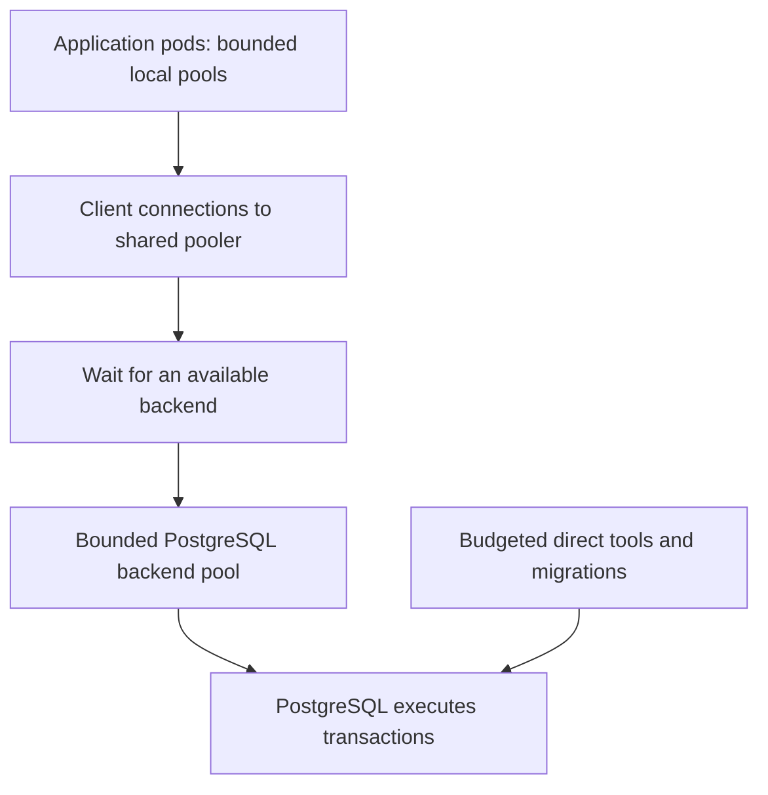
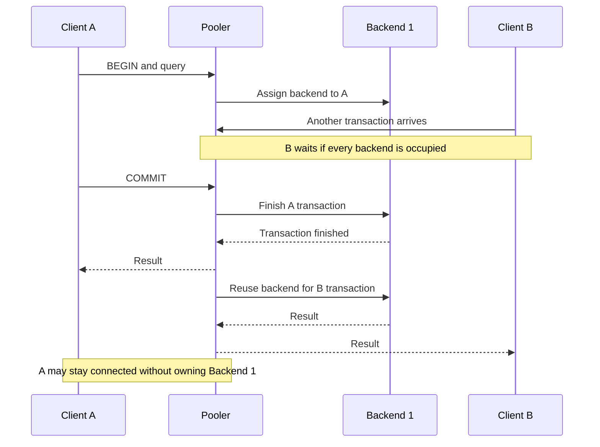
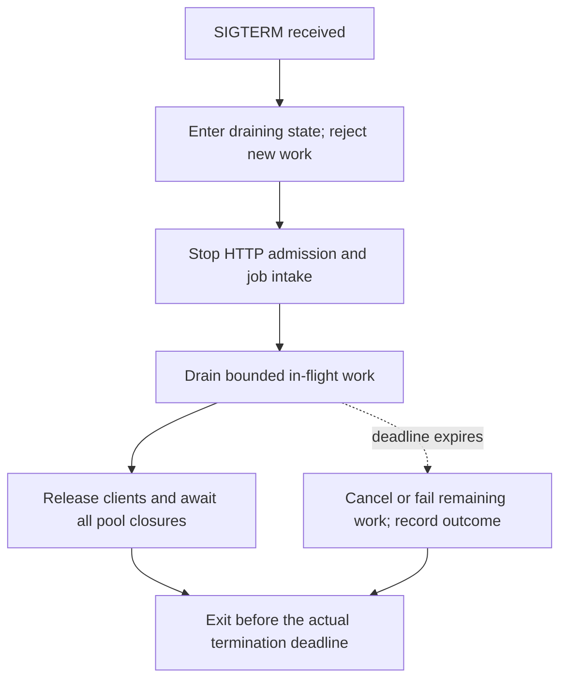

## What This Optimization Changes

A connection pool reuses database connections. A shared pooler lets many application clients take turns using fewer PostgreSQL connections, reducing connection overhead and controlling concurrent database work. It cannot make an expensive query cheap or add database CPU capacity.

Learn to budget fleet connections, explain transaction pooling, choose a compatible mode, and design shutdown and failure tests. Use the [interactive checkpoint](/practice/databases/postgres-connection-pooling-questionnaire?path=database-indexes-and-search) to calculate limits, order shutdown steps, and diagnose failures. The [review feed](/paths/database-indexes-and-search/flashcards) reinforces the key decisions.

### The Reported Titan Scenario

The motivating report described connection pressure around Titan, Saturn pods exposed to spot interruptions, a connection ceiling of **1,187**, a **30-second warning**, and PgDog available in staging but not production. These reported inputs are unverified and do not establish an incident diagnosis. Verify the cloud provider, actual limits, pool count, interruption sequence, and deployed PgDog version. The worked examples use invented workloads, timings, and configurations.

The four suggested actions address separate problems:

| Action | Intended effect | What still needs work |
| --- | --- | --- |
| Set an explicit application pool `max` | Bounds connections from each pool | Count every process, pool, replica, and deployment overlap |
| Close pools during `SIGTERM` handling | Releases resources during an orderly exit | Drain work first; crashes and partitions can bypass cleanup |
| Limit and spread spot workloads | Reduces correlated application loss and replacement bursts | Maintain enough stable capacity and test its recovery behavior |
| Introduce a production pooler | Reuses database backends across application clients | Budget all pooler replicas, validate compatibility, and operate it reliably |

## Separate Requests, Clients, And Backends

An HTTP request is work arriving at your application. An application pool client is a database-protocol connection held by one application process. A PostgreSQL backend connection is a session at the database server. With direct connections, the last two usually correspond one-to-one. A transaction pooler separates their lifetimes.



Think of backends as checkout counters: an application pool reserves them for one process; a shared pooler lets several processes use them at different times. A longer queue creates neither more counters nor faster cashiers.

Application pools remain useful behind a pooler: they reuse sockets to the proxy and limit local concurrency. Creating a new pool per request defeats reuse. Conversely, one singleton in each process is still many pools across a deployment. Count HTTP processes, queue workers, scheduled jobs, ORM clients, tenant-specific pools, and read/write pools by their actual destination. The [node-postgres sizing guide](https://node-postgres.com/guides/pool-sizing) explicitly treats pool size as a fleet-wide decision.

PostgreSQL dedicates resources to connections, and raising `max_connections` increases some resource allocations. A high connection ceiling is therefore a limit to respect, not a throughput target. Reserve emergency access according to the deployed version and managed-service rules; do not grant application roles emergency privileges to evade admission limits. See [PostgreSQL connection settings](https://www.postgresql.org/docs/18/runtime-config-connection.html).

## How Transaction Pooling Works

In transaction mode, the pooler assigns a backend for a transaction and makes it available again after the transaction finishes and required cleanup completes. The next transaction from the same client may use a different backend. Autocommit statements are transactions too. See [PgDog transaction mode](https://docs.pgdog.dev/features/connection-pooler/transaction-mode/).



Imagine 1,000 connected clients whose requests rarely overlap sharing 80 backends. If all 1,000 need a backend simultaneously, up to 80 can hold one; the others wait or fail admission. This illustrates reuse, not a benchmark or promised ratio.

Returning a client to an application pool and committing a database transaction are different events. A leaked application checkout can block that process even while the shared pooler has capacity. An open transaction can pin a backend even while no SQL is executing. Measure both lifetimes.

### Choose The Pooling Mode

| Mode | Backend assignment lasts until | Useful when | Main constraint |
| --- | --- | --- | --- |
| Session | Client disconnects | The client needs a persistent server session | Idle connected clients retain assignments, limiting sharing |
| Transaction | Transaction ends | Short, independent request transactions | Session state must be compatible with the exact pooler |
| Statement | Individual statement finishes | Work is strictly autocommit | Explicit multi-statement transactions are disallowed |

These modes are documented in [PgBouncer's feature map](https://www.pgbouncer.org/features.html). Adding session pooling in front of long-lived application sockets does not automatically reduce database connections. Transaction mode usually provides the desired sharing among many idle application connections.

## Calculate A Direct-Connection Budget

First decide what the quoted ceiling means. Is **1,187** the server's `max_connections`, an application allowance after reserved slots, or an observed count? Check the server and provider configuration before calculating. Avoid subtracting reserved slots twice.

For one database server, define:

```text
C = verified connection ceiling before the reserve defined below
R = reserved slots and operational headroom not already deducted from C
O = connections allowed to other services, tools, and jobs
P = peak simultaneous pods, including rollout and replacement overlap
W = database-using processes per pod
K = independent pools per process targeting this same server
M = max connections per pool

Planned total = P × W × K × M + O
Constraint: Planned total <= C - R
Per-pool cap: M <= floor((C - R - O) / (P × W × K))
```

For heterogeneous services, sum each service's product instead of assuming all pods have the same shape. Repeat the budget for each primary or replica endpoint. A pool targeting a separate read replica does not consume the primary's slots unless routing or failover moves it there.

### Worked Example: Leave Headroom Below 1,187

Assume, only for this exercise, that **1,187** is the total ceiling and the **187** reserved/headroom slots have not already been deducted. Other consumers get **200** connections. The application may have **25** simultaneous pods, **2** processes per pod, and **2** pools per process targeting the same server.

```text
Application allowance = 1,187 - 187 - 200 = 800
Number of pools = 25 × 2 × 2 = 100
Maximum per pool = floor(800 / 100) = 8
Planned total = 25 × 2 × 2 × 8 + 200 = 1,000
```

Here, `max: 10` would permit **1,200** connections including other consumers: **13** over the reported ceiling and **200** over the planned operating budget. `max: 8` fits this model, but still needs load testing; it is not a Titan recommendation.

| Scenario | Pods × processes × pools × max | Other connections | Total | Result against the 1,000 operating budget |
| --- | --- | --- | --- | --- |
| Normal peak | 25 × 2 × 2 × 8 | 200 | 1,000 | Fits |
| Five extra overlapping pods | 30 × 2 × 2 × 8 | 200 | 1,160 | Consumes 160 of the intended headroom |
| Budget for 30 pods using max 6 | 30 × 2 × 2 × 6 | 200 | 920 | Fits with 80 spare within the operating budget |
| Two pools overlooked, max 10 retained | 25 × 2 × 2 × 10 | 200 | 1,200 | Exceeds even the total ceiling |

A maximum describes potential allocation, not immediate connections. Budget for many pools filling together, including old backend sessions that linger after replacement pods start.

**Try it:** before opening the [checkpoint](/practice/databases/postgres-connection-pooling-questionnaire?path=database-indexes-and-search), calculate the cap if peak simultaneous pods rises to 40. With the other inputs unchanged, `floor(800 / 160)` gives **5**. State your assumptions along with the answer.

## A Shared Pooler Needs Its Own Budget

Budget application-to-pooler clients separately from pooler-to-database backends. A client admission limit does not necessarily cap backends across the pooler fleet. PgBouncer distinguishes `max_client_conn`, pool sizes, and per-database/user limits; see its [configuration reference](https://www.pgbouncer.org/config.html).

For a simple, single-destination teaching model:

```text
Backend ceiling = peak pooler replicas × pools per replica × backend cap per pool
Total database connections = Backend ceiling + direct bypass connections
```

PgDog creates independent pools for configured user entries, with `pool_size` overriding `default_pool_size`. Audit the actual user/database/server layout; the precise grouping depends on configuration. See [PgDog pool configuration](https://docs.pgdog.dev/user_guides/connection_pool/).

Suppose there are **3** pooler replicas, **2** pools per replica aimed at the same database, and a backend cap of **80** for each pool. Add **120** direct connections:

```text
3 × 2 × 80 + 120 = 600 database connections
4 × 2 × 80 + 120 = 760 during one-replica rollout overlap
```

More application clients may connect, subject to the pooler's client limits, memory, file descriptors, and queue capacity. Autoscaling poolers raises the potential backend count unless another enforced limit prevents it. Sidecar poolers multiply with application pods; they do not inherently impose a fleet-wide cap.

This is an illustrative PgDog sizing fragment, **not a complete deployment configuration**:

```toml
[general]
pooler_mode = "transaction"
default_pool_size = 80
checkout_timeout = 1000
```

The timeout here is in milliseconds. Complete the database/user configuration, credentials, verified TLS on both network legs, client admission policy, and monitoring for the pinned release. Audit overrides and all destinations. The [general settings reference](https://docs.pgdog.dev/configuration/pgdog.toml/general/) defines the knobs; their example values are not universal production defaults.

A surviving pooler can reuse its backend connections when application pods reconnect. It cannot preserve an in-flight transaction through arbitrary failures, guarantee no errors, or replace database failover. Keep a budgeted administrative route, but avoid an automatic bypass that sends the whole fleet directly to PostgreSQL when the pooler fails. That removes the very admission boundary protecting the database.

## Size For Useful Concurrency, Then Measure Waiting

The connection ceiling limits sessions. Useful concurrency measures simultaneous work completed within the latency target. More active queries can increase CPU contention, memory pressure, I/O, and lock waits.

Apply Little's Law to backend occupancy in a stable workload: average occupied backends are approximately transaction throughput multiplied by average backend hold time. Use seconds, and exclude time waiting to acquire a backend from the hold time. This is a mean relationship, not a tail-latency sizing rule. See [MIT's queueing notes](https://web.mit.edu/1.041/www/lectures/L8-queuing-models-2026sp.pdf).

The following numbers are calculated examples, not measurements:

| Throughput | Mean backend hold time | Mean occupied backends | Interpretation |
| --- | --- | --- | --- |
| 600 transactions/s | 0.04 s | 24 | A modest backend pool may be enough, subject to bursts |
| 600 transactions/s | 0.20 s | 120 | Slower transactions require five times the occupancy |
| 600 transactions/s | 2 s | 1,200 | This load cannot fit the example ceiling without waiting or rejection |

With 80 backends and a constant 0.04 s hold time, `80 / 0.04 = 2,000` transactions/s is an idealized service bound. Real service time changes with concurrency, and queueing near full utilization hurts latency. Do not advertise this arithmetic as achieved throughput.

Holding a transaction open during a 2-second external API call consumes a backend for that interval even if its SQL took only milliseconds. Move unrelated remote work outside the transaction when consistency permits. If the workflow requires durable coordination, redesign it explicitly rather than dropping atomicity to improve a pool metric.

Compare several caps under the same representative workload. Choose based on throughput, p95/p99 end-to-end latency, errors, database CPU/I/O, lock waits, and both application and pooler acquisition delays. A smaller pool that lowers contention can outperform a larger pool; a pool that is too small merely moves the bottleneck into a queue.

## Use Application Pools Correctly

Reuse pool instances in a long-lived Node.js process. This example uses the earlier **8**-connection allowance; calculate your own service budget. `DATABASE_URL` identifies either the approved direct endpoint or the pooler endpoint and must come from secure runtime configuration. Do not disable certificate verification to make a connection succeed.

```typescript
import { Pool } from "pg";

export const pool = new Pool({
  connectionString: process.env.DATABASE_URL,
  application_name: "example-api",
  max: 8,
  connectionTimeoutMillis: 1000,
  idleTimeoutMillis: 30000,
});

pool.on("error", () => {
  console.error("An idle database client failed");
});
```

`max` bounds this pool only. Acquisition can wait when all clients are checked out. `idleTimeoutMillis` removes idle pool clients; it does not cancel running queries or rescue leaked checkouts. Monitor `totalCount`, `idleCount`, and `waitingCount`. Close the pool with `pool.end()` during orderly shutdown, after callers finish. See the [node-postgres Pool API](https://node-postgres.com/apis/pool).

### Keep A Transaction On One Checked-Out Client

This function assumes `pool` is the shared instance above. Its read-only transaction illustrates transaction-local settings and guaranteed client release; it is not an application query benchmark.

```typescript
export async function readDatabaseClock() {
  const client = await pool.connect();
  let discard = false;
  try {
    await client.query("BEGIN READ ONLY");
    await client.query("SET LOCAL statement_timeout = '2s'");
    const result = await client.query("SELECT current_timestamp AS observed_at");
    await client.query("COMMIT");
    return result.rows[0];
  } catch (error) {
    try {
      await client.query("ROLLBACK");
    } catch {
      discard = true;
    }
    throw error;
  } finally {
    client.release(discard);
  }
}
```

Separate `pool.query()` calls can select different clients. Use one checked-out client for `BEGIN`, every statement, and `COMMIT` or `ROLLBACK`, as required by the [node-postgres transaction guide](https://node-postgres.com/features/transactions). Release it on every path; discard it when rollback cannot restore a usable connection.

For a Node/NestJS rollout, verify every runtime import is a direct production dependency under the repository's conventions. Test the final pruned artifact and every supported entrypoint with inert I/O; source tests and a successful bundle do not establish startup readiness. These teaching snippets do not add `pg` to Codematica or connect it to Titan.

## Test Session Features Before Changing Endpoints

Transaction pooling removes permanent backend ownership. Compatibility depends on the pooler, version, configuration, driver, and ORM.

| Application behavior | What to verify |
| --- | --- |
| Session `SET`, role changes, tenant context | State is restored correctly for this client and cannot leak to another |
| Temporary tables used across transactions | Required lifetime survives, or the workload uses a dedicated session route |
| Session advisory locks | Ownership and release remain correct; consider transaction-scoped locks where suitable |
| `LISTEN` listeners | Notifications survive reconnects with the intended delivery semantics |
| Cursors retained after commit | Required server state survives the selected mode |
| Migrations and administrative tools | Locking, DDL, and connection assumptions work on their designated route |
| Prepared statements | Test the exact protocol and reconnect/cache behavior |

PgBouncer's transaction-mode feature map marks several persistent session features unsupported, but supports protocol-level prepared statements when `max_prepared_statements` is nonzero. SQL `PREPARE` is a separate case. Parameterized queries and SQL `PREPARE` are not synonymous; do not remove parameterization to work around pooling. See [PgBouncer compatibility](https://www.pgbouncer.org/features.html).

PgDog documents session-setting tracking and advisory-lock handling in [transaction mode](https://docs.pgdog.dev/features/connection-pooler/transaction-mode/), and separate behavior for prepared-statement protocols in its [prepared statement documentation](https://docs.pgdog.dev/features/connection-pooler/prepared-statements/). Those capabilities must be checked against the deployed release. Neither “all transaction poolers break session state” nor “a staging smoke test proves full compatibility” is a safe rule.

Test alternating clients with distinct tenant settings, errors followed by reuse, rollback, cancellation, prepared statement cache churn, and reconnects. Use synthetic identities and fixtures. Successful query execution is insufficient if it returns another tenant's data.

## Bound Queues, Timeouts, And Retries

Requests can wait in the application pool, the shared pooler, and on database locks. Set an overall deadline and budget each stage within it.

For an illustrative **3,000 ms** request deadline, you might allocate at most **500 ms** to local acquisition, **500 ms** to proxy acquisition, **1,500 ms** to database work, and **500 ms** to networking, response handling, and cleanup. Several statements and retries must share the remaining time; restarting every timer for each attempt defeats the deadline. A client-side timeout alone does not prove the server stopped executing.

| Control | What it bounds |
| --- | --- |
| Local acquisition timeout | Waiting to obtain an application client |
| Pooler checkout timeout | Waiting for a database backend |
| `statement_timeout` | Execution time of each statement at PostgreSQL, including its waits |
| `lock_timeout` | Time waiting for each lock acquisition |
| `idle_in_transaction_session_timeout` | Sessions idle inside an open transaction |

Use workload-appropriate, version-supported database settings and test their effects on clients. A per-statement timeout does not cap a whole multi-statement transaction. Transaction-local settings stay within that transaction; avoid changing global defaults indiscriminately. See [PostgreSQL client connection defaults](https://www.postgresql.org/docs/18/runtime-config-client.html).

Bound admission and queue size where supported, cap background-job concurrency, and shed excess work instead of accumulating unlimited waiting requests. Retry only eligible failures with bounded exponential backoff and jitter, at a deliberate layer. A dropped response to `COMMIT` leaves the outcome uncertain: the write may have committed. Reconcile using durable operation identity or an idempotent design before repeating it. See the [AWS guidance on timeouts, retries, and jitter](https://aws.amazon.com/builders-library/timeouts-retries-and-backoff-with-jitter/).

## Graceful Shutdown Is A Sequence

Calling `pool.end()` first can break work that still needs a database client. It cannot run after process exit. Give each process one coordinated, idempotent shutdown path covering all pools and workers.



Readiness changes and load-balancer propagation can overlap with termination; also gate admission inside the process. Stop timers and queue consumers that could open new work. Drain or cancel existing work within the remaining budget, release clients in cleanup paths, await every pool's close operation, and then exit. In NestJS, connect this sequence to the actual application lifecycle and enable the appropriate signal hooks; verify hook ordering with the HTTP adapter and workers in use. See the [NestJS lifecycle documentation](https://docs.nestjs.com/fundamentals/lifecycle-events).

Kubernetes normally sends `SIGTERM`, then forces termination when the grace period expires. A `preStop` hook consumes that same grace period. The common default is **30 seconds**, but that is not evidence that an interrupted VM will provide 30 usable seconds to your application. See [Pod termination](https://kubernetes.io/docs/concepts/workloads/pods/pod-lifecycle/#pod-termination).

Google Compute Engine Spot VMs document a best-effort shutdown period of up to **30 seconds**. Other providers have different semantics; verify the actual platform and signal delivery path. See [Google Cloud Spot shutdown behavior](https://docs.cloud.google.com/compute/docs/instances/create-use-spot).

A controlled 30-second test could allocate 2 seconds to stopping admission, 20 seconds to draining, 3 seconds to closing resources, and 5 seconds of margin. This is a test target, not a preemption guarantee. A hung checkout can prevent closure; test both normal shutdown and deadline expiry. Do not run asynchronous database cleanup from a synchronous process exit callback.

After abrupt process death, the operating system can often close sockets; after node loss or a network partition, the server may detect the loss later. Neither persistent connections after every killed pod nor reliable cleanup through SIGTERM is guaranteed. Observe backend disappearance and validate TCP/driver/server timeouts in disposable failure tests.

## Reduce Correlated Spot Loss

Spot placement is an availability decision with a database consequence: many replacements starting together can create simultaneous connections and retries. A shared pooler may absorb some connection churn while the application still loses serving capacity.

An illustrative design keeps a minimum serving tier on ordinary capacity and caps a separate spot tier. If 12 stable pods meet the degraded-service target, six spot pods could add throughput. Validate these counts under load; they are not Saturn recommendations. Separate deployments and autoscaler bounds can make a spot cap explicit. A soft scheduling preference alone is not a numerical cap.

Spread replicas across relevant nodes and zones, then verify how node affinity, taints, available capacity, and topology constraints interact. Spreading among spot nodes cannot guarantee their survival. [Kubernetes topology spread constraints](https://kubernetes.io/docs/concepts/scheduling-eviction/topology-spread-constraints/) describe the placement controls. A PodDisruptionBudget limits supported voluntary disruptions; it cannot prevent provider preemption or node failure. See [Kubernetes disruptions](https://kubernetes.io/docs/concepts/workloads/pods/disruptions/).

Keep the pooler itself sufficiently available and spread across failure domains. Budget its rollout overlap and test loss of one replica. A deployment that concentrates every pooler on the same interrupted node recreates a shared point of failure. The [PgDog production guide](https://docs.pgdog.dev/user_guides/deploying-to-production/) is a starting point for version-specific deployment planning.

## Diagnose The Bottleneck Before Choosing The Fix

Collect application acquisition latency and pool counts alongside pooler client/backend occupancy, queue time, errors, reconnect rates, transaction duration, database utilization, and pod lifecycle events. Inspect peaks and intervals; averages can hide replacement waves.

This read-only query groups client backends without SQL text:

```sql
SELECT datname, usename, application_name, state,
       count(*) AS connections,
       max(clock_timestamp() - xact_start)
         FILTER (WHERE xact_start IS NOT NULL) AS oldest_transaction_age
FROM pg_stat_activity
WHERE backend_type = 'client backend'
GROUP BY datname, usename, application_name, state
ORDER BY connections DESC;
```

Permissions can restrict visibility. Behind a pooler, PostgreSQL sees backend connections, not every connected application client; use pooler metrics too. `idle` and `idle in transaction` mean different things, and `active` does not prove CPU saturation. The filter excludes other backend types, so this is not a complete accounting of every server resource or reserved slot. See [PostgreSQL activity statistics](https://www.postgresql.org/docs/18/monitoring-stats.html).

| Observation | Investigate first | Likely direction after confirming evidence |
| --- | --- | --- |
| Many idle backends, low execution load, connection failures during scale-out | Pool multiplication and old/new overlap | Lower explicit caps; evaluate transaction pooling |
| Rising queue time, busy CPU/I/O, or long lock waits | Slow queries, contention, and excessive job concurrency | Reduce work, shorten transactions, tune queries/indexes, or add appropriate capacity |
| Old idle-in-transaction sessions | Missing commit/rollback and remote work inside transactions | Fix lifecycle; apply tested timeouts |
| Exhausted local pool while pooler has spare backends | Leaked checkouts, per-process imbalance, or undersized local cap | Fix release paths; tune the local cap within its budget |
| Errors align with mass pod replacement | Placement, admission, connection creation, and retry timing | Stable capacity, bounded startup, jitter, and tested shutdown |
| Failures appear only after switching to transaction mode | Session state and driver/proxy compatibility | Correct the incompatibility or isolate a budgeted session route |

Pooling is most useful when client count and backend occupancy differ substantially: autoscaling APIs, short transactions, bursty workers, and many mostly idle processes. It provides less sharing for long transactions, continuously busy clients, or sessions that require persistent backend ownership. For a small fixed deployment already within its budget, a well-sized application pool may be sufficient; the proxy adds another service and network hop to operate.

## Prove The Change Before A Production Rollout

Use staging or disposable infrastructure, synthetic data, and inert external I/O. Failure exercises must not run campaigns, change entitlements, or replay real writes. Staging PgDog experience does not establish production sizing, TLS, permissions, routing, or compatibility.

1. **Inventory.** Record actual versions, connection limits and reserves, every pool constructor, ORM/driver defaults, process count, peak pods, pooler replicas, bypass routes, and failover destinations.
2. **Baseline.** Capture representative request mix, throughput, tail latency, errors, backend occupancy, queue time, and transaction duration. Separate normal load, scale-out, and rollout overlap.
3. **Validate behavior.** Exercise transaction/session features, authentication, TLS verification on both legs, cancellation, tenant isolation, and ambiguous write outcomes using fixtures.
4. **Validate failure handling.** Test an orderly pod exit, abrupt loss, network interruption, pooler restart, and loss of one pooler replica. Record whether work drained, failed, or requires reconciliation.
5. **Compare evidence.** Require the calculated backend budget to hold at peak replica count; queues must remain bounded and recover. Compare tail latency and error rate to agreed targets, not just connection count. Record the tested final application artifact and pooler image/configuration.
6. **Prepare a canary and rollback.** Decide traffic fraction, abort thresholds, and owners before an authorized rollout. Existing pooled connections may retain the old endpoint until drained. Budget direct and proxied traffic together during migration and rollback.

Record code/test success, final artifact startup, deployment, and confirmed service recovery separately. A lower connection graph with rising request failures is not success. Unknown incident impact, duration, and transaction outcomes remain unknown until evidence resolves them.

## Practice And Further Study

Open the [12-question connection pooling checkpoint](/practice/databases/postgres-connection-pooling-questionnaire?path=database-indexes-and-search). It includes numerical inputs, mode matching, shutdown ordering, and incident decisions with explanations. It uses this lesson's assumptions and has no database connection.

Draw your request-to-database path and annotate every pool, queue, timeout, and retry boundary. Recalculate after doubling application replicas, adding a database user, losing one pooler replica, and increasing transaction hold time fivefold. Identify which changes increase the connection ceiling and which increase waiting instead.

Return to [index fundamentals](/docs/databases/index-fundamentals?path=database-indexes-and-search) when expensive queries dominate hold time, or [HOT updates](/docs/databases/postgres-hot-updates?path=database-indexes-and-search) when update and index-maintenance costs dominate. Connection management complements those optimizations.

Primary documentation was consulted on **2026-09-30**. The linked PostgreSQL references target version 18; confirm differences for your server. PgDog, PgBouncer, node-postgres, Kubernetes, and cloud behavior must be checked against the versions and platform you actually deploy.
