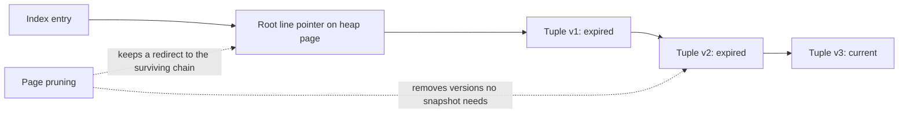

## Why An `UPDATE` Creates More Work Than It Appears To

PostgreSQL uses multiversion concurrency control (MVCC). An `UPDATE` does not normally overwrite a row in place. It creates a new row version in the table heap and leaves the old version available for transactions whose snapshots can still see it.

That behavior gives PostgreSQL strong concurrency, but a normal update can create work in several places:

- write the new heap tuple
- mark the old tuple as superseded
- add entries to every affected index
- write corresponding WAL records
- leave heap and index versions that later maintenance must reclaim

Heap-Only Tuple, or HOT, updates are PostgreSQL's optimization for avoiding part of that cost. A HOT update still creates a new heap tuple. The important difference is that PostgreSQL can avoid creating replacement entries in the table's regular indexes.

HOT is not a SQL command or planner hint. It is an internal decision PostgreSQL makes for each updated row.

## The Two HOT Eligibility Rules

An update can be HOT when both conditions are true:

1. The update does not modify a column referenced by any non-summarizing index on the table.
2. The heap page containing the old row has enough free space for the new row version.

Meeting these rules makes an update eligible; it does not make every update to that table permanently HOT. Page space, row size, and the indexes present when the statement runs decide the outcome for each row.

Consider this table:

```sql
create table accounts (
  id bigint generated always as identity primary key,
  email text not null unique,
  display_name text not null,
  status text not null default 'active',
  last_seen_at timestamptz
) with (fillfactor = 80);
```

`id` and `email` are indexed through the primary-key and unique constraints. `last_seen_at` is not indexed, so this update is HOT-eligible when the old page has enough room:

```sql
update accounts
set last_seen_at = clock_timestamp()
where id = 42;
```

The `id` index still finds the original row's page item. PostgreSQL follows the HOT chain on that page to the row version visible to the current snapshot.

Updating `email` is different:

```sql
update accounts
set email = 'new-address@example.com'
where id = 42;
```

Because `email` is referenced by a unique B-tree index, PostgreSQL must create an index entry that represents the new value. This update is not HOT.

## How A HOT Chain Reuses An Index Entry

An index entry identifies a heap page and a page item identifier, often called a line pointer. For a HOT update, the new tuple stays on the same page. The original item becomes the root of a chain of row versions, and each version's tuple header links toward its successor.



The index does not need one entry per HOT version. An index scan reaches the chain root, and PostgreSQL checks the same-page versions to find the one visible to its MVCC snapshot.

When intermediate versions are no longer visible to any active transaction, page pruning can remove them during ordinary access to the page. The root item can become a redirect to the oldest version that might still be visible. This is cheaper than requiring index vacuuming to remove a separate index entry for every update.

Long-running transactions can delay pruning because older versions may still be visible to their snapshots. HOT reduces cleanup work; it does not override MVCC visibility rules.

## How Index Design Changes HOT Eligibility

The relevant question is not merely "does this table have indexes?" It is "does this update modify a column referenced by any of them?"

| Index shape | Effect when a referenced column is updated |
| --- | --- |
| B-tree, Hash, GiST, SP-GiST, or GIN key | Prevents HOT because the new row version may need a new index entry. |
| Primary-key or unique index | Prevents HOT when its key columns are updated; uniqueness enforcement does not make it an exception. |
| Multicolumn index | Updating any referenced key column prevents HOT. Updating an unrelated table column does not. |
| Covering index with `INCLUDE` | Updating an included payload column prevents HOT even though the column is not an ordering key. |
| Expression index | Updating a base column used by the expression prevents HOT. |
| Partial index | Updating a column used by the indexed keys or predicate prevents HOT because membership may change. |
| BRIN summarizing index on PostgreSQL 16+ | Does not by itself disqualify HOT, although the BRIN summary may still need maintenance. |

Index access methods do not make updates faster merely by existing. For HOT, most index types share the same rule: if the update touches data the index depends on, PostgreSQL must assume the index representation could change.

### Expression, Partial, And Included Columns

Indexes can depend on columns that are easy to overlook during a schema review:

```sql
create index accounts_lower_email_idx
  on accounts (lower(email));

create index accounts_active_name_idx
  on accounts (display_name)
  where status = 'active';

create index accounts_status_cover_idx
  on accounts (status)
  include (last_seen_at);
```

- Changing `email` affects the expression index.
- Changing `status` can move a row into or out of the partial index.
- Changing `last_seen_at` affects the covering index payload.

All three updates lose HOT eligibility. `INCLUDE` is especially important: a payload column can improve an index-only read, but indexing a frequently updated value can increase write amplification and block HOT updates.

### One Extra Index Can Change A Hot Write Path

The original `last_seen_at` update was HOT-eligible. Adding this seemingly useful index changes that:

```sql
create index accounts_last_seen_idx
  on accounts (last_seen_at);

update accounts
set last_seen_at = clock_timestamp()
where id = 42;
```

The second statement now modifies an indexed column and cannot be HOT. Before indexing a frequently changing column, compare the read benefit with the update rate, index maintenance, WAL volume, vacuum work, and additional index storage.

Redundant and speculative indexes expand the set of updates that must maintain index entries. Removing an index solely to chase a HOT ratio is also a mistake if important reads depend on it. Optimize the whole workload.

## The BRIN Version Boundary

BRIN stores summaries for ranges of heap pages rather than one ordinary entry for each table row. PostgreSQL 16 changed HOT eligibility so an update can remain HOT when only BRIN-indexed columns change. The BRIN summary may still be updated to cover the new value.

```sql
create index events_recorded_at_brin
  on events using brin (recorded_at);
```

On PostgreSQL 16 and later, changing `recorded_at` does not lose HOT eligibility merely because this BRIN index exists, provided the new row version still fits on the original heap page and no other non-summarizing index references the changed columns.

On PostgreSQL 15 and earlier, indexed-column updates—including BRIN-indexed columns—do not qualify under the older HOT rule. Treat this as an explicit version boundary in mixed-version fleets.

BRIN should still be chosen for its query behavior: very large tables whose values correlate with physical page ranges. Its HOT exception is not a reason to replace a selective B-tree with a BRIN index that cannot support the workload.

## Fillfactor Reserves Same-Page Space

The second eligibility rule is physical: the updated tuple must fit on the old tuple's heap page. A table's `fillfactor` controls how densely new rows are packed during inserts and rewrites.

```sql
alter table accounts set (fillfactor = 80);
```

A fillfactor of 80 asks PostgreSQL to leave roughly 20 percent of each newly populated heap page available for future row versions. This can improve the HOT rate for update-heavy tables.

The tradeoff is real:

- the table uses more pages for the same live rows
- sequential scans may read more pages
- fewer rows fit in shared buffers
- indexes may point across a larger heap footprint

Changing the setting does not immediately repack existing pages or create free space throughout the current table. It influences future page population and future rewrites. Operations that physically rewrite a table have meaningful locking, disk-space, and operational costs, so do not schedule one only to apply a guessed fillfactor.

Wide rows and updates that make values larger can exhaust the reserved space quickly. TOAST can change the stored row shape, but it does not turn HOT into a guarantee. Measure the actual workload before and after tuning.

## Monitoring HOT Updates

`pg_stat_user_tables` exposes cumulative update counters:

```sql
select
  schemaname,
  relname,
  n_tup_upd,
  n_tup_hot_upd,
  n_tup_upd - n_tup_hot_upd as n_tup_non_hot_upd,
  n_tup_newpage_upd,
  round(
    100.0 * n_tup_hot_upd / nullif(n_tup_upd, 0),
    2
  ) as hot_update_pct,
  n_dead_tup,
  last_autovacuum
from pg_stat_user_tables
where n_tup_upd > 0
order by n_tup_upd desc;
```

Interpret the columns carefully:

- `n_tup_upd` counts all updated rows.
- `n_tup_hot_upd` counts HOT-updated rows.
- `n_tup_newpage_upd` counts updates whose new row version went to a different heap page; these are always non-HOT.
- `n_tup_upd - n_tup_hot_upd` counts all non-HOT updates, including some whose successor still fit on the same page but had to update indexes.

These statistics are cumulative, can lag briefly, are cached within a statistics-reading transaction, and can be reset. Compare rates over a known interval rather than treating one lifetime percentage as a service-level objective.

A low HOT percentage may be completely healthy when the workload mostly updates indexed business keys. A falling percentage on a table that only changes unindexed status metadata is more actionable: inspect new indexes, row growth, page density, and transaction age.

## HOT Does Not Replace Vacuuming

HOT makes it possible to prune removable intermediate versions during normal page access, but PostgreSQL still needs autovacuum and routine vacuuming to:

- reclaim or reuse other dead tuples and index entries
- update planner statistics through analyze activity
- maintain the visibility map used by index-only scans
- freeze old transaction IDs and prevent wraparound

Any update, including HOT, makes the changed heap page no longer all-visible until vacuum can prove otherwise. A write-heavy table can therefore have a high HOT rate while still performing heap visibility checks during index-only scans.

Do not disable autovacuum because HOT is working. Also investigate long-running transactions, replication slots, or other old snapshots that prevent dead versions from becoming removable.

## Benefits And Tradeoffs

### Benefits

- Avoids new entries in regular indexes for eligible updates.
- Reduces index write amplification and the index cleanup work caused by superseded entries.
- Limits index bloat from frequently updated, unindexed attributes.
- Lets page pruning remove intermediate same-page versions without waiting for a full index-cleanup cycle.
- Can reduce update latency and WAL volume for the right write-heavy workload.

### Constraints And Costs

- Remains opportunistic because same-page free space is required.
- Cannot help when a changed column is referenced by a regular index.
- Does not eliminate heap writes, dead tuples, MVCC checks, autovacuum, or transaction-ID maintenance.
- Lower fillfactor trades update headroom for a larger table and potentially more read I/O.
- Long HOT chains and dead versions can persist while old snapshots need them.
- A high HOT ratio can be the wrong goal if achieving it requires removing valuable indexes.

## Production Review Checklist

When reviewing an update-heavy PostgreSQL table, ask:

1. Which columns change most often?
2. Which indexes reference those columns as keys, expressions, predicates, or included payload?
3. Do those indexes support measured read paths, or are some redundant?
4. Are new row versions staying on the same page?
5. What do interval changes in `n_tup_upd`, `n_tup_hot_upd`, and `n_tup_newpage_upd` show?
6. Would a lower fillfactor help enough to justify a larger heap?
7. Are autovacuum and transaction age healthy even when the HOT rate is high?
8. Does the deployed PostgreSQL version include the PostgreSQL 16 BRIN exception?

HOT is best treated as one signal in a workload review. Design indexes for real reads, preserve page space for real update patterns, and verify the result with production-shaped measurements.

## Reference Anchors

- [PostgreSQL Heap-Only Tuple updates](https://www.postgresql.org/docs/current/storage-hot.html)
- [PostgreSQL cumulative statistics system](https://www.postgresql.org/docs/current/monitoring-stats.html)
- [PostgreSQL table fillfactor](https://www.postgresql.org/docs/current/sql-createtable.html)
- [PostgreSQL routine vacuuming](https://www.postgresql.org/docs/current/routine-vacuuming.html)
- [PostgreSQL index-only scans and the visibility map](https://www.postgresql.org/docs/current/indexes-index-only-scans.html)
- [PostgreSQL 16 release notes](https://www.postgresql.org/docs/16/release-16.html)
- [PostgreSQL 15 HOT behavior](https://www.postgresql.org/docs/15/storage-hot.html)
