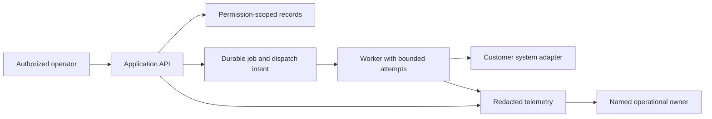

A prototype demonstrates a hypothesis under controlled conditions. Production adds variable inputs, real permissions, concurrent users, partial failures, change management and an owner who must respond when it breaks. Make that transition a visible workstream in the plan.

## Build a vertical slice

Choose one operator, one task, one data source and one meaningful success condition. Build the interface, backend contract, storage and feedback as a thin end-to-end slice. Keep loading, stale, denied, failed and empty states explicit. A manually edited database and a hardcoded account can be useful scaffolding only if the limitation is disclosed and removed before the dependent release gate.

Write a short architecture decision record: context, considered options, decision, consequences and trigger for reconsideration. Separate reusable platform capabilities from customer-specific adapters and policy. Do not invent a general framework before observing variation, but avoid scattering tenant-specific conditionals through core code.

The diagram is an original reference design. A small read-only deployment may not need a queue or worker. Select components based on latency, durability and failure requirements rather than diagram completeness.

## Establish release evidence

Test pure rules, storage/API boundaries and the complete operator journey. Add denial, stale data, duplicate delivery, timeout and recovery cases. Use a fake external adapter until authorized integration testing is available. Keep fixture results separate from staging and production evidence.

Verify the artifact you will deploy. In Node deployments, audit runtime imports against direct production dependencies, the bundler's externalization and the final install/pruning/copy steps. Boot the final artifact after production pruning in an isolated disposable environment with inert dependencies. HTTP should reach readiness; job validation must not perform real business actions. A local module compile or successful bundle does not prove the image can start.

Keep job-only modules out of normal HTTP startup paths. Select an entrypoint before loading the graph and test that ordinary startup does not import campaign or job orchestration. This operational checklist is a curriculum exercise; the path itself adds no deployable service.

## Make rollout reversible

Use backward-compatible data/API changes, a small first cohort, versioned configuration and explicit health gates. Record rollback triggers and who can act. A rollback of application code may not reverse a database migration or an external write; plan compatibility and reconciliation separately. Exercise restore procedures for retained data and record recovery objectives with their owners.

A handover includes deployment instructions, configuration ownership, secret rotation process, dashboards, runbooks, escalation contacts, known limits and a support agreement. The customer needs an operational owner before a pilot becomes an enduring dependency.

## Practice

For your capstone, produce a release checklist with artifact identity, tests, environment, dependencies, permissions, rollback, unresolved risks and approval owner. Simulate a missing runtime package, a stale source and an unavailable adapter. Demonstrate an honest degraded state and a recovery route. Keep startup tests isolated from real external systems.

## Review your work

Can another engineer deploy and recover the slice using only the repository and approved configuration? Does the evidence describe the final artifact? Is “ready” tied to observed behavior rather than a successful demo or green unit suite?

## Sources and further study

- [Service Level Objectives](https://sre.google/sre-book/service-level-objectives/): Google Site Reliability Engineering book. Selected user-facing indicators and objective definitions.
- [Making retries safe with idempotent APIs](https://aws.amazon.com/builders-library/making-retries-safe-with-idempotent-APIs/): Malcolm Featonby, Amazon Builders Library. Selected client intent, atomicity and parameter mismatch guidance.
