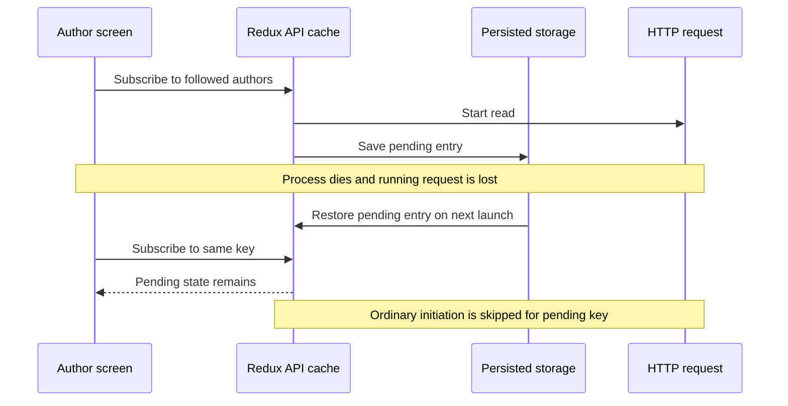

## The Case: an App Restarts, but a Request Never Does

This lesson is inspired by [inkitt/flash PR #12666](https://github.com/inkitt/flash/pull/12666), reviewed at commit `4d5768c99ef905136512da2374041636bcd7b7e6` on **2026-09-09**. Access to that private repository may be required. This self-contained explanation uses a generalized reading app without customer records.

The PR reports that an app persisted RTK Query slices using redux-persist and synchronous device storage. Killing the process during a followed-author request left a cached entry with `status: 'pending'`. On restart, that entry returned without the promise or network request that had produced it. The UI kept rendering a loader. The proposed transform removes pending query and mutation entries both before storage and after reading old storage.

The PR reports a reproduction and proposed repair; deployment and customer recovery remain unverified here. This learning path does not change Flash.

## Why “Just Force a Refetch” Can Fail

The query thunk in **2.2.8** checks whether an entry is already pending before evaluating ordinary forced-refetch behavior. This protects legitimate concurrent work from duplication. A malformed restored entry can satisfy the same check without a live request. The same ordering exists in the inspected **2.12.0** source; upgrading alone is not a persistence policy. [2.2.8 query thunk](https://github.com/reduxjs/redux-toolkit/blob/v2.2.8/packages/toolkit/src/query/core/buildThunks.ts), [2.12.0 query thunk](https://github.com/reduxjs/redux-toolkit/blob/v2.12.0/packages/toolkit/src/query/core/buildThunks.ts).

The following diagram is an explanation of the failure path, not a captured production trace:



**Interview answer:** “Serializing execution metadata does not serialize execution. A persisted pending status needs a restart policy; it is not proof that work is currently running.”

## Two Restoration Paths You Must Distinguish

RTK's `extractRehydrationInfo` path is designed to process restored API data. The inspected **2.2.8 and 2.12.0 reducers both accept fulfilled/rejected query entries and skip pending entries** through that path. That makes “RTK always restores pending requests” an incorrect generalization. [2.2.8 reducer](https://github.com/reduxjs/redux-toolkit/blob/v2.2.8/packages/toolkit/src/query/core/buildSlice.ts), [2.12.0 reducer](https://github.com/reduxjs/redux-toolkit/blob/v2.12.0/packages/toolkit/src/query/core/buildSlice.ts).

A generic persistence reconciler or raw Redux `preloadedState` can instead inject an entire API slice. Inspect the actual root reducer, persist nesting, reconciler, migrations, and `extractRehydrationInfo` wiring. A filtering helper cannot protect a restore path that bypasses it. Test the installed version and exact persistence configuration together.

## Choose What Deserves to Survive

For normal browser apps, official guidance generally discourages persisting API caches because data can remain stale across long absences. Native/offline applications may justify it, with a deliberate rehydration strategy. A server cache and a durable offline domain store solve different problems. [Persistence guidance](https://redux-toolkit.js.org/rtk-query/usage/persistence-and-rehydration).

**Bad configuration fragment:** include `libraryApi` in a broad persist whitelist because it is in Redux. **Better default fragment:** persist only intentional durable slices such as reading preferences and drafts. Adapt names and nesting to the app:

```ts
// Inside the existing persist configuration:
const durableSlices = ['preferences', 'readingDrafts'];
const persistOptions = {
  key: 'root',
  version: 3,
  whitelist: durableSlices,
};
```

That fragment is not a complete migration. Excluding future writes does not ensure previously stored API slices disappear on the next read. Add and test a versioned migration for known legacy keys. Preserve unrelated durable data. A blanket `purge()` may erase unsynced drafts; clearing all storage is not a routine repair.

For offline reading, prefer validated content snapshots with a schema version, owner/account identity, saved timestamp, expiry policy, and explicit refresh. Do not treat cached entitlements as authority. If retaining RTK state, test stale fulfilled data, old internal formats, failed states, tenant switches, and listener/subscription restoration on each upgrade. Internal `queries`, `provided`, and subscription shapes are not your stable business schema.

## A Defensive Repair Adapter

The PR filters pending entries in both directions: writes prevent recurrence; reads repair existing installations. Here is an original, defensive teaching variant. It returns unknown/malformed shapes unchanged so the owning versioned migration can decide what to do. It is **not** a universal validator or a replacement for RTK's documented rehydration path.

```ts
type JsonRecord = Record<string, unknown>;
const isRecord = (value: unknown): value is JsonRecord =>
  typeof value === 'object' && value !== null && !Array.isArray(value);

export function stripPendingApiEntries(value: unknown): unknown {
  if (!isRecord(value) || !isRecord(value.queries) ||
      !isRecord(value.mutations) || !isRecord(value.config)) return value;

  const settledEntries = (entries: JsonRecord) => Object.fromEntries(
    Object.entries(entries).filter(([, entry]) =>
      !isRecord(entry) || entry.status !== 'pending'),
  );
  return {
    ...value,
    queries: settledEntries(value.queries),
    mutations: settledEntries(value.mutations),
  };
}
```

Wiring fragment, with the function above in `stripPendingApiEntries.ts`:

```ts
import { createTransform } from 'redux-persist';
import { stripPendingApiEntries } from './stripPendingApiEntries';

export const pendingRepair = createTransform(
  stripPendingApiEntries, // inbound: before persisting
  stripPendingApiEntries, // outbound: before reconciling restored data
);
// Include pendingRepair in the existing persist config's transforms array.
```

Shape detection avoids importing API modules into persistence utilities, which can introduce initialization cycles. However, another slice could coincidentally have those fields. Use known persisted keys where feasible; validate compatibility before deploying any shape-based adapter. Removing query entries while retaining other internal metadata also needs integration testing. Use this example for a constrained emergency repair, not long-term cache serialization. [redux-persist transforms and migrations](https://github.com/rt2zz/redux-persist).

## Recovery Must Prove Progress

Use synthetic records, in-memory/dedicated test storage, and a controlled fake base query. Never reproduce by editing a customer's storage or invoking real mutations.

| Test | Evidence required |
| --- | --- |
| Old pending query, then relaunch | New request actually starts and settles; loader gives way to data/error |
| Interrupted background refetch with older data | Product policy for retained data is explicit; discarded cache can fetch again |
| Both transform directions | Pending query and mutation records are removed without mutating input |
| Settled and unrelated data | Fulfilled/rejected entries and unrelated drafts survive as designed |
| Real persistence integration | Serialize, recreate store, restore through the actual config, subscribe, assert request count |
| Offline restart | Bounded error/offline UI; no infinite loading and no false success |
| Account switch and old schema | Protected cache cannot cross identity; migration is repeatable |

Do not assert only that `forceRefetch` was called. Observe the fake network request and final UI state. Fake timers can help prove bounded progress without fixed sleeps.

### What About a Pending Purchase Mutation?

Dropping its local pending marker does not tell you whether the server committed the purchase. Do not automatically replay it. A durable outbox needs its own command IDs, server idempotency, retry limits, and reconciliation contract. RTK Query mutation state is not such an outbox.

## Rehearse the Incident Answer

In two minutes: identify the orphaned execution state, inspect restoration and thunk conditions, explain why an upgrade/refetch alone is insufficient, propose a targeted reversible repair, and describe the restart regression. Report reproduction, code validation, deployment, and confirmed recovery as separate facts. If impact or duration is unknown, say so.
