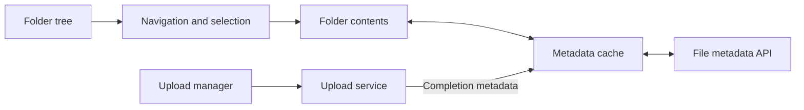

A Senior Frontend Gen Studio candidate reports a file-system design prompt during a December 2025–January 2026 loop. The March 11, 2026 report does not specify its detailed scope; this browser file-manager exercise is a Codematica adaptation. [Candidate report](https://discuss.frontendlead.com/t/adobe-senior-frontend-engineer-gen-studio-full-loop/3316)

Company attribution and interview details are not independently verified. Sources checked October 8, 2026. The prompt is paraphrased; practice constraints, follow-ups, diagrams, and review criteria are Codematica additions unless labeled as reported.

## Practice prompt

Design a file manager with folder navigation, search, rename, move, and upload.

Use the [60-minute schedule and rubric](/docs/frontend/system-design-interview-rehearsal). Spend 45 minutes designing, 10 minutes handling follow-ups, and 5 minutes reviewing. No coding is required.

- **Define:** stable file IDs, parent relationships, folder pagination, permissions, and upload state.
- **Draw:** tree navigation, folder contents, selection state, metadata requests, and a separate upload flow.

## Follow-ups

A folder contains 100,000 files. A selected file moves elsewhere. An upload fails halfway. Access is revoked while the folder is open.

## Self-review

Explain lazy loading, bounded rendering, cache invalidation after moves, and partial failures. Do not assume a filename or path is a permanent identity.

## Starting diagram

Challenge this possible boundary sketch. Add the search, rename, move, permission, and failed-upload paths.

[Start the guided rehearsal](/practice/frontend/system-design-file-manager-lab?path=frontend-system-design-interviews). Record a prediction, check your evidence, and reflect. Completion is self-assessed; it is not an architecture grade.
