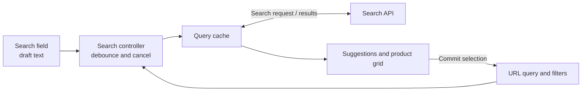
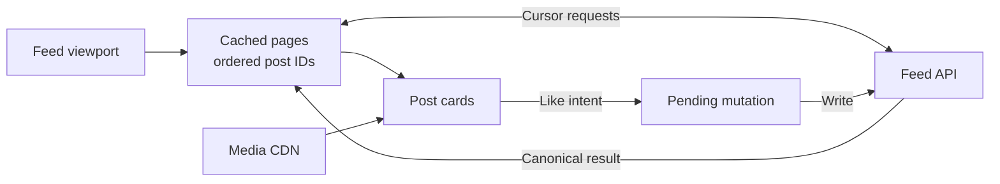
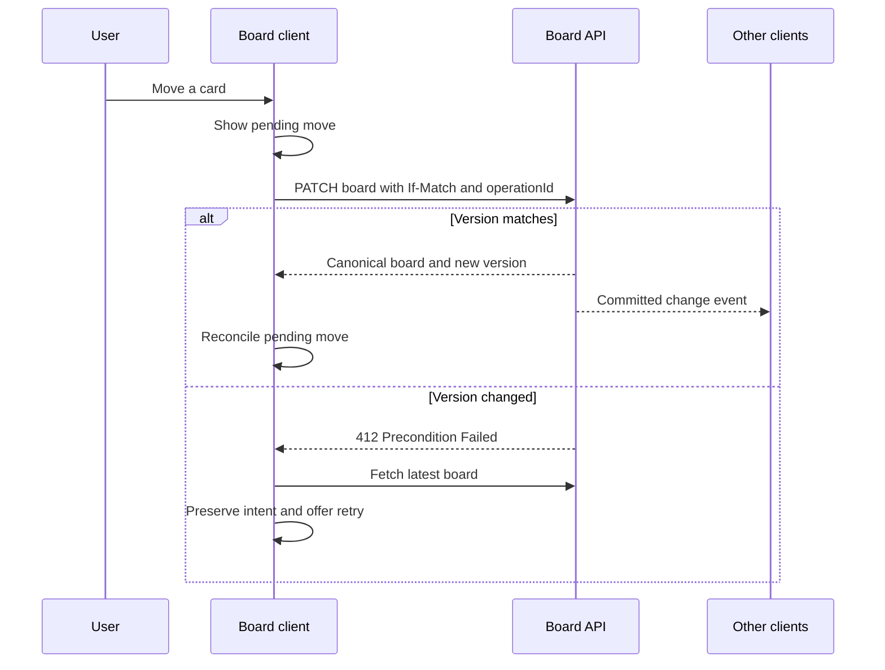

Connect **user journeys, component boundaries, state ownership, API contracts, and failure recovery**. Explain how each decision meets the requirements and adapt when they change.

Prepare for a **60-minute collaborative whiteboard interview with no coding**. Technical references checked **October 8, 2026**; the example architectures and APIs are illustrative.

## Use the hour deliberately

Adjust this schedule to the interviewer’s priorities.

| Time | Focus | What to put on the board |
|---|---|---|
| 0–7 min | Clarify requirements | Main users, two critical journeys, constraints, exclusions |
| 7–15 min | Sketch architecture | UI regions, component responsibilities, browser/server boundary |
| 15–25 min | Model data and contracts | Entities, state ownership, reads, writes |
| 25–43 min | Explore the hardest decisions | Rendering, caching, concurrency, performance |
| 43–55 min | Test the design against failures | Slow requests, conflicts, disconnection, accessibility |
| 55–60 min | Recap | Main trade-offs, remaining risks, next validation step |

A useful opening:

> “I’ll clarify the main journeys, sketch the architecture, and trace one read and one write. Then we can explore the areas you consider most important.”

## Clarify requirements

Before choosing tools, ask what changes the architecture:

- **Experience:** What must users accomplish? Which journey matters most?
- **Environment:** Mobile, desktop, low-end devices, supported browsers?
- **Scale:** How many items are loaded, visible, or updated per second? How many concurrent editors?
- **Freshness:** Can users see slightly stale data? Which actions need confirmed server results?
- **Continuity:** Must URLs be shareable? Must drafts survive reloads? Is offline editing required?
- **Delivery:** Does public content need search indexing? Are authentication and permissions involved?

Separate requirements from assumptions. Estimate quantities only when they affect a decision.

## Design components and state

Start with the page shell, feature regions, and reusable controls. Define each component’s responsibility, inputs, events, state, and loading/error behavior.

For search, the field owns draft text and keyboard interaction; the page coordinates committed filters; the data layer owns requests and cached results. Separate business rules from visual controls.

Assign each piece of state an owner and derive values when possible. Avoid independently editable copies of the same entity. [React’s state guidance](https://react.dev/learn/choosing-the-state-structure)

| State | Typical owner | Examples |
|---|---|---|
| Local interaction | Nearest relevant component | Open menu, focused item |
| Navigation | URL | Query, filters, sort, selected record |
| Server data | Query/cache layer | Products, posts, permissions |
| Shared client state | Feature or app store, when needed | Unsaved workflow spanning several screens |
| Durable draft | Persistence layer, if required | Recoverable form or offline edits |

## Define API contracts

For an important read and write, specify:

- Request parameters and response fields.
- Stable identifiers, ordering, pagination, and version information.
- Loading, empty, forbidden, failed, and stale UI states.
- Cancellation, retry conditions, and reconciliation after writes.
- Whether repeated requests are safe; define server deduplication before retrying non-idempotent operations.

Choose REST, GraphQL, or a frontend-specific aggregation endpoint based on data needs and existing infrastructure. Aggregation can reduce browser request chains but adds a service to operate.

## Choose cache policies

Caching is a consistency decision: define the cache location, key, freshness policy, and invalidation trigger.

Query keys must distinguish inputs that change results: account, query, filters, and sort. Scope private data to the current identity and clear it when the identity changes. [Query-key guidance](https://tanstack.com/query/latest/docs/framework/react/guides/query-keys)

HTTP caching is a separate layer:

- `no-cache` permits storage but requires validation before reuse.
- `no-store` prohibits storage.
- `private` prevents shared-cache storage.
- `ETag` supports conditional validation.

Choose these explicitly for public assets, public content, and personalized responses. [MDN HTTP caching](https://developer.mozilla.org/en-US/docs/Web/HTTP/Guides/Caching)

## Choose rendering per route

| Approach | Useful when | Cost to discuss |
|---|---|---|
| Static generation | Public content changes infrequently | Freshness and regeneration |
| Server rendering | Initial HTML and discoverability matter | Server latency, caching, hydration |
| Client rendering | Rich interaction dominates | JavaScript cost and initial data loading |

Combine approaches where useful. Hydration attaches client behavior to server-rendered HTML, so visible content can precede usable controls. [Rendering trade-offs](https://web.dev/articles/rendering-on-the-web)

For React roles, distinguish **Server Components** from SSR: Server Components keep their implementation code outside the browser bundle; SSR produces initial HTML. Interactive behavior still needs client components. [React Server Components](https://react.dev/reference/rsc/server-components)

## Include quality

- **Performance:** Reduce request chains, split heavy features, size images, and render only what is needed. Virtualization reduces mounted elements; pagination limits fetched data. Bound memory separately.
- **Accessibility:** Specify semantic controls, keyboard behavior, focus restoration, and announced errors. ARIA alone does not implement keyboard interaction. [W3C keyboard guidance](https://www.w3.org/WAI/ARIA/apg/practices/keyboard-interface/)
- **Security:** The server must authorize every request; hidden buttons do not enforce permissions. [OWASP authorization guidance](https://cheatsheetseries.owasp.org/cheatsheets/Authorization_Cheat_Sheet.html)
- **Reliability:** Preserve usable content during refresh failures, retain unsaved input, and offer meaningful recovery.
- **Validation:** Test state transitions and request races below the browser; test critical journeys, keyboard operation, and recovery end to end.

Measure real users. Current “good” Core Web Vitals thresholds are **LCP ≤ 2.5 seconds, INP ≤ 200 milliseconds, and CLS ≤ 0.1**, assessed at the **75th percentile**, separately for mobile and desktop. Also measure product outcomes such as search latency and failed saves. [Web Vitals](https://web.dev/articles/vitals)

## Example 1: Product search with autocomplete

Practice component design, request races, URL state, and caching.

- **Components:** Search field, suggestion list, filters, results grid, pagination.
- **Model:** Product identifiers plus display fields; results include `items`, `nextCursor`, and available facets.
- **Contract:** `GET /search?q=...&filters=...&sort=...&cursor=...`.
- **Flow:** Update typing immediately; debounce network requests. Cancel obsolete work with `AbortController`, and ensure only results matching the active query can appear. The browser supports cancellation; this design adds the active-query check. [AbortController](https://developer.mozilla.org/en-US/docs/Web/API/AbortController)
- **Accessibility:** Define arrow-key navigation, Enter selection, Escape dismissal, and focus behavior using the combobox pattern. [W3C combobox guidance](https://www.w3.org/WAI/ARIA/apg/patterns/combobox/)
- **Trade-off:** A longer debounce reduces requests but delays suggestions. Choose it through measurement.
- **Regression to describe:** An older, slower response must not replace newer results.

**Rehearse:** “The catalog grows from thousands to millions of products.” Move filtering and ranking to the server; keep the browser’s result and rendering budgets bounded.

## Example 2: A social feed

Practice pagination, memory, optimistic updates, and scroll continuity.

- **Components:** Feed page, post list, post card, composer, media viewer.
- **Model:** `Post{id, authorId, body, media, likedByMe, likeCount}`; pages contain ordered IDs and a cursor.
- **Pagination:** Define stable ordering or a server snapshot contract. A cursor alone does not prevent gaps when rankings change. Deduplicate overlapping pages by post ID.
- **Interaction:** Show a like immediately, then reconcile with the server. On failure, remove the failed optimistic change or refetch. Restoring an entire old snapshot can erase newer concurrent work. [Optimistic-update patterns](https://tanstack.com/query/latest/docs/framework/react/guides/optimistic-updates)
- **Continuity:** Preserve the reading position. Offer a “New posts” control instead of inserting content above the reader unexpectedly.
- **Trade-off:** Virtualization improves large-list performance but complicates variable heights, focus, and scroll restoration.
- **Regression to describe:** A failed like must not undo a later successful interaction.

**Rehearse:** “A user scrolls for an hour on a low-memory phone.” Bound cached pages and decoded media as well as DOM nodes, while retaining enough position information for recovery.

## Example 3: A collaborative task board

Practice shared state, concurrent edits, optimistic UI, and reconnect behavior.

- **Components:** Board, columns, cards, details panel, connection status.
- **Model:** `Board{id, revision}`, `Column{id, boardId}`, `Card{id, columnId, rank}`. Keep pending operations separate from confirmed server state.
- **Concurrency:** Send the board’s strong `ETag` through `If-Match`. The server atomically checks the precondition and applies the move; a mismatch returns `412 Precondition Failed`. [Conditional updates](https://developer.mozilla.org/en-US/docs/Web/HTTP/Reference/Headers/If-Match)
- **Transport:** HTTP writes plus server-sent events can support server-pushed board changes. Consider WebSockets when frequent bidirectional interaction warrants them. [SSE](https://developer.mozilla.org/en-US/docs/Web/API/Server-sent_events/Using_server-sent_events), [WebSockets](https://developer.mozilla.org/en-US/docs/Web/API/WebSockets_API)
- **Recovery:** Load a snapshot with its revision, then request events after that revision. Define replay and deduplication in the server contract. If replay is unavailable or a gap appears, fetch a fresh snapshot.
- **Accessibility:** Provide keyboard and menu-based moves alongside dragging.
- **Trade-off:** One board-wide version simplifies correctness but causes conflicts between otherwise independent edits. Introduce finer concurrency rules when contention justifies them.
- **Regression to describe:** Two users move the same card while one disconnects; reconnecting must converge on confirmed state without applying an operation twice.

**Rehearse:** “Offline editing becomes mandatory.” Add durable pending operations, visible sync status, and an explicit conflict policy before promising seamless recovery.

## Explain decisions

> “Given this requirement, I choose this approach because of this benefit; the cost is this trade-off, and I would revisit it if this condition changed.”

Test your diagramming tool and screen sharing before the interview. Rehearse one example in 45 minutes, then spend 15 minutes changing its requirements. Draw boundaries, label arrows, and trace one success and one failure so others can challenge your reasoning.

Continue with the [rehearsal schedule and self-review rubric](/docs/frontend/system-design-interview-rehearsal?path=frontend-system-design-interviews), then the six reported-interview exercises. Those guided labs use a separate 45/10/5 practice schedule.
