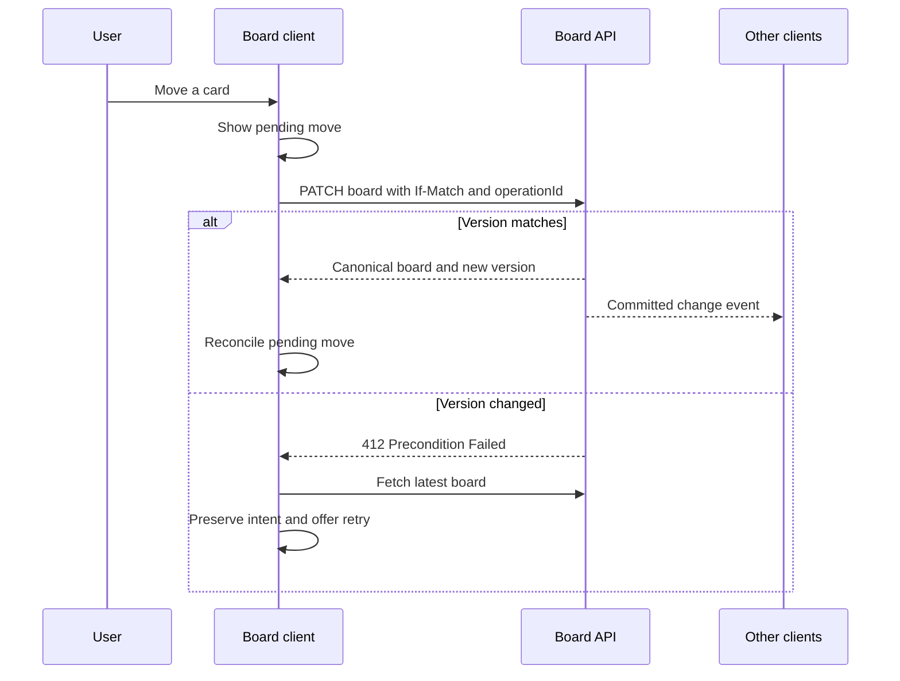

A P40 candidate’s June 29, 2025 report describes whiteboarding a Trello-like board: component architecture, state management, drag-and-drop, caching, and optimistic updates. [Candidate report](https://discuss.frontendlead.com/t/atlassian-frontend-engineer-p40-onsite/2192)

Company attribution and interview details are not independently verified. Sources checked October 8, 2026. The prompt is paraphrased; practice constraints, follow-ups, diagrams, and review criteria are Codematica additions unless labeled as reported.

## Practice prompt

Design a board where users create cards, move them between columns, and see teammates’ changes.

Use the [60-minute schedule and rubric](/docs/frontend/system-design-interview-rehearsal). Spend 45 minutes designing, 10 minutes handling follow-ups, and 5 minutes reviewing. No coding is required.

- **Define:** boards, columns, cards, ordering, permissions, and pending mutations.
- **Draw:** the component hierarchy and trace a card move through server confirmation to other clients.

## Follow-ups

Two users move the same card. A move succeeds but its response is lost. The board contains thousands of cards. Dragging is unavailable.

## Self-review

Explain conflict handling, reconnect recovery, and keyboard alternatives. Show why rolling back a failed move cannot erase a newer successful change.

## Starting diagram

This authored starting diagram illustrates a conditional-write contract. Define atomic server validation before relying on it. Extend it for a disconnected client returning.

[Start the guided rehearsal](/practice/frontend/system-design-kanban-lab?path=frontend-system-design-interviews). Record a prediction, check your evidence, and reflect. Completion is self-assessed; it is not an architecture grade.
