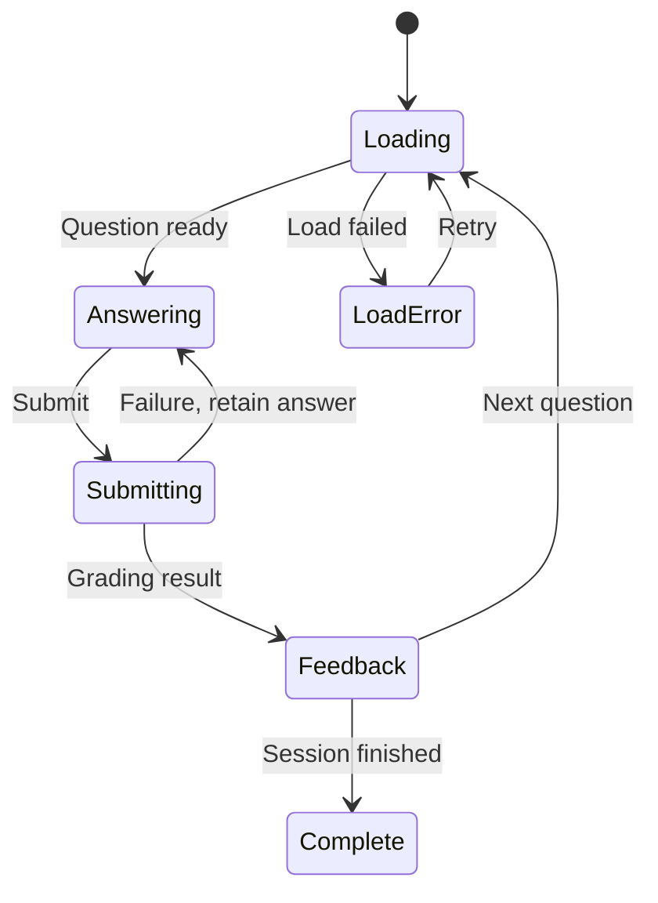

An Amazon FEE L5 candidate reported two learning workflows: choose the picture matching a word, and type the word matching a picture. The discussion also covered architecture and asset delivery. [Candidate report](https://www.reddit.com/r/cscareerquestions/comments/1iudddy/rainforest_loop_experience_frontend_l5_12_yoe/)

Company attribution and interview details are not independently verified. Sources checked October 8, 2026. The prompt is paraphrased; practice constraints, follow-ups, diagrams, and review criteria are Codematica additions unless labeled as reported.

## Practice prompt

Design a mobile-first learning app with both question types, answer feedback, and session progress.

Use the [60-minute schedule and rubric](/docs/frontend/system-design-interview-rehearsal). Spend 45 minutes designing, 10 minutes handling follow-ups, and 5 minutes reviewing. No coding is required.

- **Define:** question types, answer state, grading ownership, image loading, and progress persistence.
- **Draw:** the session controller, question renderers, asset delivery, and progress API.

## Follow-ups

An image fails to load. The user reloads after answering. A submission times out. Offline practice becomes required.

## Self-review

Can you add a question type without duplicating the session workflow? Can retrying a submission award progress twice?

## Starting diagram

Use this state diagram as a starting point. Extend it to show reload and an uncertain submission outcome.

[Start the guided rehearsal](/practice/frontend/system-design-learning-game-lab?path=frontend-system-design-interviews). Record a prediction, check your evidence, and reflect. Completion is self-assessed; it is not an architecture grade.
