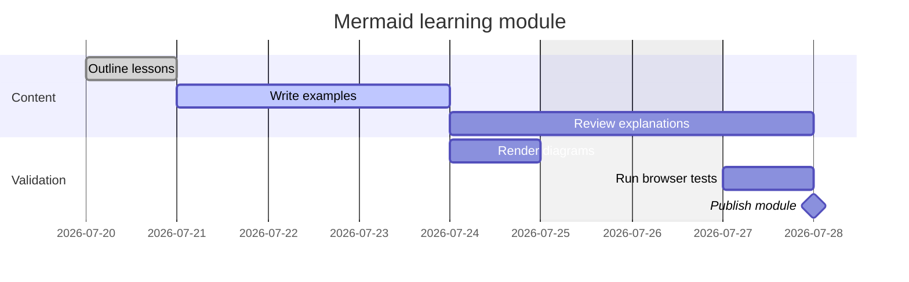
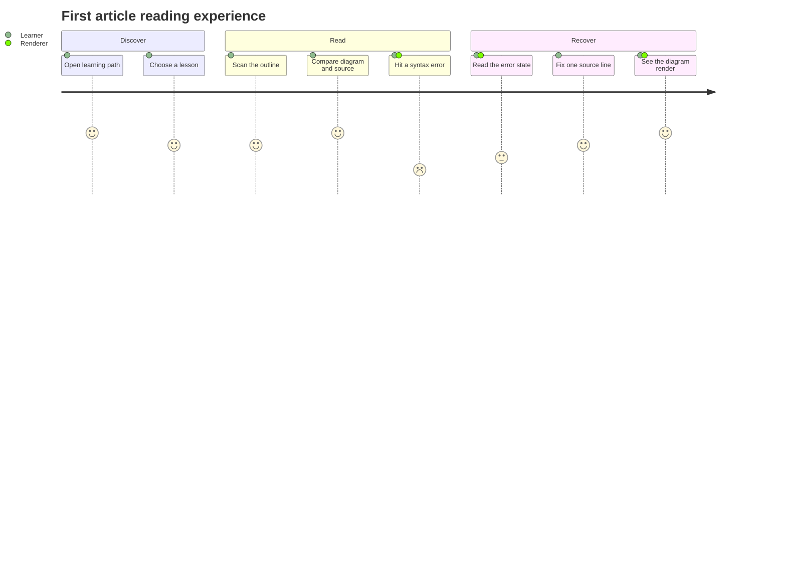
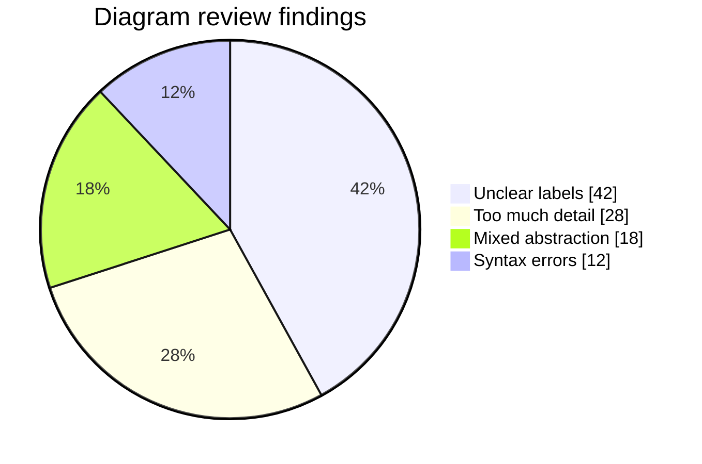
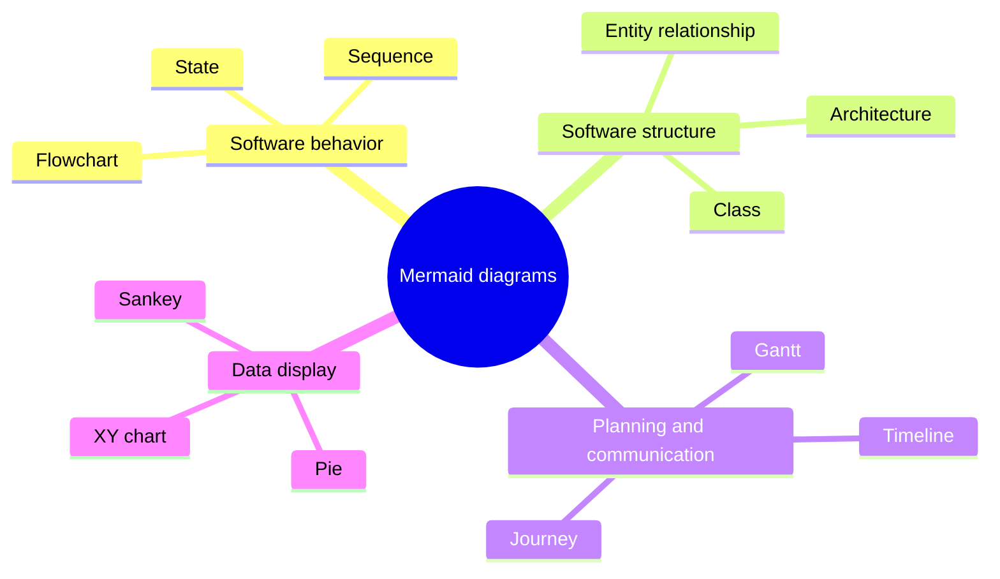
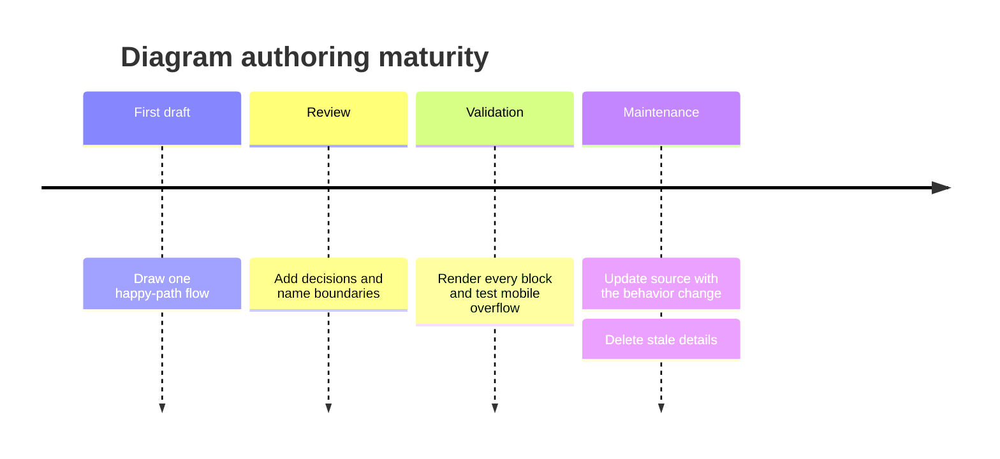
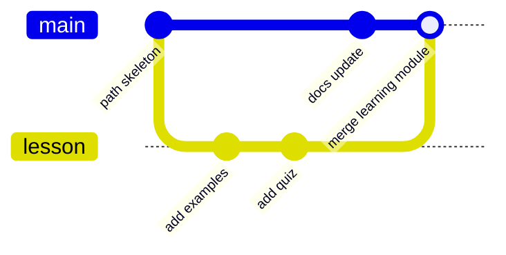

## Beyond Boxes And Arrows

Not every explanation is a system topology. Mermaid also includes grammars for schedules, user experience, proportions, hierarchy, chronology, and version-control history. These specialized diagrams are effective because they encode meaning directly. A Gantt task has a duration; a journey step has a score and actors; a pie slice has a numeric value.

The tradeoff is that each grammar has its own rules. Always begin with the declaration, then check that the data shape matches the question.

## Gantt: Work Across Time



Use Gantt when dates, durations, dependencies, and parallel work matter.

- `dateFormat` tells Mermaid how to parse dates.
- `section` groups related work.
- A task line is `Label :metadata`.
- IDs such as `outline` let later tasks use `after outline`.
- Status markers include `done`, `active`, `crit`, and `milestone`.
- `excludes weekends` adjusts task duration across excluded days; it does not cut a hole inside one continuous task bar.

A Gantt chart is not a replacement for a project system. It is a documentation snapshot. Keep its dates owned and reviewed, or it will become confident-looking stale data.

## User Journey: Experience By Actor



User journeys emphasize experience rather than implementation. Each task uses:

```text
Task name: score: actor, another actor
```

Scores range from 1 to 5 in the conventional Mermaid journey model. Use them consistently within one diagram. A score is an author judgment, not measured analytics unless the text says where the measurement came from.

Journey diagrams become especially useful when a failure and recovery path matter. A flowchart might show what the system does; the journey shows how that sequence feels to the learner and which actors participate.

## Pie: A Small Part-To-Whole Story



Use a pie chart only when categories form a meaningful whole and there are few enough slices to compare. Values do not need to be written as percentages; Mermaid calculates the proportions.

Avoid pie charts for values over time, many similar categories, negative values, or comparisons where exact differences matter. An XY chart or table is usually clearer in those cases. Example numbers should be labeled as illustrative when they are not real measurements.

## Mindmap: Hierarchy And Brainstorming



Mindmaps are indentation-based. The hierarchy comes from whitespace, so consistent indentation is semantic, not cosmetic. They work well for topic maps, discovery, taxonomies, and decomposing a broad idea.

A mindmap does not express time, cardinality, or runtime message order. If branches begin to need arrows and conditions, move to a flowchart.

## Timeline: Chronology Without Task Durations



Timeline syntax focuses on ordered periods or events. A period can have multiple events by adding another indented `: event` line. Use it for releases, incidents, decisions, or historical context when task duration and dependency math are unnecessary.

Mermaid's official documentation labels timeline as experimental, meaning parts of its syntax or capabilities may evolve. Keep version-sensitive diagrams small and run them through the same renderer used by your application.

## Git Graph: Branch And Merge History



Git graph diagrams explain a branching story, not every commit in a real repository. Use `branch`, `checkout`, `commit`, `merge`, and optionally `cherry-pick` to show the operations relevant to the lesson.

If readers need exact repository history, link to Git instead. A hand-authored Git graph should explain a strategy such as feature branching, release stabilization, or a hotfix flow.

## More Diagram Families To Recognize

Mermaid's official syntax catalog includes more specialized options. Availability can depend on the Mermaid version used by the host application.

| Family | Use it for |
| --- | --- |
| Quadrant chart | Positioning items across two scored axes |
| Requirement diagram | Requirements, elements, and verify/satisfy/trace relationships |
| Architecture diagram | Services, groups, junctions, and infrastructure relationships |
| C4 diagram | Context, container, component, and deployment views; Mermaid marks this area experimental |
| XY chart | Numeric lines and bars along axes |
| Sankey | Quantitative flow between stages |
| Block diagram | Manually structured block layouts |
| Packet | Bit-field and network packet layouts |
| Kanban | Work items grouped by workflow columns |
| Radar | Comparing several dimensions across series |
| Treemap | Hierarchical part-to-whole area |
| Ishikawa | Cause-and-effect or fishbone analysis |

Do not choose an exotic grammar merely because it exists. Choose it when its visual rules directly answer the reader's question and your deployed Mermaid version supports it.

## Debugging A Diagram That Will Not Render

Work from the parser outward:

1. Confirm the opening fence is `mermaid` and the closing fence exists.
2. Confirm the first meaningful source line is a valid diagram declaration.
3. Reduce the source to the declaration and one valid statement.
4. Add statements back until the error returns.
5. Check reserved words, quotes, indentation-sensitive grammars, and balanced `end` blocks.
6. Test the exact Mermaid version and configuration used by the application.
7. Keep the source fallback visible so readers are not left with an empty box.

Unknown grammar keywords usually fail parsing. Some unsupported parameters may instead be ignored, which is more dangerous because the diagram renders without the requested meaning. Review the output, not only the absence of errors.

## Advanced Readability Rules

- **One question per diagram.** A document may contain several diagrams at different abstraction levels.
- **Name relationships.** “publishes,” “depends on,” and “contains” are more useful than unlabeled lines.
- **Keep source order intentional.** Source order influences layout and is how reviewers read the diff.
- **Use styling sparingly.** Color should carry a small semantic vocabulary, such as failure or external ownership.
- **Prefer stable IDs.** Changing labels should not require rewriting every edge.
- **State omitted detail.** A diagram is a model, not the entire system.
- **Test narrow screens.** Wide diagrams need a deliberate scrolling or splitting strategy.
- **Treat text as untrusted.** Rendering hosts should use safe security settings when content can come from outside the repository.

## A Final Selection Checklist

- Process or branching logic: **flowchart**.
- Runtime collaboration over time: **sequence**.
- Static types and type relationships: **class**.
- Legal lifecycle transitions: **state**.
- Data entities and cardinality: **ER**.
- Tasks, dates, and dependencies: **Gantt**.
- User experience with actors and scores: **journey**.
- Small part-to-whole comparison: **pie**.
- Hierarchical idea map: **mindmap**.
- Ordered historical events: **timeline**.
- Branch and merge teaching story: **Git graph**.

## Reference Anchors

- [Mermaid diagram syntax catalog](https://mermaid.js.org/intro/syntax-reference.html)
- [Official Gantt syntax](https://mermaid.js.org/syntax/gantt.html)
- [Official user journey syntax](https://mermaid.js.org/syntax/userJourney.html)
- [Official pie chart syntax](https://mermaid.js.org/syntax/pie.html)
- [Official mindmap syntax](https://mermaid.js.org/syntax/mindmap.html)
- [Official timeline syntax](https://mermaid.js.org/syntax/timeline.html)
- [Official Git graph syntax](https://mermaid.js.org/syntax/gitgraph.html)
