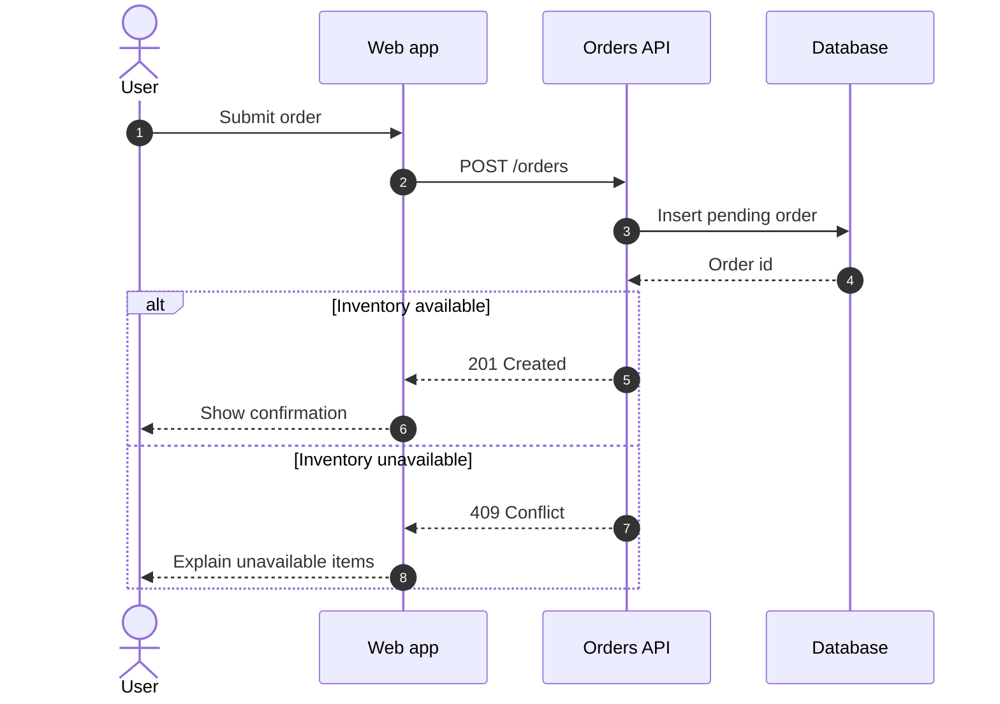
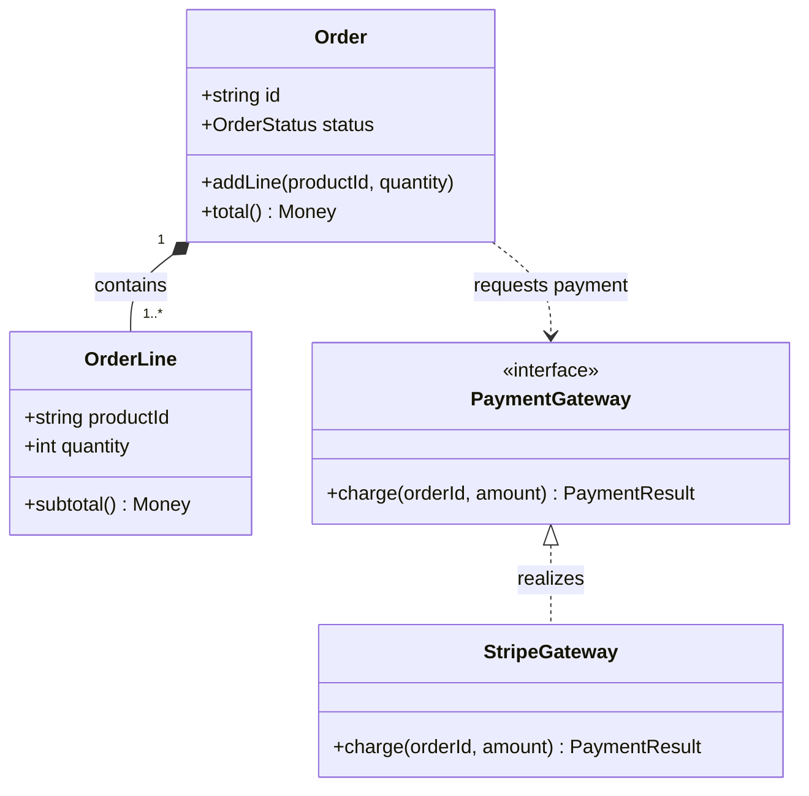
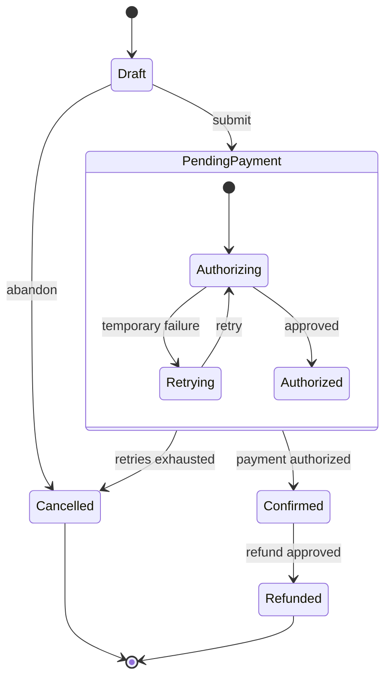
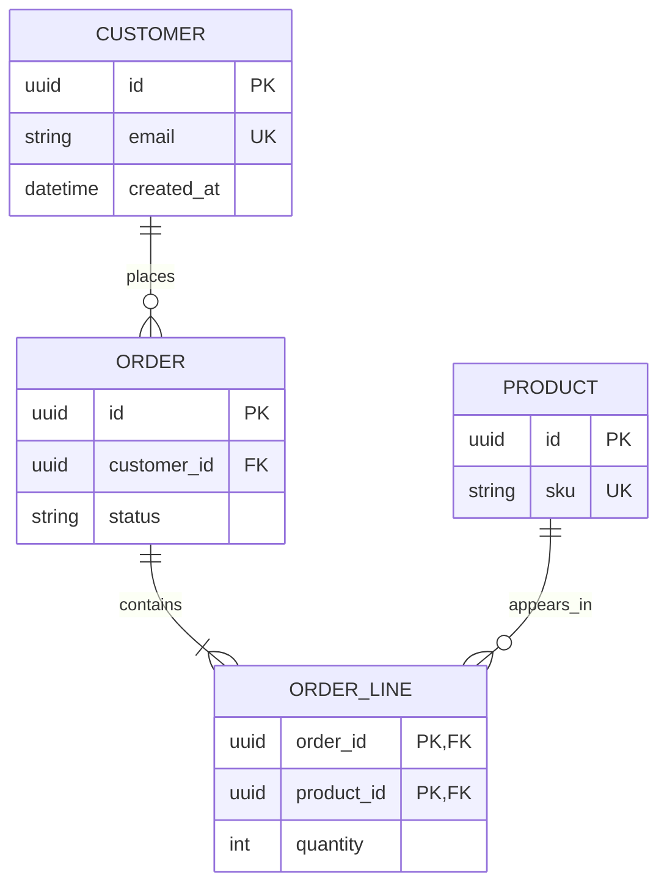

## Choose The Question, Then The Grammar

Four software diagram families are often confused because all of them contain boxes and lines. Their questions are different:

| Diagram | Best question | Main visual meaning |
| --- | --- | --- |
| Sequence | Who talks to whom, and in what order? | Time flows downward through messages |
| Class | What static types and relationships exist? | Structure, operations, inheritance, composition |
| State | Which states and transitions are legal? | Behavior over one lifecycle |
| Entity relationship | How can data records relate? | Entities, attributes, and cardinality |

Do not use a class diagram to explain runtime request order. Do not use a sequence diagram as a database schema. A precise grammar makes a diagram shorter because the reader already understands what each line means.

## Sequence Diagram: Runtime Collaboration

Read a sequence diagram from top to bottom. Participants form vertical lifelines; each arrow is a message at a point in time.

- `actor` gives a participant a person-like role.
- `participant API as Orders API` keeps a short source ID while showing a readable label.
- `->>` is a solid message arrow.
- `-->>` is a dashed response-style arrow in this documentation convention.
- `alt`, `else`, and `end` show mutually exclusive branches.
- `loop`, `opt`, `par`, and `critical` can express repetition, optional work, parallel work, and critical regions.
- `Note over API,DB: ...` can explain a subtle boundary without inventing another message.

Sequence diagrams become unreadable when they narrate every function call. Keep participants at the abstraction level needed by the question. A system overview might show browser, API, database, and provider. A detailed service diagram might show controller, use case, repository, and event publisher. Mixing both levels creates noise.

## Class Diagram: Static Design

A class diagram explains structure that exists independently of one request:

- A class body contains attributes and operations.
- `+` means public in UML-style notation; `-` means private; `#` means protected.
- `*--` means composition: the whole strongly owns the part.
- `o--` means aggregation: a looser whole-part relationship.
- `<|--` means inheritance.
- `<|..` means realization or interface implementation.
- `..>` means dependency.
- Quoted values near an association express multiplicity, such as one order containing one or more lines.

Do not copy every field and method from production code. A useful class diagram selects the types and relationships needed for one design discussion. Generated “all classes” diagrams usually reproduce complexity without explaining it.

## State Diagram: One Lifecycle

State diagrams answer “what may happen next?” rather than “what happened in this one trace.”

- `stateDiagram-v2` selects the current state grammar.
- `[*]` represents the initial or terminal pseudostate depending on arrow direction.
- `A --> B : event` declares a transition and labels its trigger or condition.
- `state Name { ... }` creates a composite state with internal states.

A state is a durable condition, not a temporary method call. “Pending payment” is a state if the order can remain there and behavior depends on it. “Call payment API” is an action and belongs on a transition or in a sequence diagram.

Review every state diagram for impossible or missing transitions. Can a confirmed order return to draft? Can a cancelled payment later become authorized through a delayed callback? The diagram should expose those product decisions.

## Entity-Relationship Diagram: Data Cardinality

Crow's-foot markers describe minimum and maximum cardinality at each end:

- `||` means exactly one.
- `o|` or `|o` means zero or one, depending on which side it appears.
- `o{` or `}o` means zero or more.
- `|{` or `}|` means one or more.
- `--` draws an identifying relationship; `..` draws a non-identifying relationship.

Read `CUSTOMER ||--o{ ORDER : places` as: one customer can place zero or more orders, and each order belongs to exactly one customer. The label is read from the first entity toward the second.

Attributes use `type name` plus optional keys such as `PK`, `FK`, and `UK`. Mermaid does not validate your database engine's real types or constraints. The diagram communicates a model; migrations and database tests enforce it.

## Comparing Similar-Looking Relationships

- Use a **sequence message** when order in time matters.
- Use a **class dependency** when one type knows about or calls another.
- Use a **state transition** when one entity changes durable condition.
- Use an **ER relationship** when record cardinality matters.

For example, “Order calls PaymentGateway” is a class dependency. “Orders API sends charge” is a sequence message. “Pending becomes confirmed” is a state transition. “Customer has many Orders” is an ER relationship. Those are four different facts and may deserve four focused diagrams.

## Authoring From Easy To Hard

For each family, begin with the smallest useful truth:

1. Sequence: two participants and one message.
2. Class: two classes and one relationship.
3. State: start, one state, and end.
4. ER: two entities and one cardinality relationship.

Render, check the meaning, and only then add alternatives, composite states, attributes, or multiplicities. When a complex diagram fails, temporarily remove the latest block instead of rewriting everything.

## Reference Anchors

- [Official sequence diagram syntax](https://mermaid.js.org/syntax/sequenceDiagram.html)
- [Official class diagram syntax](https://mermaid.js.org/syntax/classDiagram.html)
- [Official state diagram syntax](https://mermaid.js.org/syntax/stateDiagram.html)
- [Official entity-relationship syntax](https://mermaid.js.org/syntax/entityRelationshipDiagram.html)
