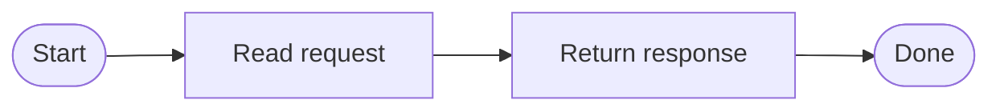
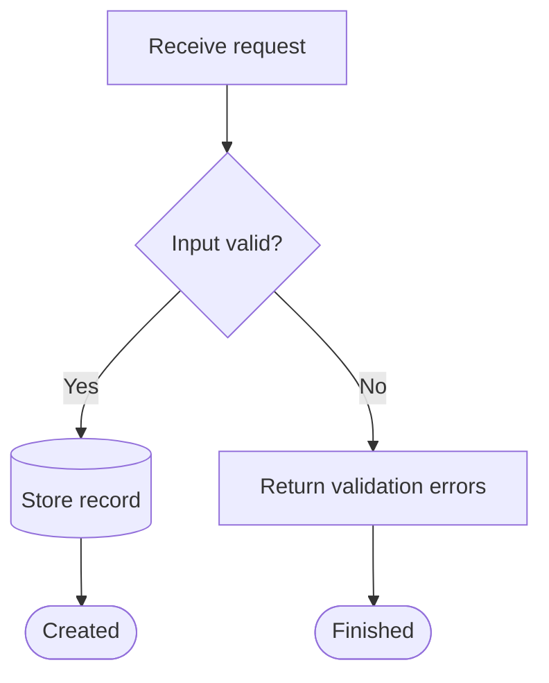
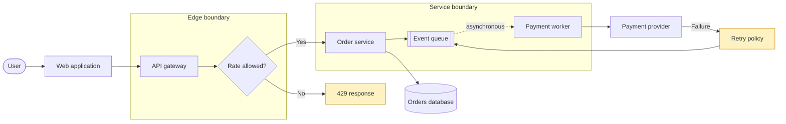

## Why Diagrams As Text

Mermaid turns a text definition into a diagram. That matters because text can live beside Markdown and code, participate in normal review, show meaningful diffs, and change without dragging shapes around a canvas. The source remains the durable explanation; the rendered SVG is a view of that source.

A diagram is useful only when it answers a question. Before writing syntax, finish this sentence:

> This diagram helps the reader understand **_____**.

If the answer is “the order of a request,” choose a flowchart or sequence diagram. If it is “which states are legal,” choose a state diagram. If it is “how records relate,” choose an entity-relationship diagram. Choosing the diagram family is part of writing clearly.

## Read A Mermaid Block In Three Layers

Every Mermaid definition can be read in three layers:

1. **Declaration:** the first meaningful line selects the grammar, such as `flowchart`, `sequenceDiagram`, or `erDiagram`.
2. **Things:** later lines declare nodes, participants, states, entities, tasks, or data points.
3. **Relationships:** arrows, transitions, messages, cardinalities, and indentation explain how those things connect.

In Codematica, a fenced block whose language is `mermaid` renders as a diagram. Expand **Source** beneath any example to compare the text with its output.

## Easy: A Three-Step Flow



Read the first line left to right:

- `flowchart` selects the flowchart grammar.
- `LR` asks the layout engine to arrange the main flow from left to right.
- `Start` is a stable node ID used by relationships.
- `([Start])` gives that node a visible label and a rounded terminal shape.
- `-->` is a directed edge.

IDs and labels serve different jobs. An ID should be short and stable; the label should explain the idea to a human. Reusing an ID refers to the same node instead of creating a copy.

### Direction Choices

Flowcharts commonly use:

- `TD` or `TB`: top to bottom, useful for long procedures and mobile reading.
- `LR`: left to right, useful for pipelines and request paths.
- `RL`: right to left.
- `BT`: bottom to top.

Direction is a request to the layout engine, not pixel positioning. Mermaid decides exact coordinates.

## Medium: Decisions, Labels, And Data



This example introduces semantic shapes and edge labels:

- `Task[Text]` creates a rectangular process.
- `Choice{Text}` creates a decision diamond.
- `Store[(Text)]` creates a cylindrical database shape.
- `([Text])` creates a rounded terminal.
- `-->|Yes|` labels the decision branch.

Shapes are visual vocabulary, not decoration. A diamond should mean a branch. A database cylinder should mean stored data. If every node uses a different shape, readers spend effort decoding style instead of understanding the system.

Useful edge forms include `-->` for a directed relationship, `---` for an undirected connection, `-.->` for a dotted directed relationship, and `==>` for a stronger rendered edge. Prefer one dominant edge meaning and label exceptions.

## Harder: Boundaries, Fan-Out, And Failure



The diagram is more advanced, but its source stays readable because it has boundaries and a main story:

- `subgraph ... end` groups nodes into a named boundary.
- One edge enters each boundary before the flow fans out.
- The dotted asynchronous edge communicates a different relationship.
- The failure class is reused instead of repeating styles.

The best way to create this diagram is incrementally. First render `User --> Web --> Gateway --> Orders`. Add the decision. Then add storage and asynchronous work. Finally add the failure loop. Rendering after each small change makes syntax errors easy to locate.

## Comments, Quoting, And Parser Safety

Use `%%` for a line comment:

```text
%% Explain why this unusual retry edge exists.
Worker --> Retry
```

Quote labels containing punctuation or parser-sensitive words:

```text
Finish["End request safely"]
```

Mermaid's official flowchart documentation warns that lowercase `end` can break a flowchart because `end` closes a subgraph. Use a different ID, capitalize the word, or quote it as display text. Similarly, do not build node IDs from full sentences. Keep IDs simple and put prose in labels.

## A Reliable Authoring Loop

1. Write the question the diagram must answer.
2. Pick the diagram family before writing relationships.
3. Add the declaration and two connected things.
4. Render immediately.
5. Add one relationship or boundary at a time.
6. Replace vague labels such as “process” with domain language.
7. Remove details that do not support the question.
8. Review the source and the rendered result at a narrow viewport.

## Readability Review

Ask these questions before merging a diagram:

- Is the intended reading direction obvious?
- Does every arrow have a consistent meaning?
- Are decisions phrased as questions with labeled outcomes?
- Do boundaries reflect real ownership or trust boundaries?
- Can the source be changed without deciphering generated IDs?
- Would deleting one-third of the nodes make the explanation clearer?

Complexity is not the number of nodes. Complexity is the amount of context a reader must hold at once. Several focused diagrams are usually better than one “everything architecture” diagram.

## Reference Anchors

- [Mermaid diagram syntax reference](https://mermaid.js.org/intro/syntax-reference.html)
- [Official flowchart syntax](https://mermaid.js.org/syntax/flowchart.html)
- [Official Mermaid examples](https://mermaid.js.org/syntax/examples.html)
