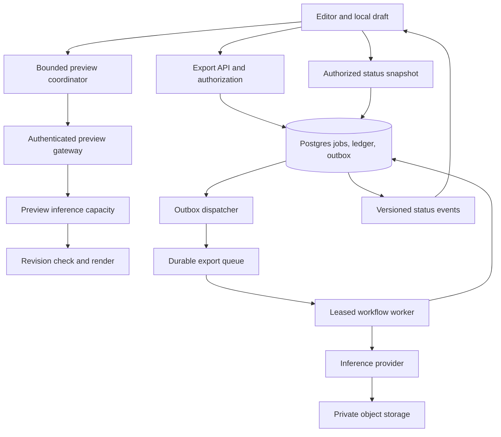
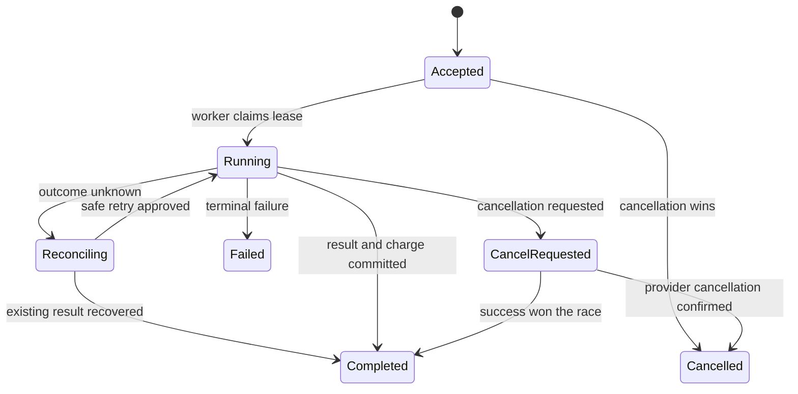

## The 30-minute design prompt

Design a collaborative AI image editor with interactive previews and durable paid exports. Users refresh tabs, switch workspaces, lose connections, and retry requests. GPU workers can crash after finishing the expensive operation. Prevent stale images, lost accepted jobs, cross-tenant access, and duplicate customer charges.

This is an original mock scenario. All scale numbers, SLOs, APIs, and architecture below are **exercise assumptions**, not any company's measured traffic, internal implementation, or promised service levels. Focus on durable execution and enterprise correctness.

## Clarify before drawing

Ask what is ephemeral, what must survive disconnect, how charging works, whether concurrent edits need offline merge, and which part of latency users notice. Agree to one region for durable metadata, regional workers, private workspace assets, and a success-only export charge with a temporary credit reservation. A preview is replaceable; an accepted export is not.

Use 2,000 active editors averaging two preview intents/second. That is **4,000 incoming intents/second**, before coalescing and admission control. If all were admitted and mean service time were 0.5 seconds, Little's Law suggests roughly **2,000 concurrent requests** in a stable system. That is not 2,000 GPUs: batching, model size, device utilization, and per-device concurrency require measurement. With capacity for 400 requests/second, choose a freshness/admission policy; an ever-growing FIFO cannot preserve interactive latency. Keep exports in a separate capacity budget so previews cannot starve them.

## Starting design



Postgres owns durable job state and charging decisions. Redis can help with admission, short-lived coordination, and caches. ClickHouse can serve analytics; it should not be the transactional entitlement authority in this design. Queue notifications and WebSocket messages deliver updates; retain a separate durable record of accepted work.

Define pending, intermediate, and terminal states explicitly in the API contract. An intermediate preview is progress, not a completed paid export. Specify which transitions generate notifications and how duplicate deliveries are handled. The database/outbox design is illustrative.

## The transaction boundary that matters

Propose these illustrative records:

| Record | Key and invariant |
| --- | --- |
| Job | `job_id`, `workspace_id`, immutable input revision, model/version/parameters, state, version, attempt token, provider operation ID |
| Submission | Unique `(workspace_id, idempotency_key)` plus request fingerprint; same key/same body returns the same job, changed body conflicts |
| Reservation/ledger | Unique `(job_id, entry_type)`; balance check and reservation are atomic; capture/release transitions cannot both win |
| Outbox | Stable event ID, job ID, payload/version, delivery state; inserted with accepted job and reservation |
| Asset | Workspace ownership, source job/revision, immutable object key, retention/access policy |

`POST /exports` authenticates the actor, authorizes the workspace, validates the immutable input, and checks entitlement. Atomically reserve credits and create the job/outbox entry, then return an accepted job ID. Scope idempotency to the tenant and define retention beyond the permitted retry window. Rate limiting is not idempotency. Two simultaneous requests that both read an available balance cannot both spend it without transactional concurrency control.

The dispatcher publishes pending outbox records and marks delivery afterward. A crash between publish and mark causes a duplicate, so workers deduplicate by durable job state. Claim work using a lease and monotonically increasing attempt/fencing token; accept a result only for the current attempt and legal state transition. A lease without a fence still lets a paused old worker overwrite a newer result.

## The hard failure: provider succeeded, worker disappeared

Suppose the provider rendered the image but the worker died before saving success. Redelivery alone cannot tell you whether another generation repeats the cost. Persist a stable provider request key before submission and use provider-supported idempotency or queryable operation IDs. Reconcile the outcome on retry. If the provider cannot deduplicate or reveal the result, describe the uncertainty and choose an explicit policy: pause for reconciliation or accept a bounded duplicate compute cost. Do not promise end-to-end exactly-once effects from a queue guarantee.

Once a result is verified, commit the winning asset pointer, terminal state, one ledger capture, and status outbox event in one database transaction. Store blobs before that transaction at immutable attempt-specific keys; a stale worker cannot replace the canonical pointer. Orphan cleanup is a separate retention-reviewed operation, not part of a retry shortcut. Failed/cancelled transitions release the reservation once. Cancellation racing success uses the same guarded state machine and an explicit product policy.



This is the exercise's simplified state machine, not a provider's API enum. Decide refund policy separately from whether bytes were computed. Browser abort/disconnect is not confirmed server cancellation.

## Optional lab: duplicate delivery versus one local effect

Run this after the timed architecture drill. [HTTP idempotency](https://www.rfc-editor.org/rfc/rfc9110.html#section-9.2.2) concerns the intended effect of repeating a request; responses and request logs can still differ. A POST needs an application contract to make a retry safe. A missing response does not prove rollback.

An external provider has its own contract. For example, [Stripe's idempotent-request API](https://docs.stripe.com/api/idempotent_requests) retains the first executed result, including a 500 response, and documents a retention window and request-parameter checks. Do not infer another provider's behavior from this example or retry with a fresh key merely because a response was lost.

This original Python 3.13+ fixture spends fictional credits in a temporary SQLite database. It performs no network, payment or provider call. Its request is just an amount; a real endpoint must authenticate and authorize before returning receipts and fingerprint every field that changes the operation. Receipts are retained for this short experiment; production retention and key reuse need an explicit policy.

[SQLite supports one writer at a time](https://www.sqlite.org/lang_transaction.html). `BEGIN IMMEDIATE` serializes the two connections before either reads the receipt. [Python's `isolation_level=None`](https://docs.python.org/3.13/library/sqlite3.html#transaction-control-via-the-isolation-level-attribute) lets this fixture control SQL transactions explicitly. This demonstrates a local atomic boundary, not PostgreSQL locking behavior, distributed exactly-once processing or a throughput benchmark.

Save the block as `durable_retry_lab.py` and run `python3 durable_retry_lab.py`. Predict the balances and receipt count before executing:

```python
from concurrent.futures import ThreadPoolExecutor
from contextlib import closing
from pathlib import Path
import sqlite3
from tempfile import TemporaryDirectory
from threading import Barrier

with TemporaryDirectory() as directory:
    database = Path(directory) / 'credits.sqlite'
    with closing(sqlite3.connect(database, isolation_level=None)) as setup:
        setup.executescript('''
            CREATE TABLE credits(workspace TEXT PRIMARY KEY, balance INTEGER NOT NULL);
            INSERT INTO credits VALUES ('a', 100), ('b', 100);
            CREATE TABLE receipts(
                workspace TEXT, key TEXT, amount INTEGER, result INTEGER,
                PRIMARY KEY (workspace, key)
            );
        ''')

    def spend(workspace, key, amount, failure=None):
        if amount <= 0:
            raise ValueError('amount must be positive')
        connection = sqlite3.connect(database, timeout=5, isolation_level=None)
        try:
            connection.execute('BEGIN IMMEDIATE')
            previous = connection.execute(
                'SELECT amount, result FROM receipts WHERE workspace=? AND key=?',
                (workspace, key),
            ).fetchone()
            if previous:
                if previous[0] != amount:
                    raise ValueError('same key, different request')
                connection.commit()
                return previous[1]
            balance = connection.execute(
                'SELECT balance FROM credits WHERE workspace=?', (workspace,),
            ).fetchone()
            if balance is None or balance[0] < amount:
                raise ValueError('missing workspace or insufficient credits')
            result = balance[0] - amount
            connection.execute('UPDATE credits SET balance=? WHERE workspace=?',
                               (result, workspace))
            connection.execute('INSERT INTO receipts VALUES (?, ?, ?, ?)',
                               (workspace, key, amount, result))
            if failure == 'before_commit':
                raise RuntimeError('injected before commit')
            connection.commit()
            if failure == 'lost_response':
                raise RuntimeError('commit happened; response was lost')
            return result
        finally:
            if connection.in_transaction:
                connection.rollback()
            connection.close()

    barrier = Barrier(2)
    def concurrent_retry(_):
        barrier.wait(timeout=5)
        return spend('a', 'export-1', 10)
    with ThreadPoolExecutor(max_workers=2) as pool:
        assert list(pool.map(concurrent_retry, range(2))) == [90, 90]
    try:
        spend('a', 'export-2', 10, 'before_commit')
    except RuntimeError:
        pass
    else:
        raise AssertionError('before-commit failure did not occur')
    with closing(sqlite3.connect(database)) as check:
        assert check.execute("SELECT balance FROM credits WHERE workspace='a'").fetchone()[0] == 90
        assert check.execute("SELECT count(*) FROM receipts WHERE key='export-2'").fetchone()[0] == 0
    assert spend('a', 'export-2', 10) == 80
    try:
        spend('a', 'export-3', 10, 'lost_response')
    except RuntimeError:
        pass
    else:
        raise AssertionError('lost-response failure did not occur')
    with closing(sqlite3.connect(database)) as check:
        assert check.execute("SELECT balance FROM credits WHERE workspace='a'").fetchone()[0] == 70
        assert check.execute("SELECT count(*) FROM receipts WHERE key='export-3'").fetchone()[0] == 1
    assert spend('a', 'export-3', 10) == 70
    try:
        spend('a', 'export-1', 20)
    except ValueError:
        pass
    else:
        raise AssertionError('changed request was accepted')
    assert spend('b', 'export-1', 10) == 90
    assert spend('a', 'export-1', 10) == 90  # Original receipt, not current balance.
    with closing(sqlite3.connect(database)) as check:
        assert check.execute('SELECT * FROM credits ORDER BY workspace').fetchall() == [('a', 70), ('b', 90)]
        assert check.execute('SELECT count(*) FROM receipts').fetchone()[0] == 4
    print('concurrent retry, rollback, lost response, request conflict and tenant scope: passed')
```

Expected: the final line reports all five cases passed; workspace `a` has 70 credits, `b` has 90, and four receipts remain until the temporary directory closes. A repeated `export-1` returns its original receipt of 90 even though `a` now has 70. It is an operation result, not a current-balance query.

Inspect state **before** retrying: a pre-commit failure leaves neither debit nor receipt; a lost post-commit response leaves both. Move the commit before receipt insertion and confirm the pre-retry assertion fails. Then remove the changed-request check or tenant scope and confirm the corresponding assertion fails. Keeping those mutations green would leave a gap in the evidence.

An external payment cannot join this SQLite transaction. Extend the design with durable intent, a stable provider operation identity, reconciliation and a guarded capture/release transition; the lab does not implement that integration. Complete the [Durable Retry Lab Checkpoint](/practice/software-engineering/durable-retry-lab-checkpoint).

## Reconnect, collaboration, and authorization

Persist each export's immutable input revision. Stream `{jobId, version, state}` updates; ignore stale/duplicate versions and fetch an authorized snapshot when a gap appears. On reconnect, obtain a snapshot plus a replay cursor, or subscribe-and-buffer before fetching, so no update is lost between the two. A dropped socket must not create a new export. Cursor expiry should trigger snapshot recovery.

For shared canvas state, explain a CRDT or server-ordered operation log, stable node IDs, offline edits, undo, and conflict semantics. CRDT convergence does not authorize a job, enforce balances, or guarantee the latest inference result matches the canvas. Validate graph operations and generated-result attachments separately. For a node workflow, topologically schedule ready nodes, reject cycles, deduplicate each node's execution, and invalidate descendants when an upstream input changes.

Authorize every status read, event subscription, retry, cancellation, and asset download. Cache keys include workspace, model revision, input fingerprint, parameters, and relevant policy version. Keep generated outputs private by default with short-lived authorized URLs. Client caches cannot serve as the source of truth for entitlements. Explain how revocation interrupts future actions and how already accepted work is handled.

## Pub/Sub versus webhooks is not a binary choice

[Pub/Sub supports pull and push subscriptions](https://docs.cloud.google.com/pubsub/docs/subscriber). A push subscriber receives HTTP requests; a durable bus can sit behind a webhook receiver. Compare producer/consumer coupling, fan-out, retention, replay, retry ownership, and operational control. Acknowledge only after durable acceptance or the effect your contract requires, and budget lease extensions for variable work. Keep retry delay bounded with jitter, retryable error classification, an attempt/deadline budget, and a dead-letter/reconciliation path.

When reviewing a provider integration, confirm exactly which transitions produce notifications: admission, start, intermediate progress, or terminal outcome. Document signature verification, delivery retry windows, and ordering guarantees before relying on them. Clarify undocumented capabilities before assuming they are absent. Never treat possession of a job ID as proof a webhook is authentic—verify a supported signature or reconcile with an authenticated status read before trusted side effects.

## Separate Kafka progress from an external effect

The [Kafka 4.1 design reference](https://kafka.apache.org/41/design/design/) distinguishes committing progress before processing from committing after processing. The former risks missing work; the latter permits repeated work after a crash. A consumer group does not prove that an external charge happens once. Kafka transactions can bind Kafka output records and consumed offsets; downstream `read_committed` matters. An external destination needs its own coordinated effect/receipt boundary.

For this original export scenario, predict a crash at each boundary:

| Boundary | Evidence to recover |
| --- | --- |
| Offset saved before the fictional debit | Progress moved, but the required effect may be missing |
| Debit committed, offset not saved | Delivery may repeat; reuse the matching durable receipt |
| Provider accepted work, response lost | Outcome is uncertain; reconcile the stable operation identity |

Keep retention long enough for the agreed recovery window and document what happens after that window. A dead-letter route needs ownership, alerts and a replay policy; moving a failed record is not successful completion. This is a design exercise, not an executed Kafka cluster or certification of connectors, windowing, CDC or Saga implementations.

## Recover Redis work without treating an ack as a receipt

[Redis Pub/Sub](https://redis.io/docs/latest/develop/pubsub/) cannot replay a message lost by a disconnected subscriber. Use it only where loss is acceptable or authorized snapshot recovery supplies the missing state. A shared session store also needs an explicit outage policy; a Redis connection is not the durable job contract.

For a Stream consumer group, [`XACK`](https://redis.io/docs/latest/commands/xack/) removes an entry from that group's pending list. It does not atomically commit our SQL debit or an external provider effect. [`XAUTOCLAIM`](https://redis.io/docs/latest/commands/xautoclaim/) transfers sufficiently idle pending entries; reclaiming does not stop a worker that is still executing. Guard effects with current ownership/version and durable operation identity. Retention, persistence and failover policies still bound recovery. Since Redis 7.0, the claim reply also identifies pending entries whose underlying records were removed; those entries cannot supply the missing payload.

In an original review trace, worker A commits a debit and crashes before acknowledging. Worker B claims the pending entry and finds the same scoped receipt: no second debit. If A merely pauses and resumes after B claims, neither worker may bypass the effect store's guard. If retention removed the payload, surface the gap and recover from authorized durable state; do not declare the job completed from a missing pending entry. Extend the existing SQLite experiment's crash receipt; it neither runs Redis nor demonstrates an atomic transaction across the broker and SQL.

## Define reliability from the user's view

Proposed targets to negotiate: 99% of admitted preview requests reach a current, usable preview within 1 second; 99.9% of accepted exports reach a truthful terminal outcome within the agreed model-specific deadline over 30 days. These are distinct quality and liveness signals: a fast terminal failure meets truthful-outcome liveness but fails the usable-result metric. Track success rate separately, include backend failures, and report intentional cancellations separately under a documented denominator. Missing terminal outcomes remain failures after the deadline.

Instrument the [four golden signals](https://sre.google/sre-book/monitoring-distributed-systems/) at the API and workers, plus queue age, active leases, coalesced intents, stale-result suppression, retries, timeouts, cancellation outcomes, reconciliation backlog, and ledger mismatches. Split end-to-end latency into client handling, queueing, inference, storage transfer, decoding, and rendering. Use model/version/region/outcome as bounded metric dimensions. Keep job/request IDs in restricted traces/logs; avoid prompts, images, tokens, or user IDs as metric labels.

Carry trace context from request to outbox/queue to worker/provider adapter, and link retries to the same job. [OpenTelemetry traces](https://opentelemetry.io/docs/concepts/signals/traces/) connect operations across service boundaries. Page for sustained user-facing failure or error-budget burn; use dashboards for diagnosis. A green HTTP status does not prove an export is usable.

## Incident injection and first refactor

At minute 20, introduce: **p95 preview latency jumps from 0.8 to 3 seconds after a deploy; inference duration is flat; duplicate charge reports appear after worker restarts.** These are fictional symptoms.

First contain the charge risk using the narrowest safe admission/reconciliation control, retain evidence, and inspect ledger transitions. For latency, compare cohorts and per-stage spans; flat inference points toward queueing, request volume, network/decoding, or rendering, not automatically a GPU shortage. Roll back/canary the implicated change based on evidence. Do not claim recovery until user-facing SLIs and affected job/ledger reconciliation confirm it.

Prioritize correctness at the payment/job boundary, then queue/admission observability, then expensive architectural rewrites. Require concurrency tests, duplicate/redelivery tests, crash-point injection, reconnect tests, tenant-isolation tests, and safe startup of the actual pruned artifact when packaging or entrypoints change. Never test these scenarios against live paid generations.
