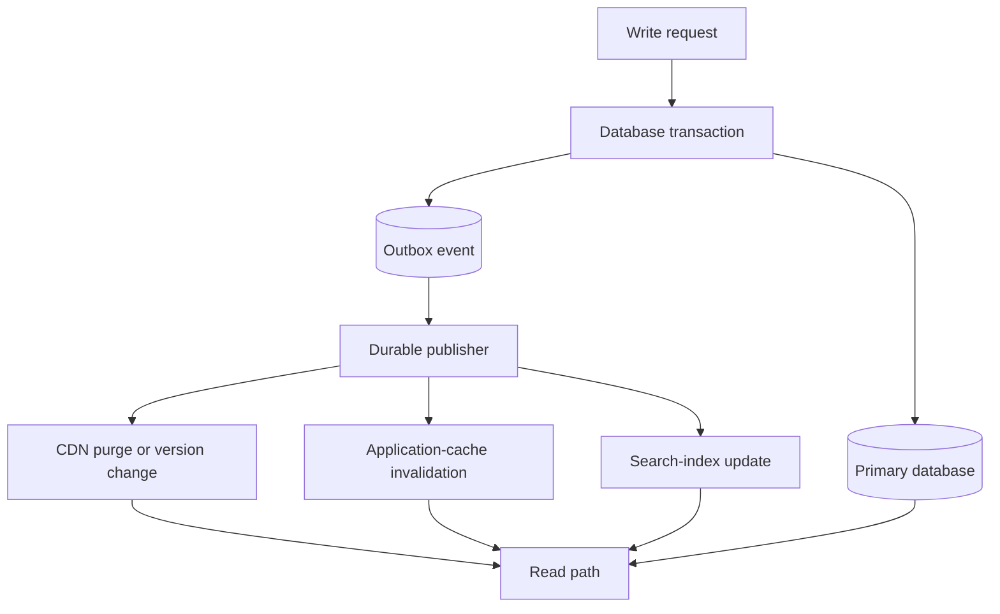

## Core Decision

Cache invalidation is not a cleanup task. It is a product contract about how stale the user experience is allowed to be, how expensive recomputation can become, and which system owns truth when writes happen.

The first question is not "which cache should we use?" The first question is "what is the acceptable lie?" A product feed can tolerate seconds of drift. A billing ledger cannot. A permissions system usually cannot either, unless every sensitive operation re-checks the source of truth.

## Strategy Map

Use time-based expiration when stale data is cheap and obvious. Use event-driven invalidation when stale data creates user-visible contradictions. Use versioned keys when reads fan out and deletion is hard to make complete.

The write and its invalidation event must have an ordering contract. Publishing before commit can evict the cache and let a concurrent reader repopulate it with old data. Committing and then publishing can lose the event if the process crashes between those operations. A transactional outbox records the state change and event atomically; an idempotent publisher and consumers handle retries. This provides repairable at-least-once delivery, not magical exactly-once execution.

## Read-Path Safety

Cache-aside needs stampede control when a hot key expires. Use request coalescing, bounded stale-while-revalidate, jittered expirations, or admission limits so thousands of misses do not become thousands of origin reads. Negative caching can protect an origin from repeated misses, but use a short TTL when the missing object may be created soon.

In multi-level caches, invalidating only the application cache is insufficient if a browser, CDN, or derived search index can still serve the old representation. Name every layer, its key, freshness budget, purge mechanism, and observable age.

## Operational Tests

Good invalidation designs answer these questions before launch:

- Can a failed invalidation be replayed without corrupting newer data?
- Does the read path have a deterministic fallback when the cache is cold?
- Can operators see the age, hit rate, and key cardinality of the cache?
- Does a write commit before or after the invalidation event becomes visible?
- Can an old or duplicated event overwrite a newer value, or do consumers compare entity versions?
- What prevents a hot-key miss from overwhelming the source of truth?

## Failure Modes

The dangerous failures are silent. A stale permission cache may look like a fast system until it becomes a security incident. A stale recommendation cache may only look like weak personalization. Treat cache classes differently instead of forcing one global freshness rule.

## Implementation Heuristic

Start with cache-aside for simple expensive reads. Add explicit invalidation events for entities users edit directly. Move to versioned keys for composite views, feed pages, and computed projections where deleting every derived key is unreliable.

For authorization, balances, inventory reservations, and other critical decisions, the cache should usually accelerate a read rather than become the final authority. Fail closed or revalidate against the source of truth when stale state would violate a safety invariant.

## Reference Anchors

- [RFC 9111: HTTP Caching](https://www.rfc-editor.org/rfc/rfc9111)
- [AWS Builders' Library: Caching challenges and strategies](https://aws.amazon.com/builders-library/caching-challenges-and-strategies/)
- [AWS Prescriptive Guidance: Transactional outbox pattern](https://docs.aws.amazon.com/prescriptive-guidance/latest/cloud-design-patterns/transactional-outbox.html)
