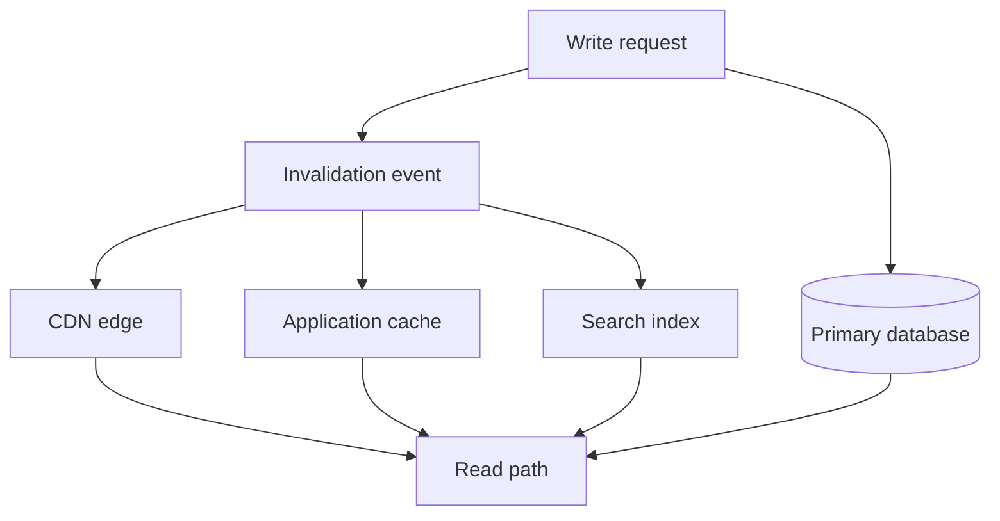

## Core Decision

Cache invalidation is not a cleanup task. It is a product contract about how stale the user experience is allowed to be, how expensive recomputation can become, and which system owns truth when writes happen.

The first question is not "which cache should we use?" The first question is "what is the acceptable lie?" A product feed can tolerate seconds of drift. A billing ledger cannot. A permissions system usually cannot either, unless every sensitive operation re-checks the source of truth.

## Strategy Map

Use time-based expiration when stale data is cheap and obvious. Use event-driven invalidation when stale data creates user-visible contradictions. Use versioned keys when reads fan out and deletion is hard to make complete.

## Operational Tests

Good invalidation designs answer these questions before launch:

- Can a failed invalidation be replayed without corrupting newer data?
- Does the read path have a deterministic fallback when the cache is cold?
- Can operators see the age, hit rate, and key cardinality of the cache?
- Does a write commit before or after the invalidation event becomes visible?

## Failure Modes

The dangerous failures are silent. A stale permission cache may look like a fast system until it becomes a security incident. A stale recommendation cache may only look like weak personalization. Treat cache classes differently instead of forcing one global freshness rule.

## Implementation Heuristic

Start with cache-aside for simple expensive reads. Add explicit invalidation events for entities users edit directly. Move to versioned keys for composite views, feed pages, and computed projections where deleting every derived key is unreliable.
