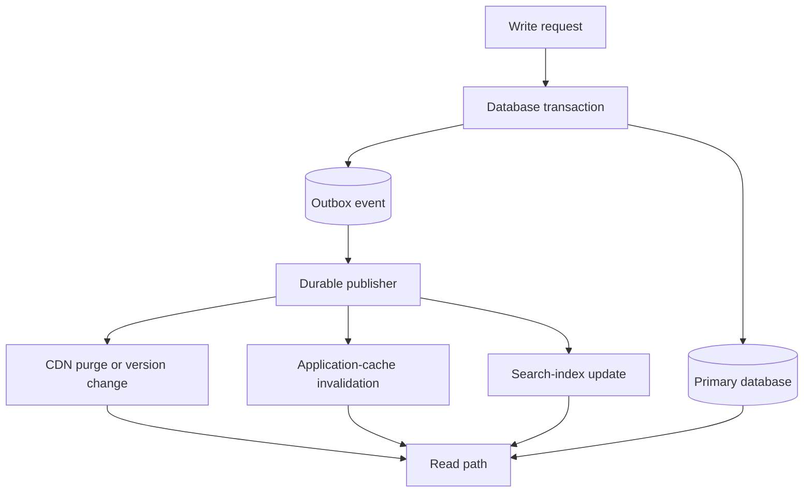

## Core Decision

Cache invalidation defines acceptable staleness, recomputation cost, and which system is authoritative after a write.

Define acceptable staleness before choosing a cache. A product feed can tolerate seconds of drift; a billing ledger cannot. A permissions system usually cannot either, unless every sensitive operation re-checks the source of truth.

## Strategy Map

```mermaid
flowchart TD
  W[Write request] --> TX["Database transaction"]
  TX --> DB[(Primary database)]
  TX --> O[(Outbox event)]
  O --> Q[Durable publisher]
  Q --> CDN[CDN purge or version change]
  Q --> App[Application-cache invalidation]
  Q --> Search[Search-index update]
  CDN --> R[Read path]
  App --> R
  Search --> R
  DB --> R
```

Use time-based expiration when stale data is cheap and obvious. Use event-driven invalidation when stale data creates user-visible contradictions. Use versioned keys when reads fan out and deletion is hard to make complete.

The write and its invalidation event must have an ordering contract. Publishing before commit can evict the cache and let a concurrent reader repopulate it with old data. Committing and then publishing can lose the event if the process crashes between those operations. A transactional outbox records the state change and event atomically; an idempotent publisher and consumers handle retries. This provides repairable at-least-once delivery, not exactly-once execution.

## Read-Path Safety

Cache-aside needs stampede control when a hot key expires. Use request coalescing, bounded stale-while-revalidate, jittered expirations, or admission limits so thousands of misses do not become thousands of origin reads. Negative caching can protect an origin from repeated misses, but use a short TTL when the missing object may be created soon.

In multi-level caches, invalidating only the application cache is insufficient if a browser, CDN, or derived search index can still serve the old representation. Name every layer, its key, freshness budget, purge mechanism, and observable age.

## Study coalescing without confusing it with caching

[Discord's 2023 engineering report](https://discord.com/blog/how-discord-stores-trillions-of-messages) describes Rust data services that share an in-flight query among concurrent readers. Channel-based routing brings related requests to the same service instance. The report also says hot partitions remained possible; changing databases was not their only intervention. This is an attributed production case, not a local benchmark or a claim that Discord implemented Go's `singleflight` package.

In an original review scenario, two tenants request a similarly named object. Write the key that identifies equivalent authorized work: include the relevant tenant, permissions, query shape and version. A shared name alone is insufficient. Distinguish joining an active read from retaining its result in a cache.

Trace one waiter cancelling, the loader failing, and two service instances receiving the same key. Define bounded active keys, waiters and deadlines; show when a failed entry is removed. These are review requirements for your implementation, not claims about Discord's private cancellation policy. Coalescing identical reads does not bound unrelated-key traffic or replace admission control.

## Operational Tests

Before launch, answer:

- Can a failed invalidation be replayed without corrupting newer data?
- Does the read path have a deterministic fallback when the cache is cold?
- Can operators see the age, hit rate, and key cardinality of the cache?
- Does a write commit before or after the invalidation event becomes visible?
- Can an old or duplicated event overwrite a newer value, or do consumers compare entity versions?
- What prevents a hot-key miss from overwhelming the source of truth?

## Failure Modes

Silent failures have different consequences: stale permissions can cause a security incident while the system appears fast; stale recommendations may look like weak personalization. Set freshness rules by cache class.

## Implementation Heuristic

Start with cache-aside for simple expensive reads. Add explicit invalidation events for entities users edit directly. Move to versioned keys for composite views, feed pages, and computed projections where deleting every derived key is unreliable.

For authorization, balances, inventory reservations, and other critical decisions, the cache should usually accelerate a read rather than become the final authority. Fail closed or revalidate against the source of truth when stale state would violate a safety invariant.

## Reference Anchors

- [RFC 9111: HTTP Caching](https://www.rfc-editor.org/rfc/rfc9111)
- [AWS Builders' Library: Caching challenges and strategies](https://aws.amazon.com/builders-library/caching-challenges-and-strategies/)
- [AWS Prescriptive Guidance: Transactional outbox pattern](https://docs.aws.amazon.com/prescriptive-guidance/latest/cloud-design-patterns/transactional-outbox.html)
