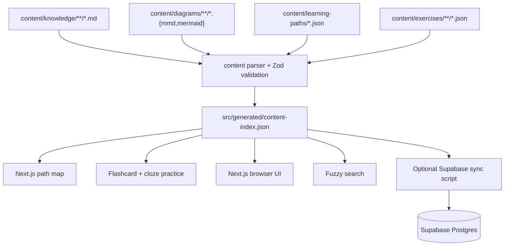

# Codematica Engineering Overview

Last updated: 2026-05-30

Codematica is a mobile-first learning app for system design, coding, programming, and software engineering. V1 keeps the product intentionally local-first: author documents as Markdown, author paths and exercises as JSON, generate a static study index, and render the app with Next.js.

## Current Stack

- Next.js App Router
- React and TypeScript
- Tailwind CSS
- plain Markdown rendered with `react-markdown`
- Mermaid rendered client-side
- Fuse.js-style fuzzy search
- local JSON learning paths and practice prompts
- Vitest for unit/integration tests
- Playwright for mobile smoke tests
- optional Supabase Postgres scaffold for later hosted search

## Content Flow

## Runtime Boundaries

V1 runtime reads `src/generated/content-index.json`. It does not require Supabase credentials, auth, storage, or edge functions.

Supabase is prepared for later:

- `kb_documents` stores Markdown metadata, body, extracted text, headings, and Mermaid blocks.
- `kb_diagrams` stores external diagram metadata and source.
- `search_kb` provides a future SQL search entrypoint.
- RLS is enabled from the start.

## Content Model

Every article has frontmatter with title, slug, summary, track, topic, difficulty, tags, prerequisites, diagram references, and status. The parser validates this contract before generating the index.

External diagrams are stored separately and referenced by slug from article frontmatter. Embedded Mermaid blocks inside Markdown are also rendered.

Learning paths live in `content/learning-paths/*.json` and contain ordered units of document, diagram, and exercise nodes. Exercises live in `content/exercises/**/*.json` and currently support `flashcard` and `cloze` prompts.

## Route Model

- `/`: path-first home map.
- `/browse`: fuzzy knowledge browser.
- `/paths/[slug]`: one role or skill path.
- `/practice/[...slug]`: one flashcard or cloze prompt.
- `/docs/[...slug]`: one Markdown article.
- `/diagrams/[...slug]`: one standalone Mermaid diagram.

## Testing Model

Unit tests cover schema validation, parser behavior, fuzzy search, snippets, path and exercise validation, and diagram indexing. Integration tests cover generated index loading and renderer behavior. Playwright smoke tests cover the mobile path, practice, browser, and diagram journey.

## Future Architecture Direction

The likely next step is still hybrid: keep Markdown documents and local structured study content canonical, then sync selected content into Supabase for server-side search, AI summaries, progress, auth, and study features. Native clients should consume API/search contracts, not parse repo files directly.
