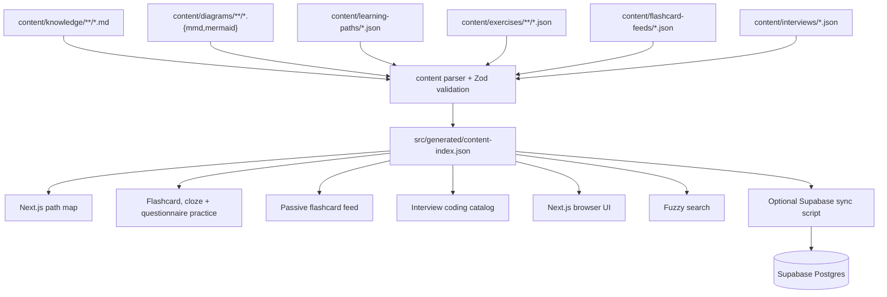

# Codematica Engineering Overview

Last updated: 2026-06-01

Codematica is a mobile-first learning app for system design, coding, programming, and software engineering. V1 keeps the product intentionally local-first: author documents as Markdown, author paths, exercises, flashcard feeds, and interview catalogs as JSON, generate a static study index, and render the app with Next.js.

## Current Stack

- Next.js App Router
- React and TypeScript
- Tailwind CSS
- plain Markdown rendered with `react-markdown`
- language-aware code highlighting with `highlight.js`
- Mermaid rendered client-side
- Fuse.js-style fuzzy search
- local JSON learning paths, practice prompts, flashcard feeds, and interview catalogs
- Vitest for unit/integration tests
- Playwright for mobile smoke tests
- optional Supabase Postgres scaffold for later hosted search

## Content Flow

## Runtime Boundaries

V1 runtime reads `src/generated/content-index.json`. It does not require Supabase credentials, auth, storage, or edge functions.

Supabase is prepared for later:

- `kb_documents` stores Markdown metadata, body, extracted text, headings, and Mermaid blocks.
- `kb_diagrams` stores external diagram metadata and source.
- `search_kb` provides a future SQL search entrypoint.
- RLS is enabled from the start.

## Content Model

Every article has frontmatter with title, slug, summary, track, topic, difficulty, tags, prerequisites, diagram references, and status. The parser validates this contract before generating the index.

External diagrams are stored separately and referenced by slug from article frontmatter. Embedded Mermaid blocks inside Markdown are also rendered. Fenced code blocks and app-authored solution snippets use the shared highlighted code block theme with language labels for Python, TypeScript, Java, JSON, shell, Markdown, and related aliases.

Learning paths live in `content/learning-paths/*.json` and contain ordered units of document, diagram, and exercise nodes. Exercises live in `content/exercises/**/*.json` and currently support `flashcard`, `cloze`, and `questionnaire` prompts. Questionnaires contain one-screen-at-a-time `choice`, `cloze`, `ordering`, and `matching` questions with per-attempt randomization and no persisted scores.

Passive flashcard feeds live in `content/flashcard-feeds/*.json` and attach short review cards to learning paths.

Interview company catalogs live in `content/interviews/*.json`. Each company contains reported-public coding questions, public source links, examples, optional Mermaid diagrams, and at least two guided solution tracks with Python, TypeScript, and Java code.

The Python language refresh path is the first reusable language-refresh slice. It pairs searchable Markdown docs with senior-level questionnaires and passive flashcards for TypeScript and JavaScript engineers.

## Route Model

- `/`: path-first home map.
- `/browse`: fuzzy content library.
- `/paths/[slug]`: one role or skill path.
- `/paths/[slug]/flashcards`: one passive flashcard feed for a path.
- `/practice/[...slug]`: one flashcard, cloze prompt, or questionnaire session.
- `/interviews`: company interview coding catalog.
- `/interviews/[company]`: one company's coding question list.
- `/interviews/[company]/[question]`: one guided coding solution walkthrough.
- `/docs/[...slug]`: one Markdown article.
- `/diagrams/[...slug]`: one standalone Mermaid diagram.

## Testing Model

Unit tests cover schema validation, parser behavior, fuzzy search, snippets, questionnaire shuffling/checking, interview solution selection, path/exercise/interview validation, and diagram indexing. Integration tests cover generated index loading and renderer behavior. Playwright smoke and regression tests cover the mobile path, practice, browser, questionnaire, interview, flashcard, and diagram journeys.

## Future Architecture Direction

The likely next step is still hybrid: keep Markdown documents and local structured study content canonical, then sync selected content into Supabase for server-side search, AI summaries, progress, auth, and study features. Native clients should consume API/search contracts, not parse repo files directly.
