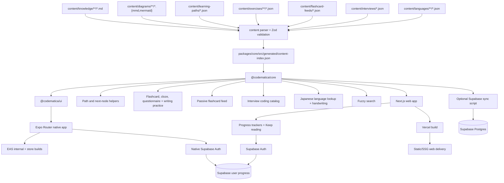

# Codematica Engineering Overview

Last updated: 2026-07-11

Codematica is a mobile-first learning app for system design, coding, programming, software engineering, and beginner human-language study. V1 keeps the product intentionally local-first: author documents as Markdown, author paths, exercises, flashcard feeds, interview catalogs, and language catalogs as JSON, generate a static study index, and render the app on web with Next.js and on Android/iOS with Expo Router.

## Current Stack

- Next.js App Router
- Expo Router for Android/iOS
- React and TypeScript
- Tailwind CSS
- React Native primitives and shared design tokens in `@codematica/ui`
- plain Markdown rendered with `react-markdown`
- native Markdown rendered with React Native Markdown components
- language-aware code highlighting with `highlight.js`
- Mermaid rendered client-side on web and through a native WebView/source fallback on mobile
- React Native SVG rendering for native handwriting/stroke surfaces
- Fuse.js-style fuzzy search
- local JSON learning paths, practice prompts, flashcard feeds, and interview catalogs
- local JSON human-language character and vocabulary catalogs
- Vercel Hobby deployment config for first hosted web delivery
- EAS internal preview, production build, and submit config for native delivery
- optional Supabase Auth and progress persistence with `@supabase/ssr`
- optional native Supabase Auth and progress persistence with secure Expo session storage
- Vitest for unit/integration tests
- Playwright for mobile smoke tests
- Jest + React Native Testing Library for mobile screen tests
- optional Supabase Postgres scaffold for hosted search and saved progress

## Content Flow

## Runtime Boundaries

V1 runtime reads `packages/core/src/generated/content-index.json` through `@codematica/core`. It does not require Supabase credentials to browse, search, read, practice, or render diagrams. The generated index is bundled into the Expo app, so native anonymous browsing and practice work offline until the next app or update release.

The repo is an npm workspace:

- `apps/web`: Next.js App Router web app, web-specific Supabase SSR helpers, and Playwright specs.
- `apps/mobile`: Expo Router Android/iOS app, native Supabase/auth/progress adapters, and mobile Jest tests.
- `packages/core`: shared content schemas, generated index access, content parsing/indexing helpers, search, practice, interview, and progress contracts.
- `packages/ui`: React Native-compatible shared screens and design tokens.

Vercel is the first hosted web target. The project deploys from `main` with `npm ci` and `npm run build`, which regenerates the core content index before building `apps/web`. Article, diagram, and practice routes stay static-first; path-scoped `?path=` next-node links are selected by small client wrappers from build-time route maps so normal content traffic can be served as static/SSG output.

EAS internal preview builds are the first native target. `apps/mobile/eas.json` defines development, preview, production, e2e-test, and submit profiles. Production builds produce store-ready Android app bundles and iOS archives; EAS Submit can send the latest builds to Play Console internal testing and App Store Connect/TestFlight after account-side credentials and store records are configured. Native routes mirror the web route contract and read the same generated index through `@codematica/core`.

Supabase is optional at runtime:

- `kb_documents` stores Markdown metadata, body, extracted text, headings, and Mermaid blocks.
- `kb_diagrams` stores external diagram metadata and source.
- `search_kb` provides a future SQL search entrypoint.
- Supabase Auth supports Google, email/password, and Apple-ready login on web and native when public runtime env vars are configured.
- `user_profiles` stores only user ids and timestamps.
- `user_progress_items` stores resume/completion milestones for documents, diagrams, practice, passive feeds, and interviews.
- RLS is enabled from the start.

## Content Model

Every article has frontmatter with title, slug, summary, track, topic, difficulty, tags, prerequisites, diagram references, and status. The parser validates this contract before generating the index.

External diagrams are stored separately and referenced by slug from article frontmatter. Embedded Mermaid blocks inside Markdown are also rendered. Fenced code blocks and app-authored solution snippets use the shared highlighted code block theme with language labels for Python, TypeScript, Java, JSON, shell, Markdown, and related aliases.

Learning paths live in `content/learning-paths/*.json` and contain ordered units of document, diagram, and exercise nodes. Exercises live in `content/exercises/**/*.json` and currently support `flashcard`, `cloze`, `questionnaire`, and `writing` prompts. Questionnaires contain one-screen-at-a-time `choice`, `cloze`, `ordering`, and `matching` questions with per-attempt randomization and no persisted scores. Writing exercises reference language character slugs and use shared stroke-count, order/direction, and shape checks.

Passive flashcard feeds live in `content/flashcard-feeds/*.json` and attach short review cards to learning paths.

Interview company catalogs live in `content/interviews/*.json`. Each company contains reported-public coding questions, public source links, examples, optional Mermaid diagrams, and at least two guided solution tracks with Python, TypeScript, and Java code.

Human-language catalogs live in `content/languages/**/*.json`. Japanese v1 indexes beginner character and vocabulary data with glyphs, readings, romaji, IPA, meanings, and normalized stroke paths for handwriting practice.

The Python language refresh path is the first reusable language-refresh slice. It pairs searchable Markdown docs with senior-level questionnaires and passive flashcards for TypeScript and JavaScript engineers.

The Langfuse and LangChain AI engineering path is the first AI engineering slice. It pairs searchable Markdown lessons, Mermaid diagrams, questionnaires, and passive flashcards for LLM application architecture, LangChain tools/RAG/agents, LangGraph operations, Langfuse tracing/evaluation workflows, and OWASP/NIST-aligned production risk governance. Coding challenge sections in these lessons are non-executable until the future code editor feature adds an executable challenge contract.

The database indexes and search path teaches production index judgment, PostgreSQL full text search, trigram fuzzy matching, and hybrid SQL search query design. It pairs searchable Markdown lessons with senior-level questionnaires and passive flashcards, while keeping executable SQL query practice as future roadmap work.

The Advanced Next.js 16 path is the first Front-End Development skill slice. It pairs hard-only searchable Markdown lessons, senior/principal questionnaires, and one-minute passive brief cards for App Router rendering, `force-dynamic`, Cache Components, data fetching, invalidation, production failure modes, performance architecture, and migration review. Next.js content must stay anchored to official Next.js documentation, official release notes, and npm registry version metadata.

The Breadth-First Search And Depth-First Search path is the graph-traversal Programming slice. It pairs searchable Markdown lessons and readable Python/TypeScript code with questionnaires, a passive scrolling review feed, and guided Google interview prompts for connected components, unweighted shortest paths, and dependency cycles. Number Of Islands deliberately includes both BFS and DFS tracks so learners can compare equivalent asymptotic performance with different readability and memory risks.

The Japanese Foundations path is the first human-language slice. It pairs local Japanese language catalogs, Markdown lessons, and writing exercises for hiragana/katakana vowels, starter kanji, IPA display, assisted tracing, and free handwriting checks across web and Expo.

Progress is user state, not authored content. Signed-in progress is stored in Supabase; signed-out progress is buffered in browser local storage on web and native local storage on Expo, then can sync after login. Progress does not store answers, scores, streaks, mastery, or full session history.

## Route Model

- `/`: path-first home map.
- `/browse`: fuzzy content library.
- `/paths/[slug]`: one role or skill path.
- `/paths/[slug]/flashcards`: one passive flashcard feed for a path.
- `/practice/[...slug]`: one flashcard, cloze prompt, or questionnaire session.
- `/languages/japanese`: Japanese lookup and study hub.
- `/languages/japanese/characters/[...slug]`: one Japanese character detail route.
- `/languages/japanese/vocabulary/[...slug]`: one Japanese vocabulary detail route.
- `/interviews`: company interview coding catalog.
- `/interviews/[company]`: one company's coding question list.
- `/interviews/[company]/[question]`: one guided coding solution walkthrough.
- `/docs/[...slug]`: one Markdown article.
- `/diagrams/[...slug]`: one standalone Mermaid diagram.
- `/login`: optional Supabase Auth sign-in and sign-up.
- `/auth/callback`: OAuth/PKCE callback and local progress sync handoff.
- `/api/progress/**`: authenticated progress summary, upsert, and anonymous-buffer sync.

## Testing Model

Unit tests cover schema validation, parser behavior, fuzzy search, snippets, questionnaire shuffling/checking, handwriting scoring, interview solution selection, path/exercise/language/interview validation, progress payload validation, anonymous progress buffering, and diagram indexing. Integration tests cover generated index loading and renderer behavior, including the Python refresh path, BFS/DFS path, Langfuse/LangChain AI engineering path, database indexes path, Advanced Next.js 16 path, and Japanese Foundations path. Playwright smoke and regression tests cover the web mobile path, practice, browser, questionnaire, interview, flashcard, one-minute brief feed, BFS/DFS study journey, signed-out progress, and diagram journeys. Mobile Jest tests cover shared React Native screens against the bundled generated index, including Japanese lookup and writing practice shell.

## Future Architecture Direction

The likely next step remains hybrid: keep Markdown documents and local structured study content canonical, keep `@codematica/core` as the shared contract surface, and expand Supabase-backed search, AI summaries, scoring, streaks, and study features behind explicit contracts.

Before relying on Supabase for production user progress at scale, revisit plan level, backups, RLS policy coverage, and operational ownership. The service role key remains server-only.
