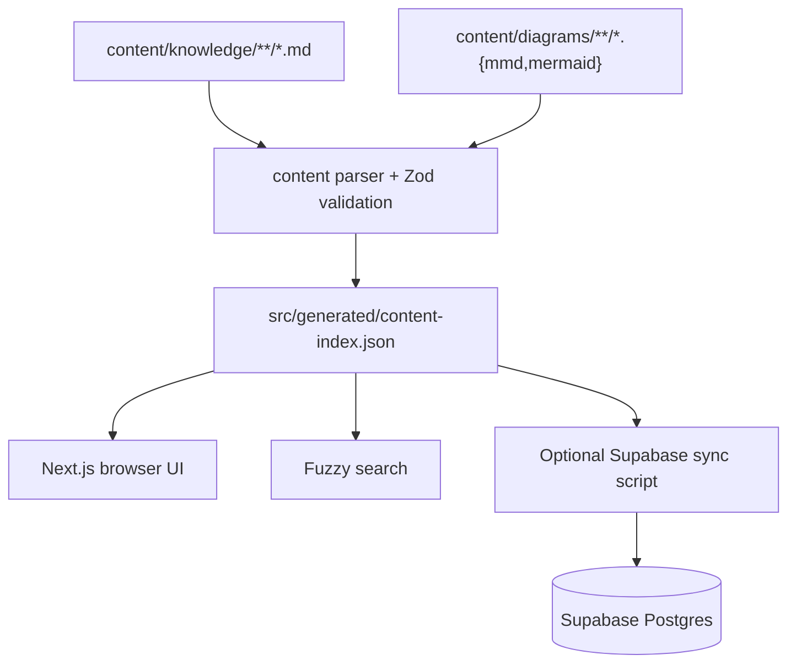

# Codematica Engineering Overview

Last updated: 2026-05-20

Codematica is a mobile-first knowledge app for system design, coding, programming, and software engineering. V1 keeps the product intentionally simple: author content as Markdown, generate a static search index, and render the app with Next.js.

## Current Stack

- Next.js App Router
- React and TypeScript
- Tailwind CSS
- plain Markdown rendered with `react-markdown`
- Mermaid rendered client-side
- Fuse.js-style fuzzy search
- Vitest for unit/integration tests
- Playwright for mobile smoke tests
- optional Supabase Postgres scaffold for later hosted search

## Content Flow

## Runtime Boundaries

V1 browser runtime reads `src/generated/content-index.json`. It does not require Supabase credentials, auth, storage, or edge functions.

Supabase is prepared for later:

- `kb_documents` stores Markdown metadata, body, extracted text, headings, and Mermaid blocks.
- `kb_diagrams` stores external diagram metadata and source.
- `search_kb` provides a future SQL search entrypoint.
- RLS is enabled from the start.

## Content Model

Every article has frontmatter with title, slug, summary, track, topic, difficulty, tags, prerequisites, diagram references, and status. The parser validates this contract before generating the index.

External diagrams are stored separately and referenced by slug from article frontmatter. Embedded Mermaid blocks inside Markdown are also rendered.

## Testing Model

Unit tests cover schema validation, parser behavior, fuzzy search, snippets, and diagram indexing. Integration tests cover generated index loading and renderer behavior. Playwright smoke tests cover the mobile browser journey.

## Future Architecture Direction

The likely next step is still hybrid: keep Markdown canonical, then sync content into Supabase for server-side search, AI summaries, progress, auth, and study features. Native clients should consume API/search contracts, not parse repo files directly.
