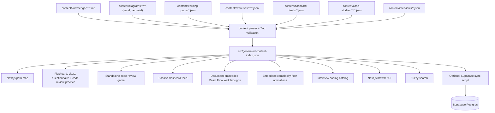

# Codematica Engineering Overview

Last updated: 2026-06-03

Codematica is a mobile-first learning app for system design, coding, programming, and software engineering. V1 keeps the product intentionally local-first: author documents as Markdown, author paths, exercises, flashcard feeds, and interview catalogs as JSON, generate a static study index, and render the app with Next.js.

## Current Stack

- Next.js App Router
- React and TypeScript
- Tailwind CSS
- plain Markdown rendered with `react-markdown`
- language-aware code highlighting with `highlight.js`
- Mermaid rendered client-side
- `@xyflow/react` for read-only architecture and algorithm-flow walkthroughs
- Fuse.js-style fuzzy search
- local JSON learning paths, practice prompts, flashcard feeds, case-study flows, and interview catalogs
- Vitest for unit/integration tests
- Playwright for mobile smoke tests
- optional Supabase Postgres scaffold for later hosted search

## Content Flow



## Runtime Boundaries

V1 runtime reads `src/generated/content-index.json`. It does not require Supabase credentials, auth, storage, or edge functions.

Supabase is prepared for later:

- `kb_documents` stores Markdown metadata, body, extracted text, headings, Mermaid blocks, and embedded complexity-flow blocks.
- `kb_diagrams` stores external diagram metadata and source.
- `search_kb` provides a future SQL search entrypoint.
- RLS is enabled from the start.

## Content Model

Every article has frontmatter with title, slug, summary, track, topic, difficulty, tags, prerequisites, diagram references, optional case-study flow references, and status. The parser validates this contract before generating the index.

External diagrams are stored separately and referenced by slug from article frontmatter. Embedded Mermaid blocks inside Markdown are also rendered. Fenced code blocks and app-authored solution snippets use the shared highlighted code block theme with language labels for Python, TypeScript, Java, JSON, shell, Markdown, and related aliases.

Markdown can also embed validated ````complexity-flow` JSON blocks. The parser stores them in `KnowledgeDocument.complexityFlowBlocks`, indexes human-readable flow text instead of raw JSON, and `MarkdownRenderer` renders them through `ComplexityFlowBlock`, a read-only React Flow animation with variant tabs, step controls, operation counters, growth bars, and optional code snippets.

Learning paths live in `content/learning-paths/*.json` and contain ordered units of document, diagram, exercise, and interview nodes. Interview nodes reference existing `content/interviews/` questions with `company/question` slugs and route with path context. Exercises live in `content/exercises/**/*.json` and currently support `flashcard`, `cloze`, `questionnaire`, and `code-review` prompts. Questionnaires contain one-screen-at-a-time `choice`, `cloze`, `ordering`, and `matching` questions with per-attempt randomization and no persisted scores. Code reviews contain one or two authored files, token/range-level findings, healthy notes, and replacement lines; attempts stay transient.

Passive flashcard feeds live in `content/flashcard-feeds/*.json` and attach short review cards to learning paths.

Case-study flows live in `content/case-studies/**/*.json`. They store fixed-position nodes, edges, and 4-6 walkthrough steps for selected system-design articles. `src/generated/content-index.json` includes them as `caseStudyFlows` under schema version 8, and `/docs/[...slug]` renders a read-only React Flow walkthrough when the article declares `caseStudyFlowRef`. These flow files are local-first content and are not part of the optional Supabase sync path until a hosted case-study/search feature explicitly adds that contract.

Interview company catalogs live in `content/interviews/*.json`. Each company contains reported-public coding questions, public source links, examples, optional Mermaid diagrams, and at least two guided solution tracks with Python, TypeScript, and Java code.

The Python language refresh path is the first reusable language-refresh slice. It pairs searchable Markdown docs with ten-question senior questionnaires, a 480-card passive flashcard feed, and a final interview-practice unit for TypeScript and JavaScript engineers.

The Big O skill path teaches algorithmic complexity with Markdown lessons, external Mermaid diagrams, embedded complexity-flow animations, cloze and questionnaire practice, a code-review exercise, a passive flashcard feed, and reused interview nodes.

The System Design Fundamentals path includes a `real-production-data-platforms` unit with Netflix, Uber, and Spotify data/ML feedback-loop case studies plus a shared streaming backbone blueprint diagram. The home route links directly to that unit through the `Real cases` shortcut.

## Route Model

- `/`: path-first home map with explicit shortcuts for browse, real cases, interviews, and code reviews.
- `/browse`: fuzzy content library.
- `/paths/[slug]`: one role or skill path.
- `/paths/[slug]/flashcards`: one passive flashcard feed for a path.
- `/practice/[...slug]`: one flashcard, cloze prompt, questionnaire session, or code-review session.
- `/code-reviews`: standalone random code-review game with deterministic `?exercise=` deep links.
- `/interviews`: company interview coding catalog.
- `/interviews/[company]`: one company's coding question list.
- `/interviews/[company]/[question]`: one guided coding solution walkthrough. When opened with `?path=`, the final explanation can continue to the next path node.
- `/docs/[...slug]`: one Markdown article.
- `/diagrams/[...slug]`: one standalone Mermaid diagram.

## Testing Model

Unit tests cover schema validation, parser behavior, fuzzy search, snippets, questionnaire shuffling/checking, code-review hit detection/replacement, interview solution selection, path/exercise/interview/case-study-flow/complexity-flow validation, and diagram indexing. Integration tests cover generated index loading and renderer behavior. Component tests cover the case-study and complexity-flow step view models. Playwright smoke and regression tests cover the mobile path, practice, browser, questionnaire, code-review, interview, flashcard, diagram, Big O, and real-system case-study journeys.

## Future Architecture Direction

The likely next step is still hybrid: keep Markdown documents and local structured study content canonical, then sync selected content into Supabase for server-side search, AI summaries, progress, auth, and study features. Native clients should consume API/search contracts, not parse repo files directly.
