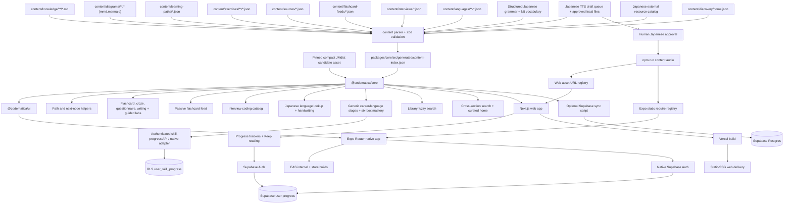
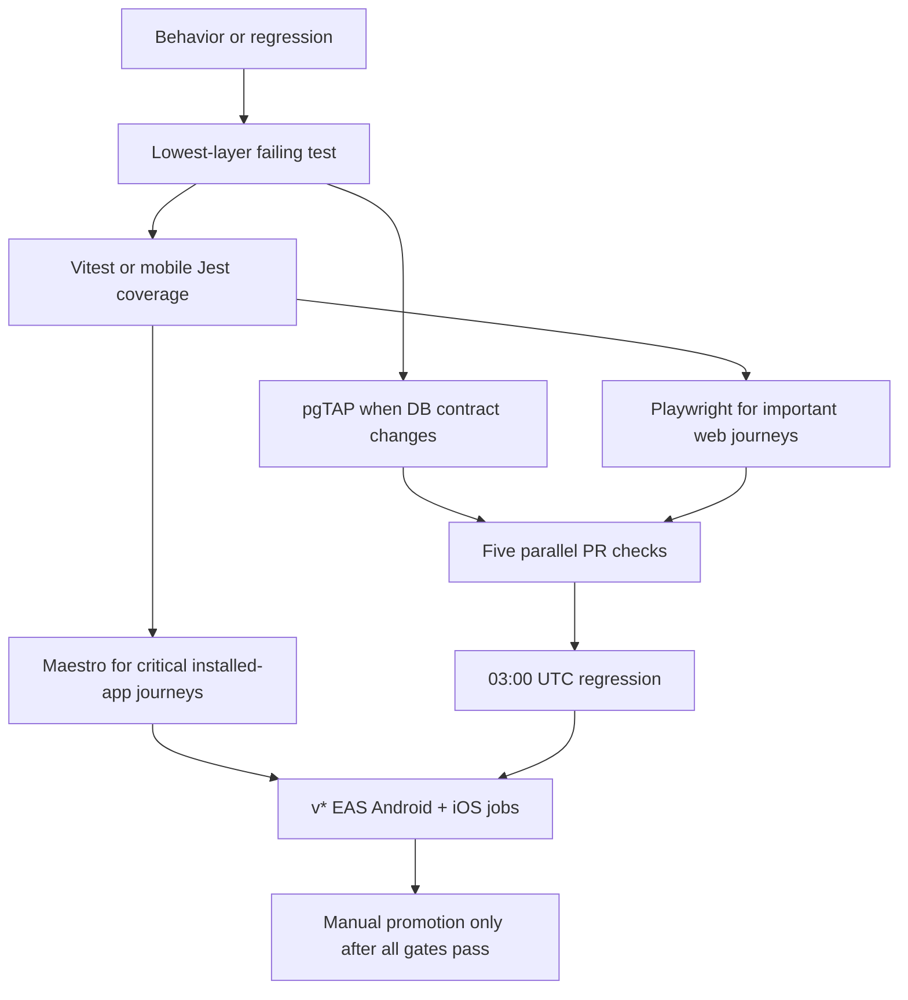

# Codematica Engineering Overview

Last updated: 2026-08-07

Codematica is a mobile-first learning app for system design, coding, programming, software engineering, ML systems, and beginner human-language study. V1 stays local-first: Markdown and structured JSON remain canonical, including a validated external-source catalog for source-linked companions.

## Current Stack

- Next.js App Router
- Expo Router for Android/iOS
- React and TypeScript
- Tailwind CSS
- React Native primitives and shared design tokens in `@codematica/ui`
- plain Markdown rendered with `react-markdown`
- native Markdown rendered with React Native Markdown components
- language-aware code highlighting with `highlight.js`
- editable React/TypeScript web projects with Sandpack's cross-origin browser runtime
- Mermaid rendered client-side on web and through a native WebView/source fallback on mobile
- React Native SVG rendering for native handwriting/stroke surfaces
- Fuse.js-style fuzzy search
- local JSON learning paths, practice prompts, flashcard feeds, and interview catalogs
- local JSON human-language character and vocabulary catalogs
- Vercel Hobby deployment config for first hosted web delivery
- EAS internal preview, production build, and submit config for native delivery
- optional Supabase Auth and progress persistence with `@supabase/ssr`
- optional native Supabase Auth and progress persistence with secure Expo session storage
- Vitest with V8 aggregate and per-file coverage gates for unit/integration tests
- Playwright for desktop Chromium, mobile Chromium, and mobile WebKit browser regression
- Jest + React Native Testing Library with coverage gates for mobile adapters and shared screens
- pgTAP against a disposable local Supabase stack for migrations, RLS, triggers, and search
- Maestro 2.8.0 through credential-free EAS Android/iOS test builds for installed-app journeys
- optional Supabase Postgres scaffold for hosted search and saved progress

## Content Flow

## Runtime Boundaries

V1 runtime reads `packages/core/src/generated/content-index.json` through `@codematica/core`. It does not require Supabase credentials to discover, browse, search, read, practice, or render diagrams. The generated index is bundled into the Expo app, so native discovery, anonymous browsing, and practice work offline until the next app or update release.

The repo is an npm workspace:

- `apps/web`: Next.js App Router web app, web-specific Supabase SSR helpers, and Playwright specs.
- `apps/mobile`: Expo Router Android/iOS app, native Supabase/auth/progress adapters, and mobile Jest tests.
- `packages/core`: shared content schemas, generated index access, content parsing/indexing helpers, search, practice, interview, and progress contracts.
- `packages/ui`: React Native-compatible shared screens and design tokens.

Vercel is the first hosted web target. The project deploys from `main` with `npm ci` and `npm run build`, which regenerates the core content index before building `apps/web`. Article, diagram, and practice routes stay static-first; path-scoped `?path=` next-node links are selected by small client wrappers from build-time route maps so normal content traffic can be served as static/SSG output.

EAS internal preview builds are the first native target. `apps/mobile/eas.json` defines development, preview, production, e2e-test, and submit profiles. Production builds produce store-ready Android app bundles and iOS archives; EAS Submit can send the latest builds to Play Console internal testing and App Store Connect/TestFlight after account-side credentials and store records are configured. Native routes mirror the web route contract and read the same generated index through `@codematica/core`.

Supabase is optional at runtime:

- `kb_documents` stores Markdown metadata, body, extracted text, headings, and Mermaid blocks.
- `kb_diagrams` stores external diagram metadata and source.
- `search_kb` provides a future SQL search entrypoint.
- Supabase Auth supports Google, email/password, and Apple-ready login on web and native when public runtime env vars are configured.
- `user_profiles` stores only user ids and timestamps.
- `user_progress_items` stores resume/completion milestones for documents, diagrams, practice, passive feeds, and interviews.
- `user_skill_progress` stores the additive Japanese review snapshot: best score, attempt count, review box, mastery state, last practice time, and next review time.
- RLS is enabled from the start.

## Content Model

Every article has frontmatter with title, slug, summary, track, topic, difficulty, tags, prerequisites, diagram references, primary-source references, and status. The parser validates this contract before generating the index. `content/sources/*.json` centralizes authoritative URLs, attribution, license when verified, version/commit, maturity, and verification date.

External diagrams are stored separately and referenced by slug from article frontmatter. Embedded Mermaid blocks inside Markdown are also rendered. Fenced code blocks and app-authored solution snippets use the shared highlighted code block theme with language labels for Python, TypeScript, Java, JSON, shell, Markdown, and related aliases.

Learning paths live in `content/learning-paths/*.json` and contain ordered units of document, diagram, exercise, and primary-source nodes. A source node resolves to its published local companion or the authoritative external URL. Exercises support `flashcard`, `cloze`, `questionnaire`, `writing`, and `guided-lab`. Questionnaires calculate aggregate overall/per-skill scores while answers stay transient. Guided labs enforce prediction and evidence-checklist completion while reflection text stays transient. Writing exercises reference language character slugs and use shared stroke-count, order/direction, and shape checks.

Passive flashcard feeds live in `content/flashcard-feeds/*.json` and attach short review cards to learning paths.

Interview collections live in `content/interviews/*.json` and are discriminated as `company` or `real-world`. Company algorithm questions retain reported-public links and guided Python, TypeScript, and Java tracks. Anonymous real-world questions require provenance notes and may provide structured evaluation rubrics plus at least three `WebExerciseProject` solutions. Web projects are authored locally, validated into the index, and executed only in Sandpack's cross-origin iframe; Expo shows the same files read-only.

Human-language catalogs live in `content/languages/**/*.json`. Schema v10 adds structured grammar, N5 study metadata, Japanese open-answer/listening question kinds, and synthetic-audio provenance while retaining generic progression and resource-rights metadata. Japanese indexes complete kana, an exact 100-kanji target, 650 N5-aligned words, 60 grammar patterns, learner romaji, IPA, study order, and normalized paths for published handwriting profiles. A compact pinned JMdict asset supplies local IME candidates. Only human-approved audio enters generated web/Expo registries; external resources remain link-only unless redistribution rights are explicit.

Home discovery curation lives in `content/discovery/home.json`. It references canonical published content by kind and slug; index generation validates every reference and serializes the ordered sections into content index schema version 10. `packages/core/src/discovery.ts` resolves those references and provides cross-section local search to web and native.

The ML Systems Engineer path is the first source-linked career curriculum. It maps the complete Harvard CS249r student surface—both books, labs, TinyTorch, MLSys·im, optional hardware, and StaffML—while locally publishing prerequisites and Volume I companions through Data Engineering. Later stages remain explicitly planned but open their primary sources now.

The Python language refresh path is the first reusable language-refresh slice. It pairs searchable Markdown docs with senior-level questionnaires and passive flashcards for TypeScript and JavaScript engineers.

The Langfuse and LangChain AI engineering path is the first AI engineering slice. It pairs searchable Markdown lessons, Mermaid diagrams, questionnaires, and passive flashcards for LLM application architecture, LangChain tools/RAG/agents, LangGraph operations, Langfuse tracing/evaluation workflows, and OWASP/NIST-aligned production risk governance. Coding challenge sections in these lessons are non-executable until the future code editor feature adds an executable challenge contract.

The database indexes and search path teaches production index judgment, PostgreSQL Heap-Only Tuple update behavior, full text search, trigram fuzzy matching, and hybrid SQL search query design. Its HOT unit connects MVCC row versions, same-page space, regular and BRIN index effects, fillfactor, pruning, vacuuming, and statistics monitoring. The path pairs searchable Markdown lessons with senior-level questionnaires and passive flashcards, while keeping executable SQL query practice as future roadmap work.

The Advanced Next.js 16 path is the first Front-End Development skill slice. It pairs hard-only searchable Markdown lessons, senior/principal questionnaires, and one-minute passive brief cards for App Router rendering, `force-dynamic`, Cache Components, data fetching, invalidation, production failure modes, performance architecture, and migration review. Next.js content must stay anchored to official Next.js documentation, official release notes, and npm registry version metadata.

The Breadth-First Search And Depth-First Search path is the graph-traversal Programming slice. It pairs searchable Markdown lessons and readable Python/TypeScript code with questionnaires, a passive scrolling review feed, and guided Google interview prompts for connected components, unweighted shortest paths, and dependency cycles. Number Of Islands deliberately includes both BFS and DFS tracks so learners can compare equivalent asymptotic performance with different readability and memory risks.

The Reading And Writing Mermaid Diagrams path is the source-first technical documentation slice. It uses the existing embedded Mermaid renderer to pair 13 inspectable source blocks with browser-rendered output across flowchart, sequence, class, state, ER, Gantt, journey, pie, mindmap, timeline, and Git graph families. Three choice-only questionnaires enforce one correct option and explain every distractor; a passive feed reinforces selection, syntax, debugging, and readability.

The Japanese Foundations path is the first human-language slice. Its open progression spans Kana Explorer followed by Core Connections, Everyday Japanese, Reading and Listening, and N5 Readiness. Ten progressive A1 units combine original lessons, mixed quizzes, open-answer IME composition, cumulative flashcards, and approval-gated listening across web and Expo. Pencil Scribble writes into the same transient native text input; no raw ink or answer history is persisted.

Progress is user state, not authored content. Existing completion remains in `user_progress_items`. Japanese mastery is additive: anonymous review state persists locally, while `user_skill_progress` provides an RLS-protected signed-in target for best score, attempt count, review box, mastery state, and review times. Web and Expo load the remote snapshot when authenticated, validate it, merge it deterministically with retained local state, save the merged snapshot locally, and upload it in batches of at most 20. Neither path stores answers, raw handwriting, recordings, or full attempt history.

## Route Model

- `/`: cross-section discovery home with Keep reading, curated rows, and global local search.
- `/paths`: complete learning-path catalog grouped by category.
- `/browse`: fuzzy content library.
- `/paths/[slug]`: one role or skill path.
- `/paths/[slug]/flashcards`: one passive flashcard feed for a path.
- `/practice`: complete exercise and passive-review catalog.
- `/practice/[...slug]`: one flashcard, cloze prompt, questionnaire, or writing session.
- `/languages`: available language hubs.
- `/languages/japanese`: Japanese lookup and study hub.
- `/languages/japanese/review`: due-skill recommendations and manually browseable skill cards.
- `/languages/japanese/characters/[...slug]`: one Japanese character detail route.
- `/languages/japanese/vocabulary/[...slug]`: one Japanese vocabulary detail route.
- `/interviews`: real-world and company interview collections.
- `/interviews/[collection]`: one anonymous or company question list; existing company URL segments are unchanged.
- `/interviews/[collection]/[question]`: a guided algorithm walkthrough or runnable web exercise.
- `/docs/[...slug]`: one Markdown article.
- `/diagrams/[...slug]`: one standalone Mermaid diagram.
- `/login`: optional Supabase Auth sign-in and sign-up.
- `/auth/callback`: OAuth/PKCE callback and local progress sync handoff.
- `/api/progress/**`: authenticated completion summary/upsert, anonymous-buffer sync, and Japanese skill-progress read/batch-sync.

## Testing Model

Unit tests cover schema validation, parser behavior, library and cross-section search, discovery curation, snippets, questionnaire shuffling/checking, handwriting scoring, interview solution selection, path/exercise/language/interview validation, stage percentage/stamp eligibility, six-box mastery transitions, due ordering, local/remote mastery merge, progress payload validation, lossless batching, file walking, route mapping, audio-registry generation, Supabase sync mapping, and diagram indexing. Integration tests cover generated-index relationships, renderers, web/API/Auth boundaries, and native screen/adaptor behavior.

Coverage is enforced by scope and per file. Core requires 90% lines/statements/functions and 85% branches; web services/API/content scripts require 85% and 80% branches; web components require 75% and 70% branches; mobile libraries require 80% and 70% branches; shared native UI requires 70% and 60% branches. Every instrumented file also requires 60% lines/statements/functions and 50% branches. Exclusions are limited to generated output, type-only barrels/tokens, and thin route or CLI composition and are annotated where configured.

Playwright runs the complete suite in mobile Chromium and repeats smoke journeys in desktop Chromium and mobile WebKit. It covers discovery, catalogs, path routing, reading, standalone and embedded Mermaid, every practice renderer, passive feeds, algorithm and runnable web interviews, Japanese lookup/detail/review/writing, local progress, login/Auth-disabled behavior, 404 recovery, responsive layout, and representative accessibility. Mobile Jest covers platform adapters, configured/unconfigured Supabase, offline/partial-failure progress behavior, app configuration, and the complete shared-screen matrix. Maestro covers installed-app offline discovery, path-to-practice, browse-to-diagram, Japanese study/review, interviews, and unconfigured login on Android and iOS release candidates.

Transactional pgTAP tests replay migrations in a disposable local Supabase stack and assert tables, indexes, constraints, RLS, anonymous denial, per-user isolation, completion/mastery preservation, published-only search, ranking, and limits.

The stable command and workflow contract is documented in `docs/features/automated-testing-and-release-regression.md`.

## Future Architecture Direction

The likely next step remains hybrid: keep Markdown documents and local structured study content canonical, keep `@codematica/core` as the shared contract surface, and expand Supabase-backed search, AI summaries, scoring, streaks, and study features behind explicit contracts.

Before relying on Supabase for production user progress at scale, revisit plan level, backups, RLS policy coverage, and operational ownership. The service role key remains server-only.
