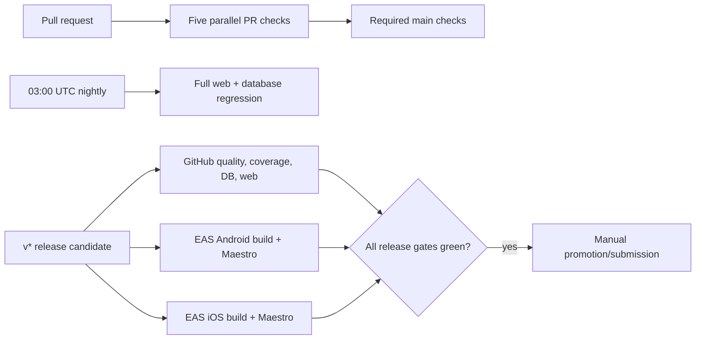

# Automated Testing And Release Regression

## Snapshot

- Status: `shipped`
- Last updated: `2026-08-05`
- Owner thread: `n/a`
- Current state: Codematica has enforced Vitest and Jest coverage, transactional pgTAP checks, multi-project Playwright suites, Maestro native flows, fast PR gates, nightly regression, and `v*` release-candidate workflows.
- Target outcome: Every shipped feature has a reliable test at the lowest useful layer, critical journeys are exercised on browser and installed native targets, and a release cannot be promoted without reproducible evidence.
- Code touchpoints:
  - `vitest.config.ts`
  - `vitest.per-file.config.ts`
  - `apps/web/e2e/`
  - `apps/mobile/.maestro/`
  - `supabase/tests/`
  - `.github/workflows/`
- Primary tests:
  - `packages/core/src/**/*.test.ts`
  - `apps/web/src/**/*.{test,spec}.{ts,tsx}`
  - `apps/mobile/src/__tests__/*.test.{ts,tsx}`
  - `supabase/tests/*.test.sql`

## One-Minute Brief

The test system is deliberately layered. Vitest pins shared rules, server helpers, content tooling, API handlers, and web components. Jest exercises mobile adapters and shared React Native screens. pgTAP replays and checks the disposable local Supabase database. Playwright verifies browser journeys and responsive accessibility. Maestro runs the built Android and iOS applications.

Pull requests get five parallel, fast checks. Nightly runs expand browser and database regression coverage. A `v*` tag triggers complete GitHub release regression plus parallel EAS Android/iOS builds and Maestro runs. These workflows create evidence but never submit builds or publish a release.

## Outcome / Contract

- Fixes begin with a failing regression test at the lowest reliable layer; new behavior follows red-green-refactor.
- Shared logic is tested in `packages/core`, not duplicated across platform suites.
- Important user-visible changes have both a lower-layer rule test and an E2E journey.
- `npm run e2e:web:smoke` runs only tests tagged `@smoke`; deeper cases are tagged `@regression`.
- Browser automation uses role queries or stable `data-testid` values, and native automation uses stable `testID` values. Fixed sleeps and CSS selectors are forbidden.
- Anonymous/local-first behavior never depends on hosted Supabase in unit, integration, or browser tests.
- Database tests use only the disposable local Supabase stack and may not read hosted projects, production data, or credentials.
- E2E build profiles are credential-free Android APK and iOS simulator builds.
- Coverage thresholds may increase but may not decrease. A new exclusion or lower threshold requires an explicit feature-doc and changelog justification.
- PR checks are named `quality`, `unit-integration-coverage`, `mobile-jest`, `database`, and `web-smoke` so branch protection can require stable names.
- A release candidate is promotable only after GitHub release regression and both EAS native release jobs pass.

## Current State

The repository instruments production core logic, content scripts, web services/API/Auth helpers, web components, mobile libraries, and shared native screens. Generated artifacts, type-only barrels/design tokens, and thin route or CLI composition are excluded with comments in the owning configuration or source.

Coverage output includes terminal summaries, HTML, LCOV, JSON, and CI JUnit where the runner supports it. A second Vitest pass enforces per-file floors because the aggregate scope thresholds and per-file policy are distinct gates.

The EAS workflow definitions match the current Expo Maestro job schema, including `build_id`, `flow_path`, `include_tags`, `maestro_version`, JUnit output, retries, and screen recording. EAS currently labels built-in Maestro jobs alpha, so the workflow definitions must be revalidated when Expo changes that contract.

Branch protection is an account-side follow-up: after the five PR jobs have completed successfully at least once on GitHub, require those exact checks on `main` without changing review or administrator policies.

## Scope

### In Scope

- Shipped and currently implemented core, content, web, mobile, Auth/progress, Supabase, interview, Japanese, practice, renderer, and routing behavior.
- Coverage enforcement and regression evidence.
- PR, nightly, tag, and manually dispatched validation workflows.

### Out Of Scope

- Proposed subscriptions and other roadmap-only product behavior.
- Hosted Supabase integration or production-data tests.
- Automatic store submission, release publication, or branch-protection mutation.

### Assumptions

- CI runs Node 22 and installs dependencies from `package-lock.json`.
- Database validation has Docker and the Supabase CLI available.
- EAS workflows require a linked Expo project and authenticated EAS/GitHub integration when executed remotely.

## Detailed Behavior

### Coverage Gates

| Scope | Lines / statements / functions | Branches |
|---|---:|---:|
| Core | 90% | 85% |
| Web services, API, and content scripts | 85% | 80% |
| Web components | 75% | 70% |
| Mobile libraries | 80% | 70% |
| Shared native UI | 70% | 60% |
| Every instrumented file | 60% | 50% |

`npm run test:coverage` first enforces scope totals and then runs `vitest.per-file.config.ts`. `npm run test:mobile:coverage` enforces the mobile-library and shared-screen totals.

### Browser Matrix

- `mobile-chromium`: complete smoke and regression suite.
- `desktop-chromium`: smoke journeys.
- `mobile-webkit`: smoke journeys.
- Trace, screenshot, and video are retained only for failures. HTML/JUnit reports and failure evidence are uploaded by CI.

### Native Matrix

- PRs labeled `mobile-e2e` create a credential-free Android APK and run Maestro flows tagged `smoke`.
- `v*` tags build Android and iOS in parallel and run every checked-in Maestro flow on each platform.
- Maestro is pinned to `2.8.0`; EAS retains the build, JUnit test output, and failure recording.

### CI And Release Flow

### Failure And Edge Handling

- A failed database run must leave production untouched; CI stops and discards the local stack.
- Playwright and Maestro failures retain reports and visual evidence rather than relying on a rerun to diagnose the regression.
- If EAS validation cannot authenticate, validate YAML locally, keep the workflow unexecuted, and report the missing account-side verification explicitly.
- A flaky test is fixed or quarantined with a documented owner and reason; it is not silently retagged or removed from the release lane.

## Code Touchpoints

- `package.json`: stable local and CI command interface.
- `vitest.config.ts`: aggregate instrumentation, reporters, exclusions, and scope thresholds.
- `vitest.per-file.config.ts`: file-level minimum coverage gate.
- `apps/mobile/jest.config.cjs`: mobile/shared-native instrumentation and thresholds.
- `apps/web/e2e/playwright.config.ts`: projects, reports, dev server, and failure evidence.
- `supabase/config.toml`: disposable local project configuration.
- `supabase/tests/`: schema, RLS, trigger, isolation, and search pgTAP assertions.
- `.github/workflows/ci.yml`: five fast PR gates.
- `.github/workflows/nightly-regression.yml`: scheduled full web/database regression.
- `.github/workflows/release-regression.yml`: GitHub `v*` release-candidate gate.
- `apps/mobile/.eas/workflows/`: EAS Android PR and Android/iOS release regression.
- `apps/mobile/.maestro/`: installed-app regression flows.

## Test Plan

- Unit: pure schemas, parsing/indexing, route mapping, search, practice, progress, interview boundaries, environment detection, adapters, and content-audio/sync helpers.
- Integration: generated index relationships, renderers/components, API/Auth handlers, native screen matrix, and mocked Supabase boundaries.
- Database: clean migration replay plus transactional schema, index, constraint, trigger, RLS, isolation, published-search, ranking, and limit assertions. Protected content assertions accept either an explicit table-privilege denial or an RLS-filtered empty result, since Supabase database images can enforce the same no-read contract at different layers.
- E2E: representative documents, diagrams, catalogs, practice types, interviews, Japanese, Auth-disabled behavior, local progress, recovery/404, responsive layout, and accessibility.
- Regression classification: fast critical paths are `@smoke`; feature and edge coverage is `@regression`; installed-app critical paths are Maestro flows.
- Coverage impact: all production logic in the listed scopes is instrumented; exclusions are annotated and thresholds are non-decreasing.
- Required local commands: `npm run test:coverage`, `npm run test:mobile:coverage`, `npm run test:db`, `npm run e2e:web:smoke`, and, before release, `npm run test:release` plus the EAS release workflow.

Must not regress: local anonymous operation, Auth-disabled recovery, stale progress rejection, database per-user isolation, completion/mastery preservation, published-only search, deterministic generated registries, every practice renderer, cross-platform route navigation, and failure artifact production.

## Open Questions

- When should native Maestro graduate from EAS's alpha job type to a stable provider contract?
- What artifact retention should be used once the repository has enough history to estimate triage needs and storage cost?

## Decision Log

- `2026-08-05`: Adopt Vitest/Jest V8 coverage with aggregate and per-file gates.
- `2026-08-05`: Use pgTAP against disposable local Supabase instead of hosted integration tests.
- `2026-08-05`: Run the complete Playwright suite on mobile Chromium and smoke on desktop Chromium/mobile WebKit.
- `2026-08-05`: Pin Maestro 2.8.0 and require Android plus iOS for release candidates without automatic submission.
- `2026-08-08`: Keep Expo SDK 57 patch packages aligned with Expo Doctor and make the protected-content pgTAP assertion portable across Supabase images that deny reads through privileges or default-deny RLS.

## Documentation Updates

- `docs/README.md`: adds this testing/release contract to the docs map.
- Nested READMEs: `apps/mobile/README.md` documents coverage and Maestro/EAS lanes.
- `docs/engineering-overview.md`: includes the enforced test topology and release-gate flow.

## Thread Handoff Prompt

`Read docs/codex-context.md and docs/features/automated-testing-and-release-regression.md first. Preserve the coverage floors and stable check names, start behavior changes with the narrowest failing test, update the owning feature-doc test plan, run every affected local lane, and report any CI/EAS validation that still requires account-side execution.`
