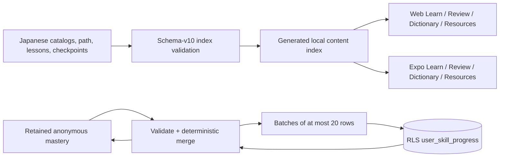
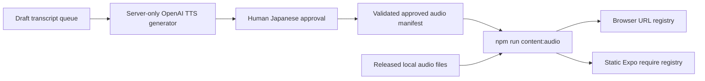

# Japanese Language Learning

## Snapshot

- Status: `in_progress`
- Last updated: `2026-08-09`
- Current state: schema-v10 carries a kana-to-N5 roadmap, 650 N5-aligned vocabulary profiles, 60 structured grammar patterns, ten progressive A1 units, mixed/open-answer/listening questionnaires, a shared offline Japanese IME, Pencil Scribble-compatible text input, substantive flashcard/writing review routes, and approval-gated OpenAI TTS metadata across web and Expo.
- Target outcome: English-speaking teens and adults can move from kana discovery to practical JF A1 Can-dos while keeping the entire course, reviews, dictionary, handwriting, flashcards, and resources open.

## One-Minute Brief

Japanese Foundations is an open stamp-rally course organized around JF/CEFR `Pre-A1` and `A1`. Friendly stages—Kana Explorer, First Connections, and Everyday Navigator—carry measurable Can-do statements and original contextual checkpoints. Children’s literacy mechanics such as sound grouping, tracing, cumulative recall, picture cues, and short readers are adapted for adult second-language learners.

The learning loop is hear, notice, trace/manipulate, recall, read in context, use for a task, and review later. Current lessons use concrete scene cues and short readers; original illustration assets remain future visual work. Audio-dependent steps are modeled but are not marked complete until original, released recordings are added. Third-party learning media is never redistributed merely because it is publicly accessible.

## Shipped Contract

- `ContentIndex.schemaVersion` is `10`.
- Learning paths may declare proficiency levels, skill strands, required nodes, JF Can-dos, open stages, checkpoint thresholds, and estimated time.
- `/languages/japanese` and the Expo Japanese hub keep four destinations visible: Learn, Review, Dictionary, and Resources.
- `/languages/japanese/review` keeps the due queue primary and links to substantive 650-card vocabulary and 80-prompt open-answer modes. Listening is linked only when its complete referenced audio is approved.
- Open answers accept Japanese directly or convert romaji locally into kana/kanji candidates. iPad uses the same native `TextInput`, allowing on-device Apple Pencil Scribble without retaining raw ink.
- Review uses six boxes: Again → box 0/10 minutes; Hard → back one/1 day; Good → forward one/1, 3, 7, 14, 30, 60 days; Easy → forward two/3, 7, 14, 30, 60, 120 days. Box 4+ is mastered.
- Web and Expo review ratings expose a persistent selected/pressed state, announce the saved choice, and lock the four ratings after one choice so an accidental repeated tap cannot create extra attempts. `Practice again` explicitly starts another recall and re-enables rating.
- A delayed authenticated progress response merges against the newest in-memory review state, so it cannot overwrite a rating made while the review screen is open.
- Anonymous review state persists locally on web and Expo. When authenticated, both clients load the remote snapshot, validate it, merge it with retained local state, save the merged result locally, and upload bounded 20-row batches. The additive `user_skill_progress` table is RLS-protected and does not change `user_progress_items`.
- No individual answers, raw handwriting coordinates, microphone recordings, or full attempt histories are stored.
- Handwriting is intentionally forgiving in both modes: assisted mode advances a rough trace that follows the highlighted stroke and direction, and free mode accepts a recognizable character with the correct stroke count and general order/direction. Clearly unrelated, reversed, or missing strokes still fail. Web scoring includes the pointer-release position so quick drags are not truncated before comparison.
- Character/vocabulary search remains local-first and includes glyphs, readings, meanings, examples, learner romaji, and IME aliases such as `konbanha`.
- The trusted resource shelf records publisher, URL, level, skills, access, availability, reuse policy, and attribution. Current JF, MEXT, JLPT/JFT, and Tadoku materials are link-only.

## Curriculum

### Kana Explorer — Pre-A1

Five vowels and mora rhythm lead into all 46 hiragana, sound tools, all 46 katakana, long vowels, and IME spelling. Short row-grouped writing exercises and cumulative checks remain individually accessible. The milestone is an original mixed kana/input checkpoint.

### First Connections — A1

The original lesson covers greetings, introduction, `です・は・も・か`, this/that/whose, identity, ages, time, dates, family, likes, food, drinks, and a café order. Its Level Start reader uses a short café scene.

### Everyday Navigator — A1

The original lesson covers existence, position words, routines, polite present/negative/past, `を・に・で・へ`, invitations, transport, requests, permission, shopping, signs, and short messages. Its Level 0 reader follows a rainy trip to a station. The capstone uses original JLPT/JFT-style formats and is explicitly readiness practice, not an official exam or guarantee.

### Starter Kanji

The catalog contains the exact 80 Grade-1 educational kanji plus `私・食・飲・行・来・駅・電・話・時・分・半・今・何・店・会・社・家・母・父・友`, with unique study order. Existing authored stroke profiles remain published. The remaining profiles are `planned` until original normalized stroke paths, contextual vocabulary, and visual QA exist; `晩` remains a separate greeting profile and is not counted in the 100.

### N5 Foundation

Ten A1 units progress through identity, time, home, routines, shopping, description, requests, travel, past activities, and integrated readiness. The catalog contains exactly 650 independently selected study entries aligned against a pinned open N5 deck and exactly 60 authored grammar patterns. Each unit has a searchable lesson, twelve-item mixed quiz, eight open answers, and six draft listening questions. The word set is explicitly N5-aligned rather than official; JLPT publishes level and item-format guidance, not an official exhaustive vocabulary list.

The offline IME uses deterministic romaji-to-kana rules, curriculum boosts, and a compact 12,000-reading JMdict common-word candidate map. Candidate data is local, carries attribution/share-alike notices, and never sends learner input to a service.

## Audio And Rights

- Canonical metadata lives in `content/languages/japanese/audio-manifest.json`.
- Every record requires transcript, reading, speaker, license, attribution, and a local asset path.
- Index generation rejects duplicate/missing audio IDs and any approved record whose local file is missing; draft queue records may intentionally have no MP3 yet.
- `npm run content:audio` copies web assets and creates static web/Expo registries.
- The manifest queues 710 OpenAI TTS drafts: 650 headwords and 60 original listening sentences. `content:audio:generate` is dry-run-first and resumable; no generation occurs in app runtimes.
- Generated clips require an `AI-generated voice` disclosure, checksum, standard-Tokyo Japanese review, transcript verification, and named human approval before `content:audio` exports them. Playback provides replay and 0.75× speed and never autoplays.

## iPad And Accessibility

- Expo uses adaptive orientation and retains `supportsTablet: true`.
- Native writing canvases respond to phone, Split View, portrait iPad, and landscape width up to 560 pt. Finger, mouse, and Pencil-compatible pointer input share the same responder path; pressure is not graded.
- Japanese instructional text carries `accessibilityLanguage="ja-JP"` on native; web character content uses Japanese text semantics where rendered.
- Web learning copy starts at 16 CSS px; native body copy is 17 pt, meaningful support labels are at least 13 pt, and instructional glyphs are 24 pt or larger.
- Browser zoom and native font scaling remain enabled. Controls retain visible labels, non-color feedback, and at least 44 pt native primary targets.

## Trusted References

- [JF Standard](https://www.jfstandard.jpf.go.jp/pdf/jfs2024_pamphlet_en.pdf)
- [Irodori](https://www.irodori.jpf.go.jp/en/)
- [Marugoto](https://marugoto.jpf.go.jp/en/)
- [Minato kana course](https://minato-jf.jp/CourseDetail/Index/KC25_HRGS_A100_EN01)
- [Erin’s Challenge](https://www.erin.jpf.go.jp/en/)
- [MEXT elementary literacy guidance](https://www.mext.go.jp/content/20220606-mxt_kyoiku02-100002607_002.pdf)
- [MEXT JSL guidance](https://www.mext.go.jp/a_menu/shotou/clarinet/003/001/008/007.htm)
- [JLPT levels](https://www.jlpt.jp/e/about/levelsummary.html) and [official samples](https://samplequestions.jlpt.jp/e/samples/sampleindex.html)
- [JLPT test sections and item composition](https://www.jlpt.jp/e/guideline/testsections.html)
- [JMdict/EDRDG](https://www.edrdg.org/jmdict/j_jmdict.html)
- [Apple Pencil Scribble](https://support.apple.com/guide/ipad/enter-text-with-scribble-ipad355ab2a7/ipados)
- [OpenAI text-to-speech](https://developers.openai.com/api/docs/guides/text-to-speech)
- [JFT-Basic](https://www.jpf.go.jp/jft-basic/e/about/index.html)
- [Tadoku free readers](https://tadoku.org/japanese/en/free-books-en/)

## Primary Touchpoints And Tests

- Content: `content/learning-paths/japanese-foundations.json`, `content/knowledge/languages/`, `content/exercises/languages/`, `content/languages/japanese/`
- Core: `packages/core/src/content/`, `packages/core/src/japanese-ime/`, `packages/core/src/practice/questionnaire.ts`, `packages/core/src/progress/mastery.ts`, `packages/core/src/progress/progression.ts`
- Web: `JapaneseLanguageBrowser`, `JapaneseReview`, `JapaneseAnswerInput`, `JapaneseAudioPlayer`, `JapaneseFlashcardPractice`, `QuestionnaireSession`
- Native: `packages/ui/src/screens.tsx`, `apps/mobile/app/languages/japanese/`
- Persistence: `supabase/migrations/202608040001_create_user_skill_progress.sql`
- Tests: exact N5 content counts and references, schema/grading/IME/audio filtering, assisted and free handwriting tolerance, stage progression, mastery scheduling, web/native open-answer and review modes, Japanese Playwright regression, coverage floors, and the Maestro installed-app journey.

## Implementation Map

| Concern | Canonical or primary implementation |
|---|---|
| Course order and stage metadata | `content/learning-paths/japanese-foundations.json` |
| Ten progressive N5 units | `content/knowledge/languages/japanese-n5-*.md`, `content/exercises/languages/japanese-n5-*.json` |
| Grammar and vocabulary catalogs | `content/languages/japanese/grammar-n5.json`, `content/languages/japanese/vocabulary.json` |
| Characters, vocabulary, 100-kanji target | `content/languages/japanese/*.json` |
| Trusted resources and rights | `content/languages/japanese/resources.json` |
| Audio source metadata | `content/languages/japanese/audio-manifest.json` |
| Audio registry preparation | `scripts/content/build-japanese-audio.ts`, generated registries under each app’s `src/generated/` |
| TTS draft generation | `scripts/content/generate-japanese-audio.ts` |
| Offline conversion | `packages/core/src/japanese-ime/index.ts`, `packages/core/src/generated/japanese-ime-dictionary.json` |
| Schema and reference validation | `packages/core/src/content/schema.ts`, `packages/core/src/content/build-index.ts` |
| Review schedule and merge | `packages/core/src/progress/mastery.ts` |
| Stage percentage and stamp eligibility | `packages/core/src/progress/progression.ts` |
| Web Japanese hub/review | `apps/web/src/components/JapaneseLanguageBrowser.tsx`, `apps/web/src/components/JapaneseReview.tsx` |
| Native Japanese hub/review | `packages/ui/src/screens.tsx`, `apps/mobile/app/languages/japanese/` |
| Authenticated mastery persistence | `apps/web/src/app/api/progress/skills/route.ts`, `apps/mobile/src/lib/skill-progress.ts`, `supabase/migrations/202608040001_create_user_skill_progress.sql` |

## Runtime Flows

The merge is snapshot-based: the newest practice timestamp owns box/state/due scheduling, while best score and attempt count take their maximum values. This avoids lowering either device’s stored state but does not sum independent concurrent attempt histories; retaining that information would require the per-attempt event log that the privacy contract deliberately excludes.

## Delivery Verification — 2026-08-04

- `npm run content:audio`: passed with zero released assets, matching the intentionally empty manifest.
- `npm run content:check`: passes after the schema version 9 progression migration.
- `npm run typecheck`, `npm run lint`, and `npm run build`: passed.
- Vitest: 38 files and 190 tests passed.
- Native Jest: 2 suites and 10 tests passed.
- Japanese Playwright regression and accessibility regression: passed.
- Full Playwright smoke run: 15 tests passed.
- Expo Doctor: 20/20 checks passed.
- iPad native compilation remains blocked by the local Xcode version described below; this is not recorded as a successful simulator build.

## Review Rating Follow-Up — 2026-08-08

- Added non-color selected feedback, `aria-pressed`/native selected semantics, a saved announcement, per-rating scheduling hints, and an explicit `Practice again` action.
- Added synchronous repeat-tap guards on web and Expo so one recall produces exactly one progress update.
- Added regression coverage for selection, disabling/resetting, repeat taps, delayed remote snapshot merging, and the browser journey.
- Kept `/review` focused on its due-skill queue by removing flashcard launchers from both web and Expo review screens. Review screens must not expose flashcard or audio-practice launchers unless those modes gain substantive, review-specific content under a future documented contract.

## N5 Expansion Verification — 2026-08-09

- Schema v10 content validation passes with exactly 650 published N5-aligned vocabulary entries, 60 published grammar patterns, ten mixed quizzes, ten open-answer drills, and ten draft listening sessions.
- `content:audio:generate -- --dry-run` reports 710 clips and performs no billable generation; `content:audio` exports zero because no draft has human approval.
- Full Vitest/per-file coverage and Expo Jest coverage pass. Lint, typecheck, production build, Expo Doctor, the Japanese Playwright regression, and the full smoke lane pass.
- The database lane was not applicable to this local-first change and could not connect because the optional local Supabase stack was stopped. No schema migration or persisted-user-data behavior changed.
- The Maestro journey now includes the review flashcard and writing routes. Device execution, Apple Pencil Scribble, VoiceOver/Larger Text, Japanese pronunciation, and the remaining kanji stroke-path review stay manual release checks.

## Known Gaps

- The 710 queued audio records are drafts. Listening routes intentionally remain unlisted until a Japanese speaker approves their generated MP3s.
- The 75 newly declared kanji profiles need original stroke paths and contextual exercises before publication.
- Signed-in mastery sync is shipped through the additive skill-progress API, with anonymous mastery retained locally until every bounded sync batch succeeds. Checkpoint-derived automatic stamp rendering is the next persistence/UI slice; existing completion records and local mastery remain preserved.
- Original illustrated scene assets, animation celebrations, haptics, and animated stroke demonstrations remain v2 work; reduced-motion/static-equivalent requirements already govern that future work.
- Manual VoiceOver/Larger Text QA remains. The iPad build reached native compilation, but local Xcode 26.3 is below Expo SDK 57's documented Xcode 26.4+ baseline and fails inside ExpoModulesJSI; rerun after the toolchain upgrade.

## Decision Log

- `2026-08-09`: Add schema-v10 N5 catalogs, original quizzes, local JMdict-backed conversion, open-answer composition, Pencil Scribble input, and approval-gated OpenAI TTS. Treat writing as supplemental because JLPT N5 does not test composition.

- `2026-08-08`: Apply forgiving grading to final free-mode attempts as well as assisted traces; retain stroke-count and broad order/direction checks rather than requiring precise placement.
- `2026-08-08`: Lower assisted-stroke similarity gating and include the web pointer-release coordinate so beginner traces can advance without requiring near-pixel-perfect input.
- `2026-08-08`: Keep review routes scoped to due-skill recall. Standalone flashcards remain discoverable from the Japanese hub and path, while audio practice stays unlisted until real recordings and meaningful exercises ship.
- `2026-08-08`: Treat one rating as one recall attempt. Keep the selected choice visible and locked until the learner explicitly chooses `Practice again`.
- `2026-08-04`: Adopt JF/CEFR stages with friendly stamp names and keep all content open.
- `2026-08-04`: Add mastery additively rather than changing or deleting completion history.
- `2026-08-04`: Keep public third-party materials link-only unless redistribution rights are explicit.
- `2026-08-04`: Ship audio validation and preparation before recordings; never substitute synthetic or unlicensed media for the promised native-speaker corpus.
