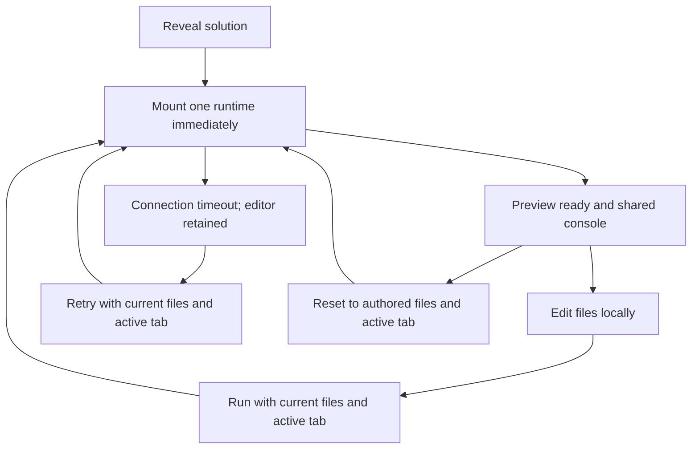

# React And TypeScript Playground

## Snapshot

- Status: `shipped`
- Last updated: `2026-09-28`
- Owner thread: `n/a`
- Current state: Web interview exercises can provide editable multi-file React/TypeScript, vanilla TypeScript, or static projects and run them beside their explanations.
- Target outcome: Any validated Codematica content surface can reuse one project contract and one isolated web player without introducing backend code execution.
- Code touchpoints:
  - `packages/core/src/content/schema.ts`
  - `apps/web/src/components/WebPlayground.tsx`
  - `apps/web/src/components/WebInterviewQuestionSession.tsx`
- Primary tests:
  - `packages/core/src/content/build-index.test.ts`
  - `apps/web/src/components/WebPlayground.test.tsx`
  - `apps/web/src/components/WebInterviewQuestionSession.test.tsx`
  - `apps/web/e2e/specs/interview-catalog.regression.spec.ts`
  - `apps/web/e2e/specs/playground.regression.spec.ts`

## One-Minute Brief

`WebExerciseProject` is the reusable authored-project boundary. It selects a Sandpack runtime, supplies an absolute safe file map, identifies visible and active files, and optionally declares an entry file and npm dependencies. The web component renders CodeMirror, an adjacent preview, Run, refresh, Reset, errors, and console output. Projects run in Sandpack's cross-origin iframe; Codematica never sends auth state, secrets, progress data, or backend authority into the project.

## Outcome / Contract

- Supported runtimes are `react-ts`, `vanilla-ts`, and `static`.
- Project paths must be absolute, may not contain dot segments, and every active, visible, or entry path must exist in `files`.
- Revealing the solution mounts and immediately starts one preview runtime. The console observes that preview; it must not use `standalone`, which starts a separate hidden project.
- Subsequent edits wait for explicit Run. Run replaces the connection using the current files and active tab. Reset creates a fresh session from the authored files and active tab, so the preview cannot rerun a stale edited snapshot.
- Switching solutions remounts only the selected project and discards transient edits.
- The CodeSandbox export/new-tab action is disabled. Runtime errors stay inside the preview overlay and console.
- Startup, ready, code-error, and connection-timeout states are visible and announced. After the Sandpack connection deadline (40 seconds), Retry preview creates a fresh connection while preserving current files and the active tab. Keep the failed preview mounted but hidden until retry; unregistering it clears Sandpack's timeout status.
- If the React editor itself fails to initialize, the error boundary retains authored source with a separate Retry playground action.
- Editor and console surfaces remain dark. Syntax colors are explicit, including comments and numeric/boolean literals, to meet 4.5:1 contrast. Initialization-failure source uses the shared `CodeBlock` with a filename label and language inferred from the file extension. Theme selection remains deferred.
- The hosted bundler is the only remote dependency. Catalog content and read-only source remain local-first.
- Expo deliberately renders source read-only and does not host a WebView runner.

## Known Gaps

- Projects are not graded, saved, shared, or executed on a Codematica backend.
- There is no offline web bundler or self-hosted Sandpack deployment.
- Package dependencies are authored content; learners cannot change package metadata from the current UI.

## Test Plan

- Schema tests reject unsafe paths and missing active, visible, or entry files.
- Component tests verify immediate initialization, a shared console, file/dependency mapping, compilation status, fresh Run/Reset sessions, timeout recovery with edits, project switching, and listener cleanup.
- The error-boundary regression forces editor initialization failure, verifies every authored file uses the shared source renderer, and retries successfully. `code-contrast.regression.spec.ts` checks actual editor syntax colors with hosted execution blocked, so contrast verification does not depend on the remote runtime.
- Console browser assertions are scoped to `web-playground-console` and use a log emitted by clicking the running preview. A page-wide text locator can falsely match the same string in the editor; module-startup logs can race bridge initialization. The separate iframe-count assertion and component test protect the single-runtime contract.
- Interview-session tests prove all authored projects are reachable.
- The `@playground` regression lane runs in mobile Chromium, desktop Chromium, and mobile WebKit. It verifies automatic startup without clicking Run, a single runtime iframe, edit → Run → interactive output, console output, Reset restoring actual preview output, and recovery after deliberately blocking the hosted runtime. The timeout test advances the browser clock, not application state.
- Run `npx playwright test --config=apps/web/e2e/playwright.config.ts apps/web/e2e/specs/playground.regression.spec.ts` and the interview/frontend regressions, plus lint, typecheck, and aggregate/per-file coverage. The browser runner builds production assets.
- Local verification on 2026-09-28: 350 Vitest tests passed with aggregate and per-file coverage gates; all 9 targeted browser regressions and 9 smoke cases passed; lint, workspace typecheck, and the production build passed. The rebuilt page also automatically rendered the 3×5 board in the user's in-app browser with one runtime iframe and no browser warnings/errors.

## Runtime Lifecycle

## Connection Incident (2026-09-28)

The reported blank preview reached Sandpack's `TIME_OUT`; retrying in the same browser successfully rendered the board. The original network failure's cause was not established. Inspection did verify that `standalone` console mode created a second hidden runtime, and that Reset called Run before React committed restored files. The fix removes duplicate execution, starts on reveal, replaces connections on Run/Retry, and restores the actual preview on Reset. Hosted-runtime availability is still required; this is not an offline bundler.

## Thread Handoff Prompt

`Read docs/features/react-typescript-playground.md and docs/features/interview-coding-catalog.md. Keep WebExerciseProject content-authored and platform-neutral, execute only inside the cross-origin Sandpack preview, preserve the read-only native fallback, and add lower-level tests before extending grading or persistence.`

## Guided Interview Entry (2026-09-27)

Web interview recipes mount the playground after Reveal/Show full solution. Switching to a Python companion displays code and local instructions; returning to TypeScript mounts the existing runner. The surrounding recipe grid bounds min-content width for small screens. The frontend regression checks mobile width and automatic preview output without forced clicks.
